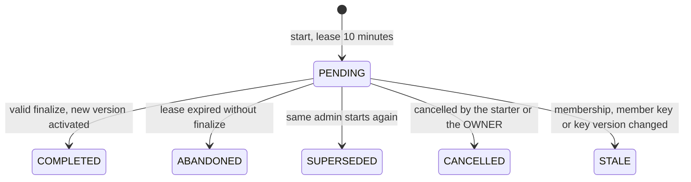

# ADR-013: Client-driven rekey state machine

- Status: Accepted
- Date: 2026-09-28
- Related: [key-lifecycle.md](../../crypto/key-lifecycle.md) section 1; [data-flow.md](../data-flow.md) DF-10; [data-model.md](../data-model.md) sections 4.6 and 4.9.1; [authorization-model.md](../../security/authorization-model.md) AZ-09, AZ-11, AZ-13, OL-13; PC-14 to PC-16; CP-25; T-21, T-37; L-04, L-24; CM-T050, CM-T051

## Context

Plain room key material exists only in members' browsers. Only an OWNER or ADMIN browser with an unlocked vault can therefore create a new key version. The Phase 0 design described member removal and key rotation as one API transaction. That works only when the removing admin's browser is online, unlocked and sends the complete key package in the same request. It does not cover members who leave, accounts that are disabled or deleted, cryptoperiod expiry, or a browser that crashes halfway. The server must still guarantee that no new content is encrypted under a key that a departed member holds.

## Decision

### Room key state

| State | Meaning | Content writes and invitations |
|---|---|---|
| ACTIVE | The current key version may be used | Allowed, but only with the current key version |
| REKEY_REQUIRED | A mandatory rekey is pending | Rejected with 409 `REKEY_REQUIRED`. Reads continue |
| REKEYING | An OWNER or ADMIN is producing the new version under a lease | Rejected with 409 `REKEY_REQUIRED`. Reads continue |

The room enters REKEY_REQUIRED immediately, in the same transaction as the triggering event. The triggers are:
- a member is removed or leaves, or their account is disabled (membership SUSPENDED) or deleted;
- a member reports that their identity key is compromised;
- the cryptoperiod expires (PC-14);
- the wrap-count bound is reached (CP-16).

Reasons accumulate. The same transaction also ends the departed member's access and deletes all of their envelopes.

### Rekey operation

1. **Start** (`POST /api/rooms/{roomId}/rekey-operations`).
   - **Who may start:** an OWNER or ADMIN (AZ-13), subject to the profile gates (a step-up in RESTRICTED rooms).
   - **Only one live operation per room.** A PENDING operation whose lease has expired becomes ABANDONED first. If a live operation belongs to the caller, it becomes SUPERSEDED. If it belongs to someone else, the request fails with 409 `REKEY_IN_PROGRESS`.
   - **Snapshot.** The server records the membership epoch and the recipient set: the ACTIVE identity key of every ACTIVE member, plus the confirmed key of every pending invitee.
   - **Response:** the operation ID, base version v, target version v+1, the recipients with their public keys and fingerprints, and the lease expiry (CP-25). A room in REKEY_REQUIRED moves to REKEYING.
2. **Client work.** The admin's browser runs these steps with the vault unlocked:
   1. It shows the recipient list with fingerprints for review.
   2. It generates fresh RKM_(v+1) and checks that the new material does not reproduce RKC_v under version v's context.
   3. It computes RKC_(v+1) and creates one RSA-OAEP envelope per recipient key.
   4. It persists nothing locally.
3. **Finalize** (`POST /api/rooms/{roomId}/rekey-operations/{operationId}/finalize`). The server locks the room row and checks all of the following in one transaction:
   - the operation belongs to the room (OL-13) and the caller started it;
   - the operation is PENDING and its lease is valid;
   - the room's current version equals the base version;
   - the membership epoch is unchanged;
   - the envelope set equals the recipient snapshot exactly, with no missing or extra recipient;
   - envelope and commitment sizes are valid.

   If every check passes, the same transaction:
   - stores version v+1 as ACTIVE and marks v RETIRED;
   - stores the envelopes, with those for pending invitees marked PENDING;
   - sets the current version, clears the reasons and returns the room to ACTIVE;
   - marks the operation COMPLETED with the digest of its payload, and appends `REKEY_COMPLETED`.

   Nothing is stored before this transaction, so an interrupted rekey leaves no partial key state.
4. **Idempotency and replay.**
   - Repeating a finalize for a COMPLETED operation with an identical payload returns the original result.
   - A different payload for a COMPLETED operation returns 409 `REKEY_PAYLOAD_MISMATCH`.
   - A finalize for an ABANDONED, SUPERSEDED, CANCELLED or STALE operation returns 409 `REKEY_OPERATION_CLOSED`.
   - A recipient set that does not match returns 422 `REKEY_RECIPIENTS_MISMATCH`.
5. **Staleness.** Every membership change and every change of a member's identity key increments the room's membership epoch. That marks a PENDING operation STALE and returns a locked room to REKEY_REQUIRED. The client then starts again.
6. **Recovery.** A crashed browser never finalizes. When the lease expires, the operation becomes ABANDONED, either at the next start or through the worker. The room returns to REKEY_REQUIRED, and any OWNER or ADMIN can start again. The OWNER can cancel another admin's operation. The room is read-only in the meantime, not unusable.
7. **Old key versions.**
   - Every write names the key version it used.
   - The API accepts only the current version, and only while the room is ACTIVE. Anything else returns 409 `KEY_VERSION_STALE`.
   - Uploads still pending when a lock is set are cancelled. The client re-encrypts them under the new version.
   - RETIRED versions stay available for decrypting existing content.
8. **Manual rotation.** An OWNER or ADMIN can rotate an ACTIVE room with the same operation and no write lock. Writes under v continue until activation and then fail with `KEY_VERSION_STALE`.

### Audit events

`MEMBER_REMOVED`, `MEMBER_LEFT`, `MEMBER_SUSPENDED`, `REKEY_REQUIRED`, `REKEY_STARTED`, `REKEY_COMPLETED`, `REKEY_ABANDONED`, `REKEY_CANCELLED`, `REKEY_STALE`, `REKEY_REJECTED`, `KEY_VERSION_RETIRED`.

## Alternatives Considered

- **One-transaction remove-and-rotate (Phase 0):** needs the admin's browser online and unlocked at removal time and does not cover other departures. Replaced. The UI still runs removal, start and finalize back to back, so the lock usually lasts only seconds.
- **Keep writing under the old key until someone rotates:** a removed member could read new content once they obtained its ciphertext. Rejected.
- **Let any member rotate at their next write:** members hold the key material and could technically do it, but it widens who creates keys and weakens accountability. Rejected.
- **Server-side rotation with a key-management service:** contradicts client-side encryption (ADR-002).

## Consequences

- A room is read-only until an OWNER or ADMIN completes the rekey (L-24). The Security Dashboard counts locked rooms (SD-08).
- More endpoints, states and tests than the Phase 0 design.
- A pending invitation survives a rekey because the invitee is part of the recipient set.

## Security Implications

- A removed member never receives the new version, and no new content is created under a key they hold (T-21).
- Replayed, raced, stale and interrupted operations are handled explicitly (T-37).
- Rotation protects future content only. It cannot revoke plaintext or keys a member already obtained (L-04).
- The design assumes the server enforces these rules honestly. A server-side attacker could activate a key version of its own (T-36), which is the subject of open decision OCD-12.

## Status

Accepted. Implementation in Phase 11 (CM-T050, CM-T051).
