# Data Flows

Status: Phase 0.5 baseline; DF-03 and DF-04 updated to the Phase 4 implementation (identity signing key, ADR-015), with DF-04a (passphrase change) and DF-04b (vault reset) added. Normative for implementation. Related: [trust-boundaries.md](trust-boundaries.md), [../crypto/cryptographic-architecture.md](../crypto/cryptographic-architecture.md), [../crypto/key-hierarchy.md](../crypto/key-hierarchy.md).

Notation used in this document:

| Symbol | Meaning |
|---|---|
| VRK | Vault Root Key: Argon2id output, never stored |
| PKWK | Private-Key Wrapping Key, derived from VRK with HKDF; one per private key (purpose encryption or signing) |
| RKM_v | Room Key Material for room key version v (32 random bytes) |
| RWK_v | Room Wrapping Key, derived from RKM_v with HKDF, wraps DEKs |
| RKC_v | Room Key Commitment, derived from RKM_v with HKDF, stored in clear |
| DEK | Data Encryption Key; FEK for files, NEK for note revisions, SEK for secrets |
| ctx(name, ...) | Canonical context object (RFC 8785 JSON) used as AAD, OAEP label or HKDF info |

All identifiers that appear inside cryptographic contexts (user, key, room, file, note and secret IDs) are UUIDv4 values. Clients generate item, room and key IDs, and the API validates format and uniqueness. Object-storage keys are generated by the API and never appear in cryptographic contexts.

## 1. What crosses the network (TB-02)

| Flow | Plaintext sent to the server | Ciphertext or wrapped keys sent | Never sent |
|---|---|---|---|
| DF-01 Registration and login | Email, display name, auth password (TLS only) | None | Vault Passphrase |
| DF-02 MFA | TOTP codes, recovery codes (TLS only) | None | None |
| DF-03 Vault setup | Both public keys, binding signature, fingerprint, KDF parameters, salt | Both wrapped private keys with their IVs | Vault Passphrase, VRK, PKWKs, private keys |
| DF-04a Passphrase change | Previous and new salt, KDF parameters, signature | Both re-wrapped private keys with new IVs | Old and new Vault Passphrase, VRKs, PKWKs, private keys |
| DF-04b Vault reset | ID of the identity being replaced, new public identity, KDF parameters, salt | Both new wrapped private keys | Vault Passphrase, VRK, PKWKs, private keys |
| DF-05 Room creation | Room name, profile, commitment | RKM envelope for the owner | RKM, RWK |
| DF-06 Invitation | Invitee ID, role, confirmed fingerprint | RKM envelopes for the invitee | RKM |
| DF-07 and DF-08 Files | Sizes, ciphertext hash, expiry | File ciphertext, encrypted manifest, wrapped FEK | Filename, MIME type, plaintext hash, FEK |
| DF-09 Secrets | Recipient ID, expiry, burn flag | Payload ciphertext (AES-256-GCM), wrapped SEK | SEK, secret plaintext |
| DF-10 Member removal and rekey | Removal request, rekey start, new version number and commitment | New RKM envelopes for the snapshotted recipients | RKM |
| DF-12 Notes | Revision number, expiry | Note ciphertext, wrapped NEK | Title, body, NEK |
| DF-13 Room Safety Code | Optional statement "compared version v" | None | The Safety Code itself |

## DF-01 Registration and login

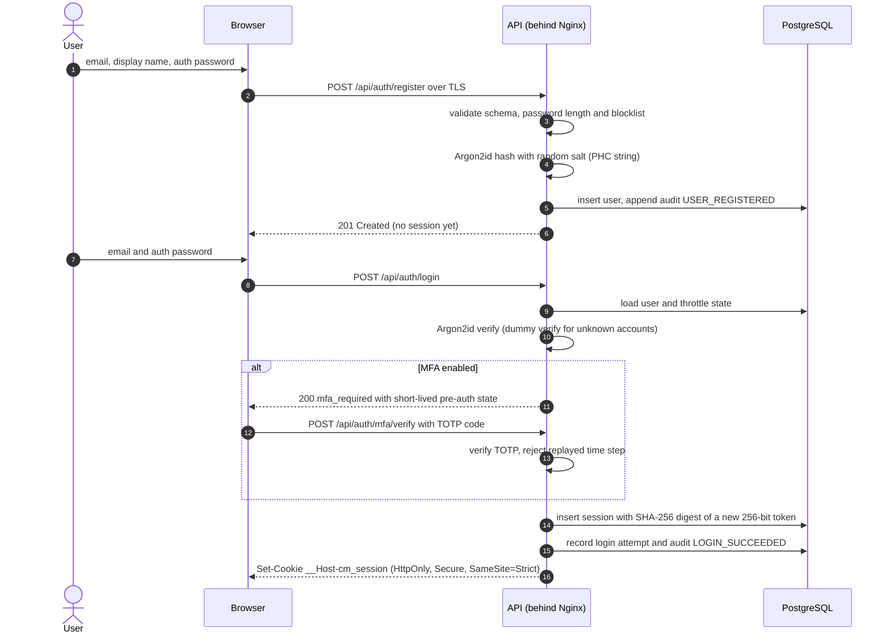

Security notes:
- Failed logins return one generic error. Unknown accounts still cost one Argon2id verification to reduce timing-based enumeration.
- Every request in this flow, including registration and login, passes the same-origin and request-header checks in [../security/session-and-csrf.md](../security/session-and-csrf.md). This also blocks login CSRF.
- Registration necessarily reveals that an email is taken. This is rate-limited and accepted as residual risk (T-15).
- Email addresses are not verified in the baseline because there is no email service. They identify accounts but do not prove identity; invitations rely on fingerprints for assurance (T-35).
- A new session token is issued at login and again after MFA verification or step-up, which prevents session fixation.
- The login attempt log stores the user ID for known accounts, or a keyed HMAC of the submitted identifier for unknown ones. It never stores the submitted password or the raw identifier of failed attempts, because users sometimes type passwords into the identifier field.

## DF-02 MFA enrollment

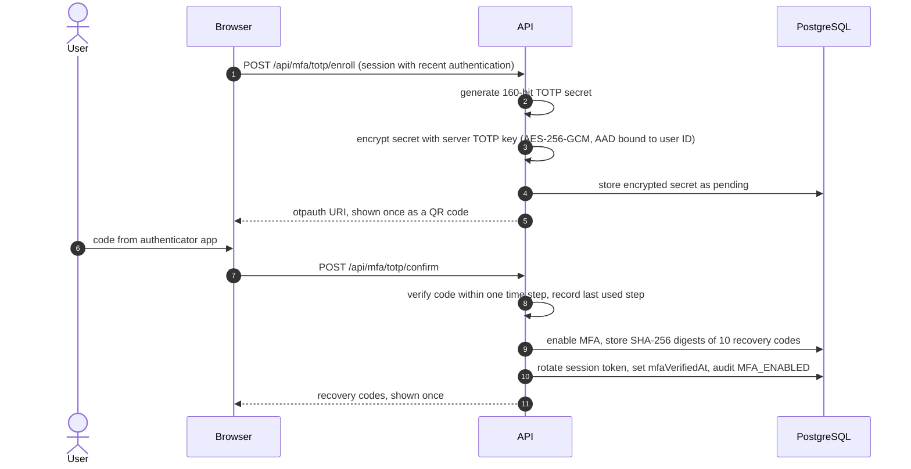

The TOTP secret cannot be client-side encrypted because the server must verify codes. It is protected by server-side encryption with a key held outside the database. This is documented as a server-readable secret in [../crypto/key-hierarchy.md](../crypto/key-hierarchy.md).

## DF-03 Vault setup (cryptographic identity creation)

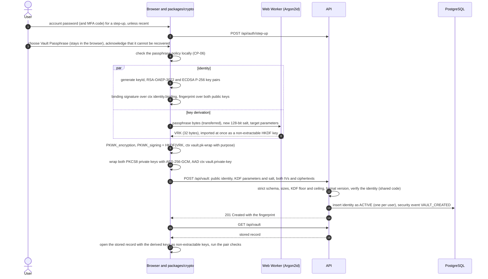

Security notes:
- The private keys are generated extractable only so that they can be wrapped once. They are wrapped inside WebCrypto (`wrapKey`), so their PKCS#8 bytes never appear in JavaScript, and they go out of scope after the stored record has been opened as non-extractable keys.
- The server validates the declared KDF parameters against the floor and ceiling in the parameter register. Declared parameters are the ones actually used, because other devices must derive the same key.
- The server never stores any verifier of the Vault Passphrase. The request schema refuses unknown fields, so no other value can travel with the record.
- Details and every check: [../crypto/vault.md](../crypto/vault.md).

## DF-04 Vault unlock

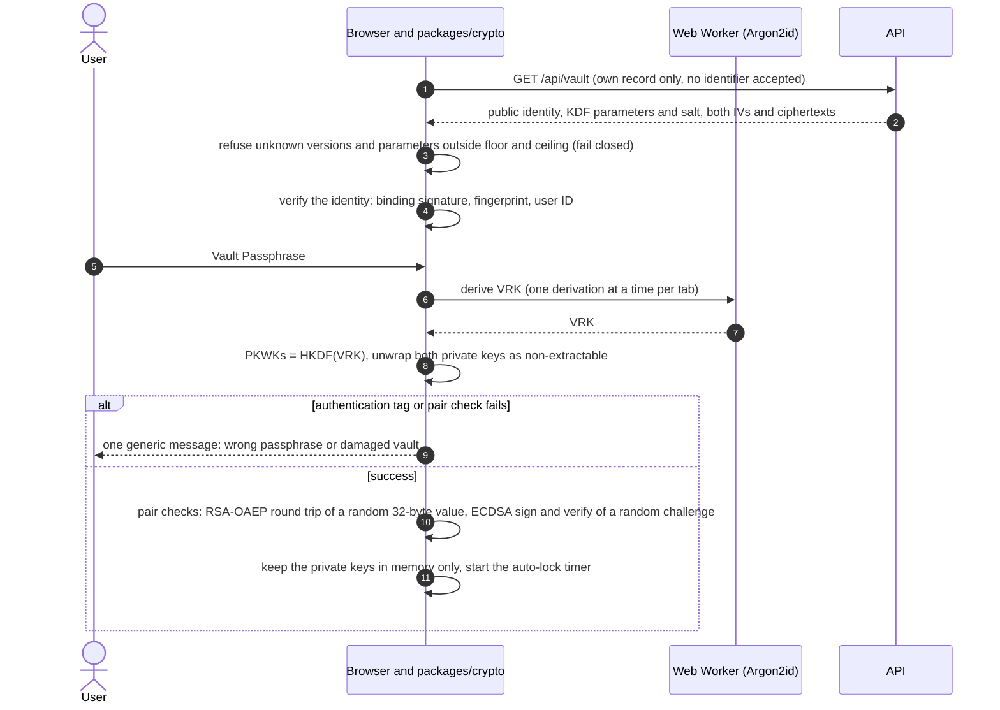

Passphrase guesses in this flow are offline and invisible to the server. The protection against guessing is the Argon2id cost and passphrase strength, not rate limiting (T-22). The vault locks after 15 minutes without user input, on sign-out, when the page is closed and when the API reports the session as ended (CP-22).

## DF-04a Vault Passphrase change and parameter upgrade

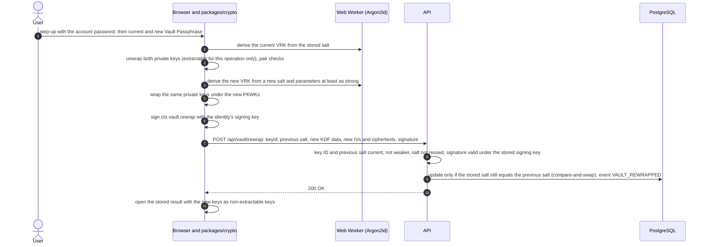

The identity, the key ID and the fingerprint do not change. A parameter upgrade is the same flow with the same passphrase. Old copies of the record still open with the old passphrase (L-40).

## DF-04b Vault reset after a lost passphrase

```mermaid
sequenceDiagram
  autonumber
  actor U as User
  participant B as Browser and packages/crypto
  participant A as API
  participant D as PostgreSQL
  U->>B: strict step-up (account password and MFA code, 5 minutes), new Vault Passphrase, acknowledgement
  B->>B: create a new identity and vault as in DF-03
  B->>A: POST /api/vault/reset: supersedesKeyId, new record
  A->>A: same validation as DF-03; supersedesKeyId must be the current ACTIVE identity
  A->>D: one transaction: old identity SUPERSEDED with its wrapped keys set to NULL, new identity ACTIVE, other sessions revoked, current session rotated, event VAULT_RESET
  A-->>B: 201 Created with the new fingerprint and a new session cookie
```

The new identity has a new fingerprint, which contacts can notice. From Phase 6 the same transaction also handles the room envelopes and invitations of the old identity (key-lifecycle section 3).

## DF-05 Room creation and initial key version

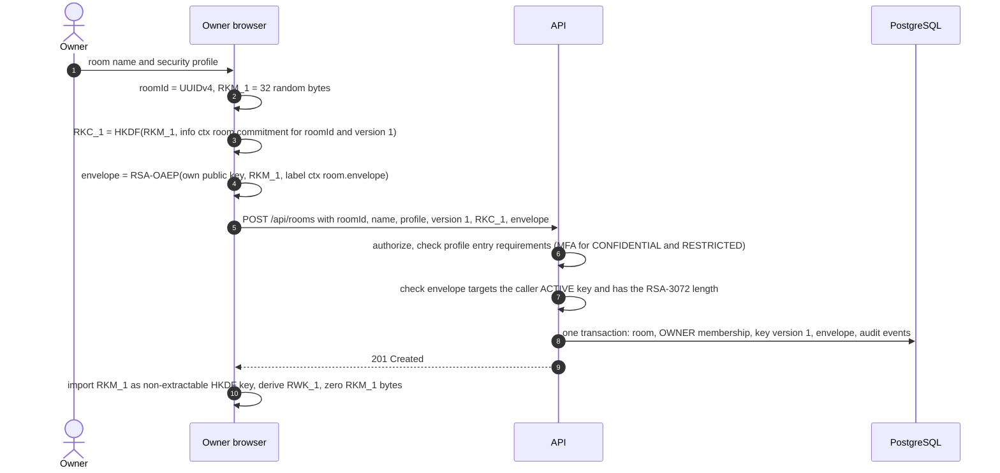

Phase 5 (CM-T030) implements the room part of this flow without key material: the browser chooses the room ID and posts it with the name and profile, and the API checks the account, the vault and the profile's entry requirements (PC-01, PC-02), then writes the room and the OWNER membership in one transaction. The commitment, the envelope and key version 1 join the request with CM-T033 (L-43).

## DF-06 Invitation, approval and acceptance

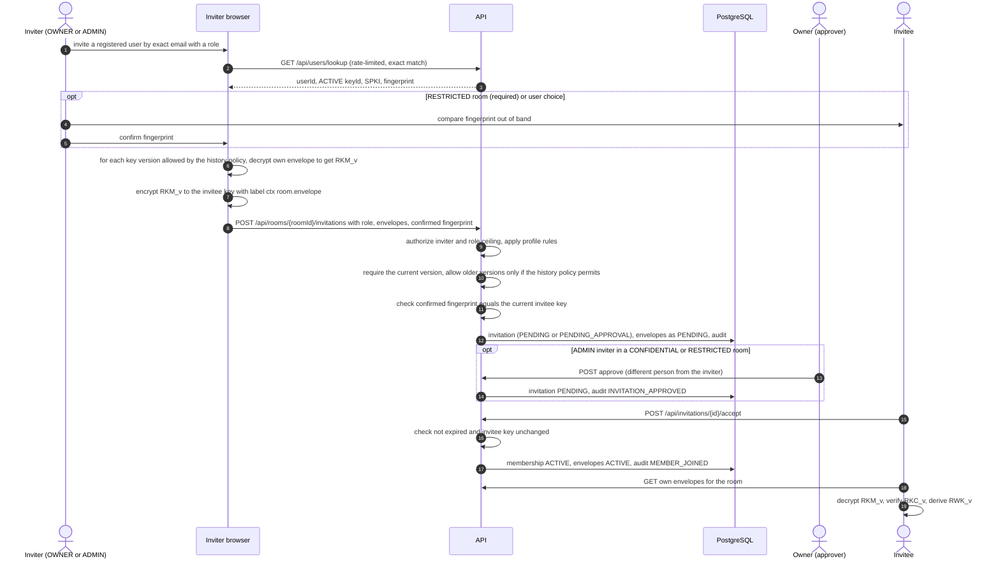

Security notes:
- Invitations are in-app only. There are no bearer invitation links or tokens.
- An inviter can wrap only the versions they hold. Where history access is allowed, the API accepts any set of retained versions that includes the current one, and the UI warns the inviter when the history they can share is incomplete.
- If the invitee rotates their identity key before accepting, the invitation becomes invalid and must be reissued.
- Invitations cannot be created while the room is REKEY_REQUIRED or REKEYING (409 `REKEY_REQUIRED`).
- A rekey includes pending invitees in its recipient snapshot and wraps the new version for them, so their invitations stay valid.

## DF-07 Encrypted file upload

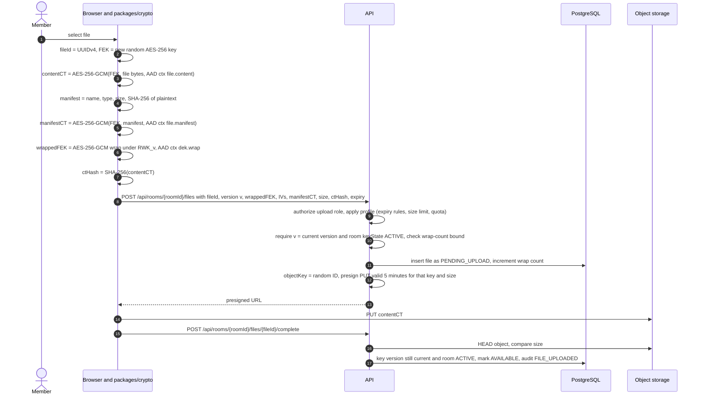

Security notes:
- The plaintext SHA-256 lives only inside the encrypted manifest. Storing it in the clear would let anyone with database access confirm guesses about file contents (INV-16).
- Baseline files are encrypted in one AES-GCM operation with a size limit (see CP-19 in the parameter register). Chunked streaming encryption is deferred and would require its own ADR.
- Uploads that never complete are removed by the worker after the presigned URL has expired. Uploads pending when the room is write-locked are cancelled, and their completion fails with `KEY_VERSION_STALE` or `REKEY_REQUIRED`.

## DF-08 Encrypted file download

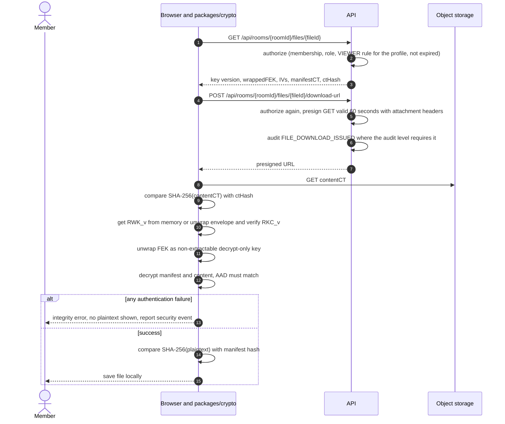

The ciphertext hash comparison is an early storage-integrity check. The decisive integrity check is AES-GCM authentication.

## DF-09 Recipient-bound secret with burn-after-reading

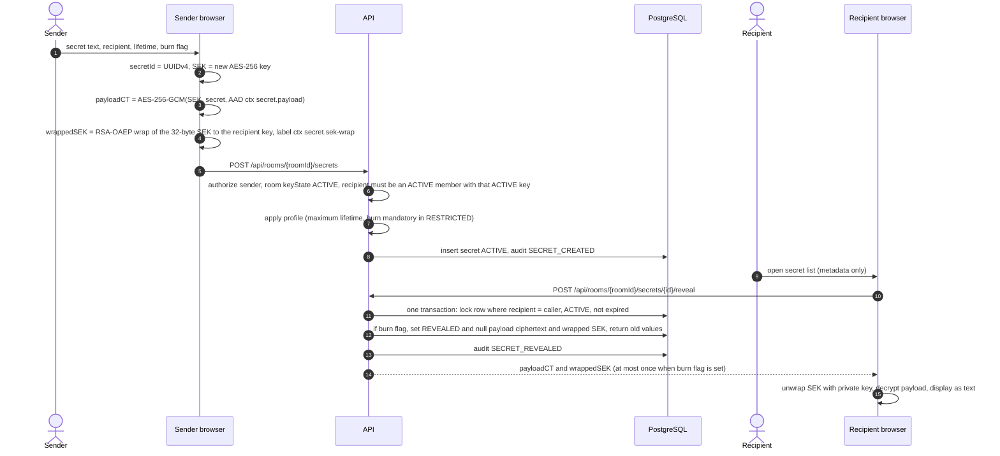

Security notes:
- Reveal is a POST so that link previewers and prefetchers cannot consume the secret.
- Delivery is at most once. If the response is lost in transit, the secret is gone. This is the correct trade-off for burn-after-reading and is shown in the UI.
- The payload is encrypted with AES-256-GCM under the SEK. Only the 32-byte SEK is wrapped to the recipient's key, so other room members cannot unwrap it even if they obtain the ciphertext. RSA-OAEP never touches the payload (INV-17).
- Secrets cannot be created while the room is write-locked for a rekey (409 `REKEY_REQUIRED`).
- Database backups keep the ciphertext and the wrapped SEK until their retention expires. They stay protected by the recipient's key (limitation L-12).

## DF-10 Member removal and rekey

Removal and rekey are separate steps joined by a write lock ([ADR-013](adr/ADR-013-rekey-state-machine.md)). In the usual case the admin's browser runs all three requests back to back, so the lock lasts seconds.

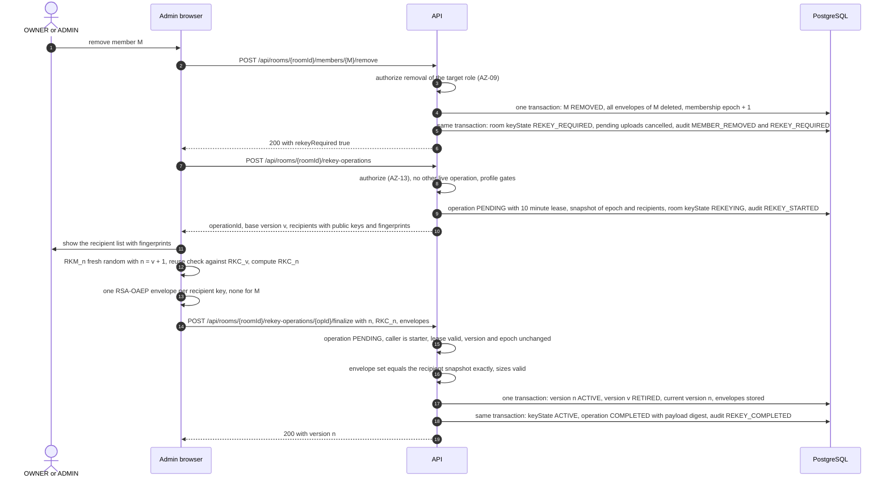

Rules:
- Between the removal and the finalize, the room is write-locked. New files, notes, note edits, secrets and invitations fail with 409 `REKEY_REQUIRED`. Reads continue.
- Leaving, a disabled or deleted account, a reported identity-key compromise, cryptoperiod expiry and the wrap bound enter the same REKEY_REQUIRED state without an admin present. Any OWNER or ADMIN completes the rekey later (L-24).
- Pending invitees are part of the recipient snapshot, so their invitations stay valid across a rekey.
- After activation, writes that name version v fail with 409 `KEY_VERSION_STALE`. RETIRED versions stay available for decrypting existing content.

Failure handling:
- **Browser crash:** nothing is stored before finalize. The lease expires, the operation becomes ABANDONED and the room returns to REKEY_REQUIRED.
- **Retry after a timeout:** repeating the identical finalize returns the original result. A different payload returns 409 `REKEY_PAYLOAD_MISMATCH`.
- **Stale finalize:** a finalize after a membership change, a key change or lease expiry fails with 409 `REKEY_OPERATION_CLOSED`, and the admin starts again.
- **Mismatched envelopes:** envelopes for the wrong recipients, including a removed member, fail with 422 `REKEY_RECIPIENTS_MISMATCH`.

## DF-11 Audit append, checkpoint and verification

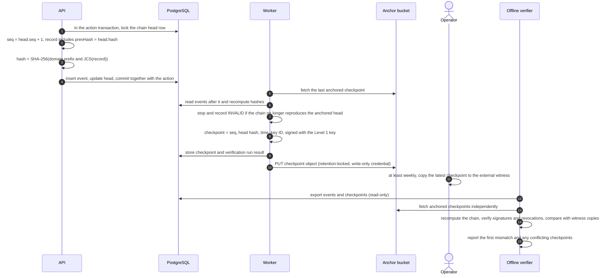

What each check can and cannot prove under each compromise scenario is described in [ADR-009](adr/ADR-009-tamper-evident-audit-ledger.md) section 8.

## DF-12 Encrypted note create and update

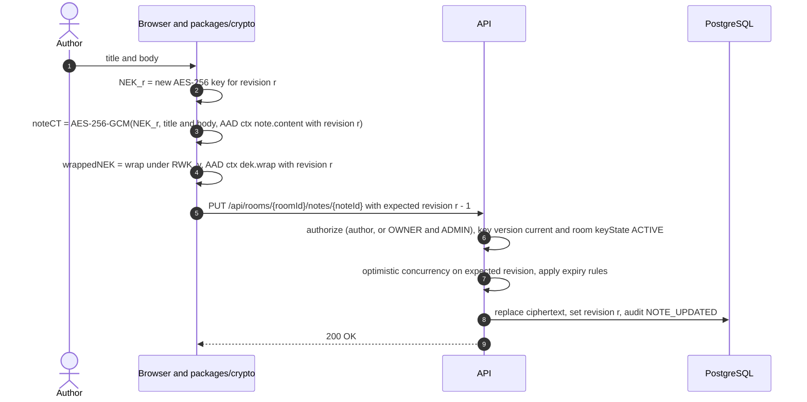

Only the current revision is stored. A fresh key per revision keeps the rule "one DEK per item version" simple and removes any risk of IV reuse across edits.

## DF-13 Room Safety Code comparison

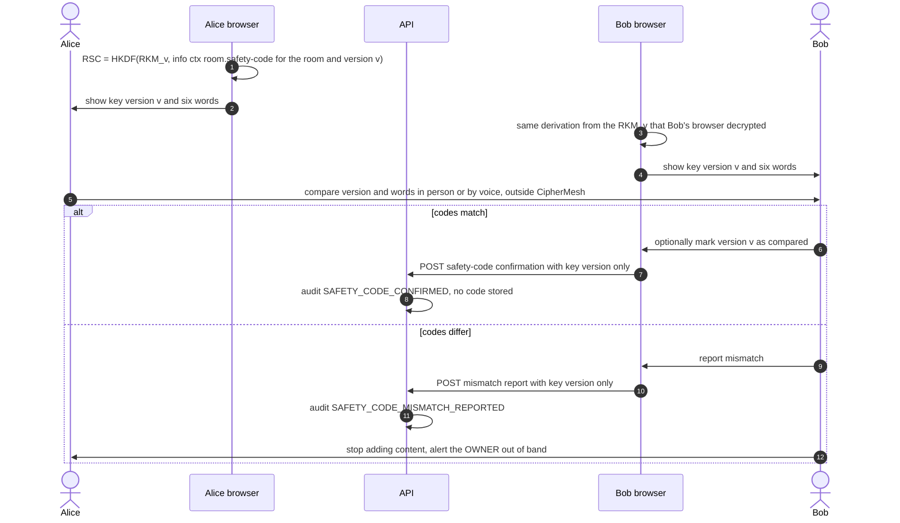

Security notes:
- The code never crosses the network. The confirmation and the mismatch report carry only the key version (INV-18).
- Matching codes show that both browsers hold the same key material for version v. They do not show who else holds it, and they do not reveal a key that every member received from an attacker (L-22, T-36).
- A recorded confirmation is a member's statement, not a verification by the system.
