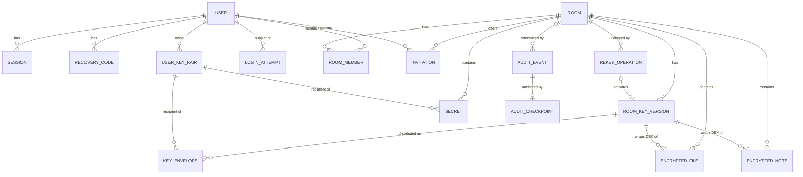

# Data Model Proposal

Status: Phase 0.5 design, implemented in Phase 2 as `prisma/schema.prisma` (schema v1). Section 7 records how the implementation maps to this design and every justified deviation. Database security controls: [../security/database-security.md](../security/database-security.md). Related: [data-flow.md](data-flow.md), [../crypto/key-hierarchy.md](../crypto/key-hierarchy.md), [../security/authorization-model.md](../security/authorization-model.md).

## 1. Principles

1. **Ciphertext and wrapped keys only** for room content and content keys (INV-01, INV-04).
2. **Minimize metadata.** Store what authorization, policy, expiry and audit need, and nothing more.
3. **Every encrypted record carries its algorithm suite** (`CM1`) and the key version it depends on.
4. **Room-scoped tables carry `roomId`**, and every query on them filters by `roomId` plus membership (INV-06).
5. **Tombstones over hard deletes** where audit needs a trace. The encrypted payload is removed immediately and the metadata row stays.
6. **UUIDv4 identifiers** for everything externally visible. Audit events additionally have a gap-free sequence number.
7. All timestamps are `timestamptz` in UTC, with millisecond precision where they enter hashes.

## 2. Field classification

| Class | Meaning | Examples |
|---|---|---|
| ID | Identifier | `id`, `roomId` |
| META | Metadata visible to the server | roles, timestamps, sizes, statuses |
| PII | Personal data, a subset of META with retention rules | email, IP address, user agent |
| CT | Client-side ciphertext; the server cannot decrypt it | note ciphertext, encrypted manifest, encrypted private key |
| WK | Client-side wrapped key; the server cannot unwrap it | RSA-OAEP envelopes, wrapped DEKs |
| SENC | Server-side encrypted secret; the server can decrypt it with a key held outside the database | TOTP secret |
| DIG | One-way digest of a secret | Argon2id password hash, SHA-256 of session token |
| INT | Public integrity value | fingerprints, commitments, ciphertext hashes, audit hashes, signatures |
| PUBK | Public key | SPKI public key |

## 3. Entity relationship overview

## 4. Entities

### 4.1 User
Ownership: the user owns their profile, sessions and MFA settings. PLATFORM_ADMIN can enable or disable accounts only.

| Field | Type | Class | Notes |
|---|---|---|---|
| id | uuid | ID | |
| email | citext, unique | PII | Login identifier. **Not verified** in the baseline (no email service); shown as unverified (T-35) |
| displayName | text (max 80) | PII | Rendered as text only |
| passwordHash | text | DIG | Argon2id PHC string including parameters and salt |
| passwordChangedAt | timestamptz | META | |
| platformRole | enum USER, PLATFORM_ADMIN | META | Grants no room access |
| status | enum ACTIVE, DISABLED | META | DISABLED blocks login and revokes sessions |
| mfaEnabled | boolean | META | |
| mfaTotpSecretEnc | bytea, nullable | SENC | AES-256-GCM under the server TOTP key, AAD bound to user ID |
| mfaTotpKeyId | text, nullable | META | Which server key encrypted the secret (rotation) |
| mfaLastUsedStep | bigint, nullable | META | TOTP replay protection |
| failedLoginCount, throttledUntil | int, timestamptz | META | Progressive backoff, never permanent lockout |
| createdAt, updatedAt, lastLoginAt, deletedAt | timestamptz | META | |

### 4.2 RecoveryCode
| Field | Type | Class | Notes |
|---|---|---|---|
| id, userId | uuid | ID | |
| codeDigest | bytea(32) | DIG | SHA-256 of a code with at least 100 bits of entropy |
| usedAt, createdAt | timestamptz | META | Single use |

### 4.3 Session
Ownership: the user; the user and PLATFORM_ADMIN can revoke. At most 10 active sessions per user (CP-08). Rotation and invalidation rules: [../security/session-and-csrf.md](../security/session-and-csrf.md).

| Field | Type | Class | Notes |
|---|---|---|---|
| id, userId | uuid | ID | |
| tokenDigest | bytea(32), unique | DIG | SHA-256 of the 256-bit token; the raw token exists only in the cookie |
| createdAt, lastSeenAt | timestamptz | META | |
| idleExpiresAt, absoluteExpiresAt | timestamptz | META | Global defaults in the parameter register |
| authenticatedAt | timestamptz | META | Last primary (password) authentication, used for session freshness |
| mfaVerifiedAt, stepUpAt | timestamptz, nullable | META | Profile requirements and step-up |
| ipAddress, userAgent | inet, text | PII | Retention-limited; shown in the session list |
| rotatedAt | timestamptz, nullable | META | Last token rotation |
| revokedAt, revokeReason | timestamptz, enum | META | |

### 4.4 LoginAttempt (security events, not hash-chained)
| Field | Type | Class | Notes |
|---|---|---|---|
| id | uuid | ID | |
| occurredAt | timestamptz | META | |
| userId | uuid, nullable | ID | Set when the identifier matches an account |
| identifierHmac | bytea(32), nullable | DIG | HMAC-SHA-256 of the normalized identifier under a server key, for unknown accounts |
| ipAddress, userAgent | inet, text | PII | |
| outcome | enum SUCCESS, BAD_CREDENTIALS, MFA_FAILED, THROTTLED, DISABLED | META | |

Retention: 90 days, then deleted by the worker. Feeds rate limiting and the Security Dashboard.

### 4.5 UserKeyPair (cryptographic identity, "Vault")
Ownership: the user. Only the owner can fetch `encryptedPrivateKey`. Other members see the public fields.

| Field | Type | Class | Notes |
|---|---|---|---|
| id (keyId), userId | uuid | ID | Client-generated keyId, validated for uniqueness |
| status | enum ACTIVE, SUPERSEDED, REVOKED | META | One ACTIVE per user (partial unique index) |
| algorithmSuite | text | META | `CM1` |
| publicKeySpki | bytea | PUBK | RSA-3072, e = 65537, validated on upload |
| publicKeyFingerprint | text(64), unique | INT | Hex SHA-256 of the SPKI bytes |
| encryptedPrivateKey | bytea | CT | AES-256-GCM of the PKCS#8 private key under PKWK |
| privateKeyIv | bytea(12) | META | Not secret |
| kdfAlgorithm | text | META | `argon2id`, version 0x13 |
| kdfMemoryKiB, kdfIterations, kdfParallelism | int | META | Must meet the floor in the parameter register |
| kdfSalt | bytea(16) | META | Not secret |
| createdAt, supersededAt, revokedAt | timestamptz | META | |

### 4.6 Room
Ownership: the room OWNER. Content belongs to the room.

| Field | Type | Class | Notes |
|---|---|---|---|
| id | uuid | ID | Client-generated, used in cryptographic contexts |
| name | text (max 100) | META | **Not encrypted**. The UI warns users not to put sensitive information in room names |
| securityProfile | enum STANDARD, CONFIDENTIAL, RESTRICTED | META | |
| policyVersion | int | META | Version of the code-defined policy catalogue |
| currentKeyVersion | int | META | |
| keyState | enum ACTIVE, REKEY_REQUIRED, REKEYING | META | REKEY_REQUIRED and REKEYING block content writes and invitations (INV-07) |
| rekeyReasons | enum set | META | MEMBER_REMOVED, MEMBER_LEFT, MEMBER_SUSPENDED, MEMBER_DELETED, IDENTITY_KEY_COMPROMISED, CRYPTOPERIOD_EXPIRED, WRAP_LIMIT_REACHED |
| rekeyRequiredSince | timestamptz, nullable | META | |
| membershipEpoch | bigint | META | Increments on every membership change and every change of a member's identity key. Binds rekey operations to one membership snapshot |
| status | enum ACTIVE, DELETING, DELETED | META | |
| createdById, createdAt, updatedAt, deletedAt | | META | |

### 4.7 RoomMember
Ownership: the room. OWNER and ADMIN manage it within the limits of the authorization matrix.

| Field | Type | Class | Notes |
|---|---|---|---|
| id, roomId, userId | uuid | ID | |
| role | enum OWNER, ADMIN, MEMBER, VIEWER | META | Exactly one ACTIVE OWNER per room (partial unique index) |
| status | enum ACTIVE, SUSPENDED, REMOVED, LEFT | META | Unique (roomId, userId) among ACTIVE and SUSPENDED rows. SUSPENDED means the account is disabled: no access, envelopes deleted, role kept so an OWNER or ADMIN can reinstate it by re-sharing keys |
| firstKeyVersion | int | META | First version the member received |
| addedById, invitationId | uuid | ID | |
| joinedAt, removedAt | timestamptz | META | |
| removedById, removalReason | uuid, enum | META | |

### 4.8 Invitation
Ownership: the room. Visible to the inviter, room OWNER and ADMIN, and the invitee.

| Field | Type | Class | Notes |
|---|---|---|---|
| id, roomId, inviteeUserId, invitedById | uuid | ID | |
| inviteeKeyId | uuid | ID | The key the pending envelopes were wrapped for |
| role | enum ADMIN, MEMBER, VIEWER | META | OWNER is never granted by invitation |
| status | enum PENDING_APPROVAL, PENDING, ACCEPTED, DECLINED, REVOKED, EXPIRED | META | |
| approvedById, approvedAt | uuid, timestamptz | META | Approver must differ from the inviter |
| confirmedFingerprint | text(64), nullable | INT | Required in RESTRICTED; must equal the current invitee key fingerprint |
| expiresAt, createdAt, respondedAt | timestamptz | META | Validity from the profile |

### 4.9 RoomKeyVersion
Ownership: the room. Created only by a client that holds the key material.

| Field | Type | Class | Notes |
|---|---|---|---|
| id, roomId | uuid | ID | Unique (roomId, version) |
| version | int | META | Starts at 1, increases by exactly 1 |
| status | enum ACTIVE, RETIRED, DESTROYED | META | One ACTIVE per room |
| commitment | bytea(32) | INT | RKC_v, derived from RKM_v with HKDF; never the key itself. Written once at activation and never changed |
| algorithmSuite | text | META | `CM1` |
| reasons | enum set | META | INITIAL, MANUAL, POLICY_CHANGE, or the rekey reasons of the room (see 4.6) |
| createdByOperationId | uuid, nullable | ID | The rekey operation that activated this version; NULL for version 1 |
| wrapCount | int | META | DEKs wrapped under this version; bounded (CP-16) |
| createdById, createdAt, retiredAt, destroyedAt | | META | |

#### 4.9.1 RekeyOperation
Ownership: the room. Started and finalized by one OWNER or ADMIN ([ADR-013](adr/ADR-013-rekey-state-machine.md)). The row holds no key material. Envelopes are submitted only in the finalize request and stored in the same transaction that activates the version.

| Field | Type | Class | Notes |
|---|---|---|---|
| id, roomId | uuid | ID | Always loaded together with roomId (OL-13) |
| startedById | uuid | ID | Only this user can finalize |
| mode | enum MANDATORY, MANUAL | META | MANDATORY when started from REKEY_REQUIRED |
| status | enum PENDING, COMPLETED, ABANDONED, SUPERSEDED, CANCELLED, STALE | META | At most one PENDING per room (partial unique index) |
| baseVersion, targetVersion | int | META | targetVersion = baseVersion + 1 |
| membershipEpoch | bigint | META | Snapshot at start. A different room epoch at finalize makes the operation STALE |
| recipientSetDigest | bytea(32) | INT | SHA-256 over the canonical, sorted list of recipient user IDs, key IDs and kinds |
| leaseExpiresAt | timestamptz | META | Start plus 10 minutes (CP-25) |
| payloadDigest | bytea(32), nullable | INT | SHA-256 of the canonical finalize payload. Makes repeated finalize requests idempotent |
| closedReason | text, nullable | META | For example LEASE_EXPIRED, MEMBERSHIP_CHANGED, CANCELLED_BY_OWNER |
| createdAt, completedAt, closedAt | timestamptz | META | |

### 4.10 KeyEnvelope (WrappedKey)
Ownership: the room. Each envelope is served **only** to its recipient, and only while the recipient is an ACTIVE member.

| Field | Type | Class | Notes |
|---|---|---|---|
| id, roomId | uuid | ID | Unique (roomId, keyVersion, recipientKeyId) |
| keyVersion | int | META | Foreign key to (roomId, version) |
| recipientUserId, recipientKeyId | uuid | ID | |
| invitationId | uuid, nullable | ID | Set while the envelope belongs to a pending invitation |
| status | enum PENDING, ACTIVE | META | PENDING envelopes are never served |
| wrappedKey | bytea(384) | WK | RSA-OAEP-3072 ciphertext of RKM_v with the context label |
| algorithm | text | META | `RSA-OAEP-3072-SHA256` |
| createdById, createdAt | | META | |

### 4.11 EncryptedFile
Ownership: the room; the uploader has delete rights, as do OWNER and ADMIN.

| Field | Type | Class | Notes |
|---|---|---|---|
| id, roomId, uploaderId | uuid | ID | Client-generated file ID |
| keyVersion | int | META | Room key version that wraps the FEK |
| status | enum PENDING_UPLOAD, AVAILABLE, DELETED | META | |
| algorithmSuite | text | META | `CM1` |
| wrappedDek, dekIv | bytea | WK, META | FEK wrapped under RWK_v |
| contentIv | bytea(12) | META | |
| manifestCiphertext, manifestIv | bytea | CT, META | Encrypted filename, MIME type, plaintext size, plaintext SHA-256 |
| objectKey | text | META | Random, server-generated; never derived from the filename |
| ciphertextSize | bigint | META | Reveals approximate file size (T-28) |
| ciphertextSha256 | bytea(32) | INT | Storage integrity reference; hash of ciphertext, not plaintext |
| expiresAt | timestamptz, nullable | META | Required in CONFIDENTIAL and RESTRICTED |
| createdAt, uploadedAt, deletedAt | timestamptz | META | |

### 4.12 EncryptedNote
Ownership: the room; the author can edit and delete, as can OWNER and ADMIN.

| Field | Type | Class | Notes |
|---|---|---|---|
| id, roomId, authorId, updatedById | uuid | ID | |
| revision | int | META | Increases on every save; part of AAD |
| keyVersion | int | META | |
| algorithmSuite | text | META | |
| wrappedDek, dekIv | bytea | WK, META | Fresh NEK per revision |
| ciphertext, contentIv | bytea | CT, META | Encrypted JSON with title and body |
| ciphertextSha256 | bytea(32) | INT | |
| expiresAt | timestamptz, nullable | META | |
| createdAt, updatedAt, deletedAt | timestamptz | META | |

### 4.13 Secret (recipient-bound)
Ownership: the sender until reveal; visible as metadata to sender and recipient; room OWNER and ADMIN can revoke.

| Field | Type | Class | Notes |
|---|---|---|---|
| id, roomId, senderId, recipientUserId, recipientKeyId | uuid | ID | |
| status | enum ACTIVE, REVEALED, EXPIRED, REVOKED | META | |
| burnAfterReading | boolean | META | Mandatory in RESTRICTED |
| algorithmSuite | text | META | |
| wrappedSek | bytea(384), nullable | WK | RSA-OAEP-3072 wrap of the 32-byte SEK to the recipient key, with OAEP label ctx `secret.sek-wrap`; set to NULL when burned, expired or revoked |
| wrapAlgorithm | text | META | `RSA-OAEP-3072-SHA256` |
| payloadCiphertext, payloadIv | bytea, nullable | CT, META | AES-256-GCM output (ciphertext and 128-bit tag) under the SEK, with AAD ctx `secret.payload`. Never RSA-encrypted (INV-17). Set to NULL together with the wrapped SEK |
| expiresAt | timestamptz, required | META | Bounded by the profile |
| createdAt, revealedAt, destroyedAt | timestamptz | META | |

### 4.14 ExternalSecret (stretch goal, STANDARD rooms only)
Same as Secret without recipient fields and without any envelope. The decryption key travels only in the URL fragment of the share link and is never sent to the server. Burn-after-reading is mandatory and the lifetime is capped (see the policy profiles).

### 4.15 AuditEvent
Ownership: the platform. Append-only (INV-09).

| Field | Type | Class | Notes |
|---|---|---|---|
| seq | bigint, primary key | META | Gap-free, assigned under the chain-head lock |
| id | uuid | ID | |
| occurredAt | timestamptz(3) | META | |
| actorType, actorUserId | enum USER, SYSTEM; uuid | META | |
| action | text (catalogued values) | META | For example `MEMBER_REMOVED`, `KEY_ROTATED` |
| outcome | enum SUCCESS, DENIED, FAILURE | META | |
| roomId, targetType, targetId | uuid, text, uuid | META | |
| requestId | text | META | Correlates with application logs |
| details | jsonb | META | Allowlisted keys per action; no secrets, no content, no IP addresses |
| prevHash, eventHash | bytea(32) | INT | See [ADR-009](adr/ADR-009-tamper-evident-audit-ledger.md) |
| hashVersion | int | META | Canonicalization and hashing scheme version |

Supporting tables: **AuditChainHead** (single row: last seq and hash, locked on append), **AuditCheckpoint** (seq, head hash, createdAt, signature algorithm, signing key ID, signature, anchor object key, witness reference, optional RFC 3161 token) and **AuditVerificationRun** (range, result VALID or INVALID or ERROR, first invalid seq, timestamps). The dashboard reads the latest verification run.

### 4.16 SecurityPolicy (code-defined catalogue, not a mutable table)
Security profiles are defined as versioned, immutable constants in `packages/shared`, reviewed through pull requests. A room stores `securityProfile` and `policyVersion`. Profile changes are recorded as audit events.

Why not a database table: a mutable policy table would let anyone with database write access silently weaken every room at once, and it would add a second source of truth. Policy distribution for the dashboard is a simple count of rooms per profile. See [../security/security-policy-profiles.md](../security/security-policy-profiles.md).

### 4.17 Organization: evaluated and not included
Rooms belong to users. An Organization entity would add tenant isolation, organization administrators and organization-level policy. None of that strengthens the three subject areas enough to justify the extra authorization surface. Revisit through an ADR if multi-tenancy becomes a requirement.

## 5. Deletion and expiration behaviour

| Entity | Trigger | Immediate effect (API transaction) | Deferred effect (worker) | What remains |
|---|---|---|---|---|
| EncryptedFile | Delete, expiry, room deletion | Status DELETED; wrapped FEK and manifest set to NULL; reads refused | Object deleted from storage, with retries | Tombstone row and audit events |
| EncryptedNote | Delete, expiry | Ciphertext and wrapped NEK set to NULL; reads refused | None | Tombstone and audit |
| Secret | Burn on reveal, expiry, revoke | Payload ciphertext and wrapped SEK set to NULL in the reveal transaction | Expiry sweep for unrevealed secrets | Metadata row and audit |
| Invitation | Decline, revoke, expiry | Status updated; PENDING envelopes deleted | Expiry sweep | Row and audit |
| RoomMember | Removal | Status REMOVED; all envelopes of that member deleted; membership epoch incremented; room REKEY_REQUIRED, all in one transaction | None | Row and audit |
| RoomMember | Leave, account suspended or deleted | Status LEFT, SUSPENDED or REMOVED; envelopes deleted; membership epoch incremented; room REKEY_REQUIRED | None | Row and audit |
| RoomKeyVersion | No remaining items reference a RETIRED version | None | Envelopes deleted, status DESTROYED | Version row with commitment |
| KeyEnvelope | Member removed, left or suspended; recipient key superseded or revoked; version destroyed; invitation declined, revoked or expired | Envelopes deleted | Envelopes of destroyed versions | Nothing |
| Room | OWNER deletes (step-up required) | Status DELETING; all reads refused | Content, objects and envelopes deleted; status DELETED | Tombstone and audit |
| UserKeyPair | Vault reset or account deletion | Status SUPERSEDED or REVOKED; encrypted private key set to NULL | None | Public key and fingerprint for audit |
| User | Account deletion (owned rooms must be transferred or deleted first) | Sessions revoked, memberships removed (rooms REKEY_REQUIRED), secrets to the user destroyed | LoginAttempt rows age out | Pseudonymous user ID in audit events |
| Session | Logout, revoke, expiry | Revoked or expired rows rejected | Deleted 30 days after expiry | Nothing |
| RekeyOperation | Completed or closed | None | Deleted 90 days after closing | Audit events |
| LoginAttempt | Age over 90 days | None | Deleted | Nothing |

Rules:
- **Expiry is enforced at read time** (INV-14). Cleanup jobs only reclaim space.
- **Backups:** managed database backups and object versioning keep deleted ciphertext until their retention period ends. That data stays encrypted. The limitation is documented as L-12.
- **Crypto-shredding scope:** removing a wrapped DEK from the live database makes the item unrecoverable from the live system. It does not affect copies held in backups or by members who already downloaded the item.

## 6. Fields that must never exist

Any of these in a schema, log, API response or migration is a critical defect.

| Must never exist | Reason |
|---|---|
| Plaintext or reversibly encrypted account password (`password`, `passwordEncrypted`) | Passwords are hashed with Argon2id only (INV-11) |
| Any Vault Passphrase value, hash or verifier | Would enable passphrase recovery or faster guessing; the passphrase never reaches the server (INV-01) |
| Plaintext private key, VRK, PKWK or any vault-derived key | INV-01 |
| Plaintext room key material, RWK, or any column named like `roomKey` holding key bytes | INV-04 |
| Plaintext FEK, NEK or SEK | INV-01 |
| Plaintext filename, MIME type or plaintext hash of a file | Metadata and confirmation-of-file attacks (INV-16) |
| Plaintext note title or body, or secret plaintext | INV-01 |
| Raw session token, raw recovery code | Stored only as digests (INV-12) |
| Plaintext TOTP secret | Stored only server-side encrypted |
| Submitted password or raw failed identifier in LoginAttempt | Users mistype passwords into identifier fields |
| Invitation bearer token or invitation link secret | Invitations are in-app only |
| Key escrow or "master key" able to decrypt room content | Contradicts client-side encryption (ADR-002) |
| Room Safety Code values or words | Derived from room key material; computed only in browsers (INV-18) |
| Content encrypted directly with RSA, or any RSA ciphertext field for content | RSA-OAEP wraps only 32-byte key material (INV-17) |
| Room key material, envelopes or commitments generated by the server | Only member browsers create keys; the server validates and stores |
| Presigned URLs stored in the database or logs | They are short-lived bearer capabilities |
| IP addresses or secrets in AuditEvent details | Privacy and immutability conflict; secrets never logged |

## 7. Phase 2 implementation record

Schema v1 implements sections 4.1 to 4.13 and 4.15 as 15 tables. Every stored field carries its classification from section 2 as a `/// class:` comment, checked by `pnpm db:check-schema`. Section 6 is enforced by that checker (name rules), by CHECK constraints (sizes and NULL rules) and by tests.

### 7.1 Deviations and decisions

| Item | Decision | Reason |
|---|---|---|
| AuditChainHead, AuditCheckpoint, AuditVerificationRun (4.15) | **Deferred to Phase 12** | They exist only for the hash chain and checkpoints (ADR-009, CM-T054 to CM-T058), which are not implemented yet. Creating them now would add unused tables. `audit_events` already has `prev_hash`, `event_hash` and `hash_version` |
| ExternalSecret (4.14) | **Deferred** | Stretch goal (CM-T045, Phase 9); added with its feature if it is built |
| ID generation | Client-generated without database default: `user_key_pairs`, `rooms`, `encrypted_files`, `encrypted_notes`, `secrets`. All other IDs default to `gen_random_uuid()` | These IDs enter AAD, OAEP labels or HKDF info (cryptographic-architecture section on contexts), so the browser must know them before encrypting. Every ID is checked as UUIDv4 |
| `RoomKeyVersion.createdByOperationId` | Foreign key with `ON DELETE SET NULL`; only version 1 is required to have NULL | Section 5 purges closed rekey operations after 90 days while the version row stays. With `RESTRICT` the purge would be impossible |
| Invitation role | Separate enum `InvitationRole` (ADMIN, MEMBER, VIEWER) | OWNER is never granted by invitation; the type makes it unrepresentable |
| One open invitation per invitee and room | Added partial unique index | Prevents duplicate pending envelopes for the same invitee |
| Enum values not listed in section 4 | `SessionRevokeReason` (LOGOUT, REVOKED_BY_USER, REVOKED_BY_ADMIN, PASSWORD_CHANGED, MFA_CHANGED, RECOVERY_CODE_USED, VAULT_RESET, PLATFORM_ROLE_CHANGED, ACCOUNT_DISABLED, SESSION_LIMIT) from the invalidation events in session-and-csrf.md; `RemovalReason` (REMOVED_BY_ADMIN, LEFT_ROOM, ACCOUNT_DISABLED, ACCOUNT_DELETED) | Section 4 names the fields but not their values. Phase 3 and Phase 5 may extend them through migrations |
| Text sizes | `display_name` 80, `name` 100, `user_agent` 512, `object_key` 128, `password_hash` 256, action 64, request ID 64 | Bounded storage; sizes from section 4 where given |
| Write-once columns | Triggers keep `user_key_pairs` identity columns (public key, fingerprint, user, suite) and `room_key_versions` identity columns (room, version, commitment, suite) unchanged | Section 4.9 says the commitment is written once; an identity key that changes in place would enable substitution (T-25) |
| `room_key_versions.wrap_count` | CHECK 0 to 2^20 | CP-16 |
| Room key state | CHECK that ACTIVE has no reasons and REKEY_REQUIRED or REKEYING has at least one | ADR-013: manual rotation keeps the room ACTIVE, so REKEYING always follows REKEY_REQUIRED |
| SecurityPolicy (4.16), Organization (4.17) | Not tables, as designed | The checker fails on a SecurityPolicy model |

### 7.2 Not decided by the schema

- Whether a non-burn secret keeps its payload after the first reveal is not specified in 4.13. The schema allows it (`status` stays ACTIVE with `revealed_at` set) and forbids a REVEALED secret with a payload. Phase 9 (CM-T043 to CM-T044) decides and documents it.
- Variable-length ciphertexts (notes, manifests, secret payloads, encrypted private keys) have lower bounds only. Upper bounds belong to the API request schemas of the feature phases.
