# Engineering Baseline (Phases 1 to 4)

Status: Phase 1, 2026-10-02; database layer added in Phase 2, authentication in Phase 3 (2026-10-04), and the cryptography package and vault in Phase 4 (2026-10-05). Records the tool and version decisions, the request pipeline and the local development setup established by CM-T006 to CM-T028. Related: [ADR-001](adr/ADR-001-monorepo-architecture.md), [ADR-011](adr/ADR-011-static-frontend-delivery.md), [../security/security-testing-plan.md](../security/security-testing-plan.md).

## 1. Versions

Versions were checked against the npm registry and peer-dependency ranges on 2026-10-02. Every pin is at least three days old, which the workspace enforces (`minimumReleaseAge`).

| Component | Version | Decision |
|---|---|---|
| Node.js | 24 LTS (engines `>=24.11 <25`, `.nvmrc`) | Active LTS today. Node 26 becomes LTS later in October 2026; moving to it is a separate change |
| pnpm | 12.6.0 (`packageManager`) | Workspaces, catalogs, build-script blocking and release-age delay are built in |
| TypeScript | 6.0.3 | TypeScript 7 (the native compiler) is current, but typescript-eslint supports only TypeScript below 6.1, and type-aware linting is a security control here |
| Next.js / React | 16.3.6 / 19.3.0 | Static export per ADR-011. Next.js 16.3.8 was too new for the release-age rule |
| Tailwind CSS | 4.3.3 | Approved stack |
| Express | 5.2.1 | Approved stack. Express 5 forwards rejected promises to the error handler |
| zod | 4.6.5 | The validation library planned in CLAUDE.md; no dependencies |
| Vitest / Vite | 5.0.2 / 8.3.1 | Vite is a required peer of Vitest 5 |
| ESLint / typescript-eslint | 10.11.0 / 8.71.0 | Flat config, type-aware strict rules |
| Prettier | 3.9.9 | Formats code only; documentation is excluded |
| Playwright | 1.63.0 | Chromium, Firefox and WebKit |
| tsx / esbuild | 4.23.15 / 0.28.2 | API development runner and production bundler (tsx already depends on esbuild) |
| PostgreSQL (development) | 17.11, image pinned by digest | Supported until 2029; managed services offer it. Phase 2 confirmed 17 as the target major version for the managed database (CM-T067) |
| Prisma (CLI, client, pg adapter) | 7.10.0 | Latest stable major. Prisma 8 is only a release candidate (`8.0.0-rc.19` carries the `latest` tag on 2026-10-04), so it was not selected. Prisma 7 supports Node 24 and TypeScript 6. Uses the `prisma-client` generator and the `@prisma/adapter-pg` driver adapter (no Rust query engine at runtime). Preview feature `partialIndexes` for the partial unique indexes required by the data model |
| pg (node-postgres) | 8.23.0 | Driver used by the Prisma adapter and by the database tooling and tests |
| Argon2id (server) | Node.js built-in `crypto.argon2` | LIB-04: no dependency, OpenSSL implementation, RFC 9106 vector verified. Parameters CP-05 |
| otpauth | 9.5.2 | LIB-06, TOTP (RFC 6238). One dependency: `@noble/hashes` 2.4.0 |
| argon2id | 1.0.1 | LIB-03, browser Argon2id (Phase 4). MIT, no dependencies, no install scripts; its two WebAssembly builds are embedded by `scripts/crypto/embed-argon2id-wasm.mjs` and compared with the package by a unit test |
| @vitest/coverage-v8 | 5.0.2 | Development only (Phase 4): measures and enforces the coverage target of CLAUDE.md section 10 for `packages/crypto`. MIT, no install scripts, same release as Vitest |
| uqr | 0.1.3 | Web client only: QR code matrix for TOTP enrollment, rendered as SVG elements. No dependencies; replaces an image request or HTML injection |
| SeaweedFS (development) | 4.47, image pinned by digest | See section 5 |
| gitleaks | 8.30.1, image pinned by digest | Secret scanning locally and in CI |

## 2. Runtime dependencies

| Workspace | Runtime dependencies | Why |
|---|---|---|
| apps/api | express, zod, @prisma/client, @prisma/adapter-pg, pg, otpauth, @ciphermesh/shared, @ciphermesh/validation | HTTP server; configuration and input validation; database access (Phase 2); TOTP (Phase 3) |
| apps/web | next, react, react-dom, uqr, @ciphermesh/shared, @ciphermesh/validation, @ciphermesh/crypto | Approved frontend stack; QR codes and response validation (Phase 3); client-side cryptography and the vault (Phase 4) |
| apps/api | adds @ciphermesh/crypto in Phase 4 | Identity verification and signature checks with the same code the browsers run, through the `./identity` and `./contexts` subpaths only |
| packages/validation | zod, @ciphermesh/shared, @ciphermesh/crypto | Boundary schemas; vault size limits come from `@ciphermesh/crypto/params` |
| packages/crypto | argon2id | Browser Argon2id (LIB-03). Everything else is WebCrypto |
| packages/shared | none | |

Deliberately not added:
- **Logging libraries.** The API uses a small in-repo JSON logger with a tested deep redactor (`apps/api/src/logging`). A library such as pino would add about ten transitive packages, and its path-based redaction cannot cover arbitrary nesting.
- **helmet, cors, supertest, dotenv.** Security headers are an explicit tested map. The API sends no CORS headers at all. Tests use `fetch` against a real loopback server. Node's `--env-file-if-exists` loads `.env` in development.
- **eslint-plugin-react and react-hooks.** The shell has no hooks yet. Add them with the first interactive components in Phase 3 or 4.

## 3. Workspace layout and builds

- Workspace packages export their TypeScript sources (`"exports": "./src/index.ts"`) and have no build step. Next.js compiles them through `transpilePackages`. tsx, Vitest and the type checker read them directly.
- The API is bundled by esbuild into `apps/api/dist/server.js`. Workspace sources are bundled, and third-party dependencies stay external.
- `moduleResolution: Bundler` everywhere, with strict compiler options: `strict`, `noUncheckedIndexedAccess`, `exactOptionalPropertyTypes`, `verbatimModuleSyntax` and `noImplicitReturns`.
- Supply-chain settings in `pnpm-workspace.yaml`:
  - `strictDepBuilds`, with dependency build scripts denied by default. esbuild's postinstall is explicitly denied; its binary comes from an optional platform package. The install scripts of `prisma` and `@prisma/engines` are denied as well: the CLI downloads its schema engine on first use from `binaries.prisma.sh` and verifies its checksum. That download is a supply-chain dependency of the tooling, not of the runtime (T-27).
  - The root `postinstall` script runs `prisma generate` through `scripts/db/prisma.mjs`. The generated client (`apps/api/src/generated/prisma`) is never committed.
  - `minimumReleaseAge` of three days.
  - `blockExoticSubdeps`.
  - `engineStrict`.
  - A version catalog for shared dependencies.

## 4. API request pipeline

```mermaid
flowchart LR
  R["Request"] --> ID["Request ID<br/>server-generated UUIDv4"]
  ID --> H["Security headers"]
  H --> L["Request log<br/>method, path, status, time"]
  L --> SO["Same-origin gate<br/>state-changing methods"]
  SO --> CT["JSON content-type gate"]
  CT --> P["JSON parser<br/>128 KiB limit, strict"]
  P --> AN["Authentication<br/>Phase 3"]
  AN --> AZ["Authorization<br/>Phase 5"]
  AZ --> V["Schema validation<br/>query and body, strict"]
  V --> C["Handler"]
  C --> PR["Response projection<br/>response schema"]
  PR --> E["Error handler<br/>generic body, request ID"]
```



The authentication and authorization steps do not exist yet. The route registry (`apps/api/src/routes/registry.ts`) makes their absence fail closed:
- every route declares an action ID, an access level, a query schema, a body schema exactly when the method carries a body, and a response schema;
- registering a route that requires authentication throws at startup until the authentication pipeline exists (CM-T016);
- public routes must be on `PUBLIC_ROUTE_ALLOWLIST`, which currently holds only `GET /api/health` and `GET /api/ready`;
- handlers can respond only through their response schema, and unexpected fields cause a 500 without sending anything;
- requests with unexpected query parameters or body fields are rejected.

The same-origin gate (INV-19) is part of the foundation rather than waiting for Phase 3. It does not depend on sessions, and the invariant applies to the first state-changing route ever added. CM-T020 still owns login-CSRF tests and the client side.

`trust proxy` is off: the API does not use client addresses yet. Phase 3 rate limiting needs the client address from Nginx and will trust exactly one proxy hop.

## 5. Local development services (decision OD-03)

`infrastructure/docker/compose.dev.yml` runs two services for development only.

| Service | Choice | Security settings |
|---|---|---|
| PostgreSQL | 17.11 Alpine, digest-pinned | Bound to `127.0.0.1:55432`; scram-sha-256 password authentication; credentials required from `.env` with no defaults; read-only root filesystem with tmpfs; `no-new-privileges` |
| S3 emulator | SeaweedFS 4.47, digest-pinned | Only the S3 port, bound to `127.0.0.1:8333`; credentials required from `.env`; anonymous and wrong-key requests rejected (verified); `no-new-privileges` |

**Why SeaweedFS (OD-03).** The MinIO community edition stopped publishing images in October 2025, entered maintenance mode in December 2025 and was archived in April 2026. SeaweedFS is Apache-2.0 licensed, actively released, and runs as a single container with S3 authentication from environment variables. Garage was the alternative: AGPL-3.0, and it needs extra layout configuration. The application code uses the S3 API behind an interface (Phase 7), so the emulator can be replaced.

PostgreSQL uses port 55432 rather than 5432, because a native PostgreSQL commonly occupies the default port on developer machines. From Phase 2 the API connects to PostgreSQL as `cm_api`; object storage follows in Phase 7.

### 5.1 Database setup (Phase 2)

```
pnpm services:up      # PostgreSQL and the S3 emulator on 127.0.0.1
pnpm db:bootstrap     # roles cm_migrator, cm_api, cm_worker, cm_verifier and the `ciphermesh` database
pnpm db:migrate       # prisma migrate deploy as cm_migrator
pnpm db:seed          # optional synthetic data (DISABLED accounts, no credentials, no key material)
```

Roles, grants, constraints and the reasoning are in [../security/database-security.md](../security/database-security.md). The Prisma CLI runs only through `scripts/db/prisma.mjs`, which allows `generate`, `validate`, `format`, `version`, `migrate deploy`, `migrate status` and `migrate diff`, and switches off Prisma telemetry (`CHECKPOINT_DISABLE`). `migrate dev`, `migrate reset`, `db push` and `db execute` are refused: schema changes arrive only as reviewed migration files.

## 6. Web security headers

The static export contains a few inline scripts emitted by Next.js. After `next build`, `apps/web/scripts/generate-csp.mjs`:
1. hashes every executable inline script;
2. fails the build if any inline style or style attribute would require `'unsafe-inline'`;
3. writes `apps/web/out-meta/security-headers.json` with the CSP and the other headers.

The file sits next to the export and is not served. The E2E server applies it today, and Nginx will use it in Phase 17. The policy has no `'unsafe-inline'` or `'unsafe-eval'`. Since Phase 4 `script-src` contains `'wasm-unsafe-eval'` for the Argon2id module (ADR-010), and `form-action` is `'none'` (security finding SF-04-01: the client sends every form with `fetch()`, so the browser refuses any native submission, which before hydration would have put the typed values into the URL); the storage origin is added to `connect-src` in Phase 7. `tests/e2e/web-shell.spec.ts` fails if `'unsafe-inline'` or `'unsafe-eval'` ever appears.

### 6.1 The Argon2id worker in the export (Phase 4)

`packages/crypto/src/kdf/runner.ts` starts the worker with `new Worker(new URL('./argon2id.worker.ts', import.meta.url), { type: 'module' })`. Turbopack compiles this into a bootstrap script, `_next/static/chunks/turbopack-worker-*.js`, which it starts as a classic worker with the list of its chunks in the worker URL; the chunks contain the worker code and the embedded WebAssembly. Everything is same-origin, so `script-src 'self'` covers it (`worker-src` falls back to `script-src`), and the E2E tests run the worker in all three engines under the production CSP without violations.

Turbopack also copies the raw worker source to `_next/static/media/argon2id.worker.*.ts` for the `new URL()` reference. Nothing loads that file: it holds only the 47-line source of the worker, no secrets, and `X-Content-Type-Options: nosniff` prevents it from being run as a script with a non-script type. It is accepted as a build artefact and reviewed again at the next Next.js upgrade.

Workspace packages are compiled by Next.js through `transpilePackages`, which now includes `@ciphermesh/crypto`. ESLint forbids browser code from importing `@ciphermesh/crypto/src/**`, so the web client uses only the package's public entry point.

`next dev` uses eval-based hot reloading. CSP is therefore applied to the production export only, never to the development server.

zod 4 compiles object parsers with `new Function`, and when the first object schema is constructed it probes whether that is allowed. Under this CSP the probe is reported as a `script-src eval` violation even though zod catches it. `packages/validation/src/zod.ts` therefore sets `z.config({ jitless: true })`, and every shared schema takes `z` from that module, which the package declares as its only side-effect module. `tests/e2e/web-shell.spec.ts` loads every page that bundles the schemas and fails on any violation.

## 7. Verification commands

| Command | What it does |
|---|---|
| `pnpm install --frozen-lockfile` | Reproducible install from the committed lockfile |
| `pnpm format:check`, `pnpm lint`, `pnpm typecheck` | Formatting, type-aware lint with security guards, strict type checking |
| `pnpm test` (or `test:unit`, `test:integration`, `test:security`, `test:database`) | Vitest suites. The database suite needs PostgreSQL (section 5.1) and fails, rather than skips, without it |
| `pnpm db:validate`, `pnpm db:check-schema`, `pnpm db:drift`, `pnpm db:status` | Prisma schema validation, forbidden-field check, drift between the database and the schema, migration status |
| `pnpm db:bootstrap`, `pnpm db:migrate`, `pnpm db:seed`, `pnpm db:generate` | Local roles and database, migrations, synthetic seed, Prisma client generation |
| `pnpm build` | API bundle and web static export with CSP generation |
| `pnpm smoke:api` | Starts the built API twice: in production mode with an unreachable TLS-only database (readiness must fail closed) and against the real database (readiness must succeed). Checks graceful shutdown on Linux and that no database password reaches the log |
| `pnpm test:e2e` | Playwright against the built export and the built API over HTTPS on one origin (`tests/e2e/static-server.mjs`: throwaway self-signed certificate from OpenSSL, generated headers, `/api` reverse proxy with one forwarding hop). Needs `DATABASE_URL` |
| `pnpm test:auth` | Authentication security suites against the real API and a throwaway database |
| `pnpm test:vault` | Vault and directory suites against the real API, real Argon2id and a throwaway database (Phase 4) |
| `pnpm test:coverage:crypto` | Coverage of `packages/crypto`; fails below 90% statements, branches, functions or lines (Phase 4, run in CI) |
| `pnpm security:negative-controls` | 27 deliberate defects (ten from Phase 3, seventeen from Phase 4), each of which must make the security suites fail; the five browser controls rebuild the web client and run Playwright. `--vitest-only` skips those. Every touched file is compared with its original by SHA-256 afterwards |
| `pnpm bench:argon2` | Argon2id benchmark and RFC 9106 check (CP-05) |
| `pnpm bench:vault` | Browser benchmark of the vault in Chromium, Firefox and WebKit: the real crypto code under the production CSP (CP-04, crypto-decisions section 8) |
| `node scripts/crypto/embed-argon2id-wasm.mjs` | Regenerates the embedded Argon2id WebAssembly after an update of the pinned `argon2id` package |
| `pnpm admin:platform-role grant\|revoke <email>` | Server-side PLATFORM_ADMIN management (CM-T022) |
| `pnpm worker:retention` | Deletes expired sessions, pre-authentication states and old login attempts, as `cm_worker` |
| `pnpm audit:deps`, `pnpm scan:secrets`, `pnpm sbom:generate` | Dependency advisories, gitleaks over the git history, CycloneDX SBOM |
| `pnpm services:up`, `pnpm services:down` | Development PostgreSQL and S3 emulator |
| `pnpm dev` | Web on `127.0.0.1:3100` and API on `127.0.0.1:4100`, with reload. Both bind to loopback only. Ports 3000 and 4000 were avoided because other local stacks commonly use them |
