# Engineering Baseline (Phase 1)

Status: Phase 1, 2026-10-02. Records the tool and version decisions, the request pipeline and the local development setup established by CM-T006 to CM-T012. Related: [ADR-001](adr/ADR-001-monorepo-architecture.md), [ADR-011](adr/ADR-011-static-frontend-delivery.md), [../security/security-testing-plan.md](../security/security-testing-plan.md).

## 1. Versions

Versions were checked against the npm registry and peer-dependency ranges on 2026-10-02. Every pin is at least three days old, which the workspace enforces (`minimumReleaseAge`).

| Component | Version | Decision |
|---|---|---|
| Node.js | 24 LTS (engines `>=24.11 <25`, `.nvmrc`) | Active LTS today. Node 26 becomes LTS later in October 2026; moving to it is a separate change |
| pnpm | 12.6.0 (`packageManager`) | Workspaces, catalogs, build-script blocking and release-age delay are built in |
| TypeScript | 6.0.3 | TypeScript 7 (the native compiler) is current, but typescript-eslint supports only TypeScript below 6.1, and type-aware linting is a security control here |
| Next.js / React | 16.3.6 / 19.3.0 | Static export per ADR-011. Next.js 16.3.8 was too new for the release-age rule |
| Tailwind CSS | 4.3.3 | Approved stack |
| Express | 5.2.1 | Approved stack. Express 5 forwards rejected promises to the error handler |
| zod | 4.6.5 | The validation library planned in CLAUDE.md; no dependencies |
| Vitest / Vite | 5.0.2 / 8.3.1 | Vite is a required peer of Vitest 5 |
| ESLint / typescript-eslint | 10.11.0 / 8.71.0 | Flat config, type-aware strict rules |
| Prettier | 3.9.9 | Formats code only; documentation is excluded |
| Playwright | 1.63.0 | Chromium, Firefox and WebKit |
| tsx / esbuild | 4.23.15 / 0.28.2 | API development runner and production bundler (tsx already depends on esbuild) |
| PostgreSQL (development) | 17.11, image pinned by digest | Supported until 2029; managed services offer it. Phase 2 confirms the production version |
| SeaweedFS (development) | 4.47, image pinned by digest | See section 5 |
| gitleaks | 8.30.1, image pinned by digest | Secret scanning locally and in CI |

## 2. Runtime dependencies

| Workspace | Runtime dependencies | Why |
|---|---|---|
| apps/api | express, zod, @ciphermesh/shared, @ciphermesh/validation | HTTP server; configuration and input validation |
| apps/web | next, react, react-dom, @ciphermesh/shared | Approved frontend stack |
| packages/validation | zod, @ciphermesh/shared | Boundary schemas |
| packages/shared, packages/crypto | none | |

Deliberately not added:
- **Logging libraries.** The API uses a small in-repo JSON logger with a tested deep redactor (`apps/api/src/logging`). A library such as pino would add about ten transitive packages, and its path-based redaction cannot cover arbitrary nesting.
- **helmet, cors, supertest, dotenv.** Security headers are an explicit tested map. The API sends no CORS headers at all. Tests use `fetch` against a real loopback server. Node's `--env-file-if-exists` loads `.env` in development.
- **eslint-plugin-react and react-hooks.** The shell has no hooks yet. Add them with the first interactive components in Phase 3 or 4.

## 3. Workspace layout and builds

- Workspace packages export their TypeScript sources (`"exports": "./src/index.ts"`) and have no build step. Next.js compiles them through `transpilePackages`. tsx, Vitest and the type checker read them directly.
- The API is bundled by esbuild into `apps/api/dist/server.js`. Workspace sources are bundled, and third-party dependencies stay external.
- `moduleResolution: Bundler` everywhere, with strict compiler options: `strict`, `noUncheckedIndexedAccess`, `exactOptionalPropertyTypes`, `verbatimModuleSyntax` and `noImplicitReturns`.
- Supply-chain settings in `pnpm-workspace.yaml`:
  - `strictDepBuilds`, with dependency build scripts denied by default. esbuild's postinstall is explicitly denied; its binary comes from an optional platform package.
  - `minimumReleaseAge` of three days.
  - `blockExoticSubdeps`.
  - `engineStrict`.
  - A version catalog for shared dependencies.

## 4. API request pipeline

```mermaid
flowchart LR
  R["Request"] --> ID["Request ID<br/>server-generated UUIDv4"]
  ID --> H["Security headers"]
  H --> L["Request log<br/>method, path, status, time"]
  L --> SO["Same-origin gate<br/>state-changing methods"]
  SO --> CT["JSON content-type gate"]
  CT --> P["JSON parser<br/>128 KiB limit, strict"]
  P --> AN["Authentication<br/>Phase 3"]
  AN --> AZ["Authorization<br/>Phase 5"]
  AZ --> V["Schema validation<br/>query and body, strict"]
  V --> C["Handler"]
  C --> PR["Response projection<br/>response schema"]
  PR --> E["Error handler<br/>generic body, request ID"]
```

The authentication and authorization steps do not exist yet. The route registry (`apps/api/src/routes/registry.ts`) makes their absence fail closed:
- every route declares an action ID, an access level, a query schema, a body schema exactly when the method carries a body, and a response schema;
- registering a route that requires authentication throws at startup until the authentication pipeline exists (CM-T016);
- public routes must be on `PUBLIC_ROUTE_ALLOWLIST`, which currently holds only `GET /api/health` and `GET /api/ready`;
- handlers can respond only through their response schema, and unexpected fields cause a 500 without sending anything;
- requests with unexpected query parameters or body fields are rejected.

The same-origin gate (INV-19) is part of the foundation rather than waiting for Phase 3. It does not depend on sessions, and the invariant applies to the first state-changing route ever added. CM-T020 still owns login-CSRF tests and the client side.

`trust proxy` is off: the API does not use client addresses yet. Phase 3 rate limiting needs the client address from Nginx and will trust exactly one proxy hop.

## 5. Local development services (decision OD-03)

`infrastructure/docker/compose.dev.yml` runs two services for development only.

| Service | Choice | Security settings |
|---|---|---|
| PostgreSQL | 17.11 Alpine, digest-pinned | Bound to `127.0.0.1:55432`; scram-sha-256 password authentication; credentials required from `.env` with no defaults; read-only root filesystem with tmpfs; `no-new-privileges` |
| S3 emulator | SeaweedFS 4.47, digest-pinned | Only the S3 port, bound to `127.0.0.1:8333`; credentials required from `.env`; anonymous and wrong-key requests rejected (verified); `no-new-privileges` |

**Why SeaweedFS (OD-03).** The MinIO community edition stopped publishing images in October 2025, entered maintenance mode in December 2025 and was archived in April 2026. SeaweedFS is Apache-2.0 licensed, actively released, and runs as a single container with S3 authentication from environment variables. Garage was the alternative: AGPL-3.0, and it needs extra layout configuration. The application code uses the S3 API behind an interface (Phase 7), so the emulator can be replaced.

PostgreSQL uses port 55432 rather than 5432, because a native PostgreSQL commonly occupies the default port on developer machines. The API does not connect to either service before Phase 2.

## 6. Web security headers

The static export contains a few inline scripts emitted by Next.js. After `next build`, `apps/web/scripts/generate-csp.mjs`:
1. hashes every executable inline script;
2. fails the build if any inline style or style attribute would require `'unsafe-inline'`;
3. writes `apps/web/out-meta/security-headers.json` with the CSP and the other headers.

The file sits next to the export and is not served. The E2E server applies it today, and Nginx will use it in Phase 17. The policy has no `'unsafe-inline'` or `'unsafe-eval'`. `'wasm-unsafe-eval'` is added in Phase 4 with the Argon2id module, and the storage origin is added to `connect-src` in Phase 7.

`next dev` uses eval-based hot reloading. CSP is therefore applied to the production export only, never to the development server.

## 7. Verification commands

| Command | What it does |
|---|---|
| `pnpm install --frozen-lockfile` | Reproducible install from the committed lockfile |
| `pnpm format:check`, `pnpm lint`, `pnpm typecheck` | Formatting, type-aware lint with security guards, strict type checking |
| `pnpm test` (or `test:unit`, `test:integration`, `test:security`) | Vitest suites |
| `pnpm build` | API bundle and web static export with CSP generation |
| `pnpm smoke:api` | Starts the built API and probes it; checks graceful shutdown on Linux |
| `pnpm test:e2e` | Playwright against the built export with the generated headers |
| `pnpm audit:deps`, `pnpm scan:secrets`, `pnpm sbom:generate` | Dependency advisories, gitleaks over the git history, CycloneDX SBOM |
| `pnpm services:up`, `pnpm services:down` | Development PostgreSQL and S3 emulator |
| `pnpm dev` | Web on `127.0.0.1:3100` and API on `127.0.0.1:4100`, with reload. Both bind to loopback only. Ports 3000 and 4000 were avoided because other local stacks commonly use them |
