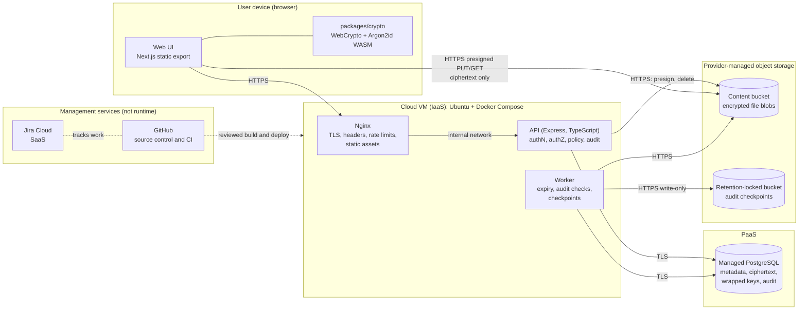

# System Overview

Status: Phase 0.5 baseline. Normative for implementation. Related: [data-flow.md](data-flow.md), [trust-boundaries.md](trust-boundaries.md), [data-model.md](data-model.md), [../crypto/cryptographic-architecture.md](../crypto/cryptographic-architecture.md).

## 1. Purpose and scope

CipherMesh is a web platform for small groups that need to exchange sensitive files, notes and one-time secrets inside **Secure Rooms**. Sensitive room content is encrypted in the browser before upload. The backend authenticates users, enforces authorization and security policy, stores ciphertext and wrapped keys, and records a tamper-evident audit trail.

## 2. Security goals

| ID | Goal | Primary mechanism |
|---|---|---|
| G1 | Confidentiality of room content against theft of the database, object storage or backups, and against cloud-provider or operator access to stored data | Client-side AES-256-GCM encryption; keys never reach the server in usable form |
| G2 | Integrity of room content and detection of ciphertext tampering | AES-GCM authentication tags with context-bound AAD; key commitments |
| G3 | Only authorized members can obtain room ciphertext and key envelopes | Server-side RBAC plus object-level authorization; per-member RSA-OAEP envelopes |
| G4 | Membership changes are reflected cryptographically for future content | Versioned room keys; the room is write-locked from a member's departure until a client-driven rekey activates a new version |
| G5 | Security-relevant actions are accountable and later modification is detectable | Hash-chained audit ledger with signed, externally anchored checkpoints |
| G6 | Handling rules follow the sensitivity of each room | Security profiles enforced by the API |
| G7 | Account takeover is hard and limited in effect | Argon2id, rate limiting, TOTP MFA, server-side sessions; the Vault Passphrase is separate from the login password |
| G8 | Members can check that they hold the same room key | Room Safety Code computed in each browser and compared over an independent channel (manual and optional) |

## 3. Non-goals

These are explicit, documented non-goals. See [../security/limitations.md](../security/limitations.md).

- Protecting plaintext on a compromised user device or browser.
- Protecting users who load the web application while the serving infrastructure is compromised (malicious JavaScript delivery).
- Preventing authorized recipients from copying plaintext they can read.
- Hiding metadata such as room names, membership, sizes and timing from the server.
- High availability or resistance to volumetric DDoS.
- Post-quantum confidentiality.
- Automatic detection of a compromised server that distributes a room key of its own (T-36). Authenticated key versions are open decision OCD-12.

## 4. System context

## 5. Components

| Component | Responsibility | Never does |
|---|---|---|
| Web UI (`apps/web`) | Rendering, user workflows, calling the API, calling `packages/crypto` | Persist unlocked keys or plaintext; render user content as HTML; load third-party scripts |
| Crypto package (`packages/crypto`) | Key generation, AES-GCM, RSA-OAEP, HKDF, SHA-256, Argon2id (Web Worker), canonical contexts | Accept caller-supplied IVs; use custom primitives; talk to the network |
| Nginx | TLS termination, HSTS, CSP and other headers, rate limits, body-size limits, static assets, `/api` proxy | Log request bodies or query strings of storage URLs; expose internal services |
| API (`apps/api`) | Registration, login, sessions, MFA, authorization, policy enforcement, room and membership management, envelope storage, presigned URLs, audit append | Receive or derive content keys; return raw database models; trust client-supplied roles |
| Worker (`apps/api`, separate entrypoint) | Expiry cleanup, cryptoperiod and abandoned-rekey handling, audit chain verification, signed checkpoints and export | Accept inbound connections |
| Managed PostgreSQL | Durable storage of users, sessions, rooms, memberships, key envelopes, encrypted notes and secrets, audit ledger | Hold any plaintext content or usable content keys |
| Provider-managed object storage | Encrypted file blobs, addressed by random object keys | Be publicly readable or listable |
| Anchor bucket | Retention-locked copies of signed audit checkpoints | Be writable by anything except the worker credential, which cannot delete |

The API and worker form a **modular monolith**: one codebase, one image, two entrypoints. There are no microservices, queues or orchestration layers ([ADR-001](adr/ADR-001-monorepo-architecture.md), [ADR-006](adr/ADR-006-cloud-service-models.md)).

## 6. Core domain concepts

- **User**: an account with an authentication password (Argon2id-hashed on the server), optional TOTP MFA, and a cryptographic identity.
- **Cryptographic identity (Vault)**: an RSA-OAEP-3072 key pair. The private key is stored only encrypted under a key derived from the Vault Passphrase ([cryptographic-architecture.md](../crypto/cryptographic-architecture.md)).
- **Secure Room**: a collaboration space with members, roles (OWNER, ADMIN, MEMBER, VIEWER), a security profile, versioned key material, encrypted content and an audit trail.
- **Security profile**: STANDARD, CONFIDENTIAL or RESTRICTED. Each profile is a set of backend-enforced controls ([security-policy-profiles.md](../security/security-policy-profiles.md)).
- **Room key version**: random 256-bit key material for one epoch of the room. It is distributed as per-member RSA-OAEP envelopes and replaced by a client-driven rekey.
- **Content items**: encrypted files (blob in object storage plus encrypted manifest), encrypted notes (current revision only), and recipient-bound secrets (optionally burn-after-reading). Each item has its own data-encryption key (DEK) and is encrypted with AES-256-GCM. File and note keys are wrapped with the room key, and a secret's key is wrapped to the recipient's public key.
- **Room key state**: ACTIVE, or write-locked (REKEY_REQUIRED, REKEYING) from the moment a member is lost until an OWNER or ADMIN browser completes a rekey ([ADR-013](adr/ADR-013-rekey-state-machine.md)).
- **Room Safety Code**: six words that each member's browser derives from the room key. Members compare them out of band to check that they hold the same key ([ADR-012](adr/ADR-012-room-safety-code.md)).
- **Invitation**: an in-app offer of membership to a registered user who already has a cryptographic identity, carrying pre-wrapped key envelopes.
- **Audit event**: an append-only, hash-chained record of a security-relevant action.

## 7. What the server can and cannot see

| Data | Visible to the server | Notes |
|---|---|---|
| Email, display name, login metadata | Yes | Needed for authentication and administration |
| Authentication password | Transiently during login and registration, over TLS | Stored only as an Argon2id hash |
| Vault Passphrase | **No** | Used only in the browser |
| User private key | **No** (only AES-GCM ciphertext) | Offline guessing against the Vault Passphrase is possible after database theft (threat T-22) |
| Room key material, DEKs | **No** (only wrapped forms) | |
| File content, filenames, MIME types | **No** (ciphertext and encrypted manifest) | Ciphertext size is visible |
| Note titles and bodies, secret payloads | **No** | |
| Room Safety Codes | **No** | Computed and shown only in browsers |
| Room names, membership, roles, security profile | Yes | Documented metadata exposure (T-28) |
| Timestamps, sizes, access events | Yes | Needed for policy and audit |
| Public keys and fingerprints | Yes | Public by design |

## 8. Key architectural decisions

| ADR | Decision |
|---|---|
| [ADR-001](adr/ADR-001-monorepo-architecture.md) | pnpm/TypeScript monorepo, modular monolith |
| [ADR-002](adr/ADR-002-client-side-encryption.md) | Client-side encryption of all sensitive room content |
| [ADR-003](adr/ADR-003-aes-256-gcm.md) | AES-256-GCM for all symmetric encryption and key wrapping |
| [ADR-004](adr/ADR-004-key-management.md) | Layered envelope encryption with versioned room keys |
| [ADR-005](adr/ADR-005-jira-cloud-management-saas.md) | Jira Cloud as project-management SaaS |
| [ADR-006](adr/ADR-006-cloud-service-models.md) | IaaS VM, PaaS managed PostgreSQL, SaaS Jira Cloud; object storage as provider-managed storage |
| [ADR-007](adr/ADR-007-asymmetric-key-wrapping.md) | RSA-OAEP-3072 with SHA-256 for room-key distribution (proposed) |
| [ADR-008](adr/ADR-008-server-side-sessions.md) | Opaque server-side sessions instead of JWTs |
| [ADR-009](adr/ADR-009-tamper-evident-audit-ledger.md) | Hash-chained audit ledger with signed, anchored checkpoints |
| [ADR-010](adr/ADR-010-browser-argon2id.md) | Argon2id in the browser for the Vault (proposed) |
| [ADR-011](adr/ADR-011-static-frontend-delivery.md) | Next.js static export served by Nginx (proposed) |
| [ADR-012](adr/ADR-012-room-safety-code.md) | Room Safety Code for manual key consistency checks |
| [ADR-013](adr/ADR-013-rekey-state-machine.md) | Client-driven rekey state machine with write lock |

## 9. Differentiating features and where they are designed

| Feature | Design location |
|---|---|
| Client-side encrypted Secure Rooms | [cryptographic-architecture.md](../crypto/cryptographic-architecture.md) sections 5 to 7 |
| Cryptographic room membership | [cryptographic-architecture.md](../crypto/cryptographic-architecture.md) section 7, [data-flow.md](data-flow.md) DF-05 and DF-06 |
| Envelope encryption | [key-hierarchy.md](../crypto/key-hierarchy.md) |
| Burn-after-reading secrets | [cryptographic-architecture.md](../crypto/cryptographic-architecture.md) section 11, [data-flow.md](data-flow.md) DF-09 |
| Expiring encrypted content | [data-model.md](data-model.md) section 5, [security-policy-profiles.md](../security/security-policy-profiles.md) |
| Security policy profiles | [security-policy-profiles.md](../security/security-policy-profiles.md) |
| Room-key rotation (rekey state machine) | [ADR-013](adr/ADR-013-rekey-state-machine.md), [key-lifecycle.md](../crypto/key-lifecycle.md), [data-flow.md](data-flow.md) DF-10 |
| Tamper-evident audit ledger | [ADR-009](adr/ADR-009-tamper-evident-audit-ledger.md), [data-flow.md](data-flow.md) DF-11 |
| Room Safety Code | [ADR-012](adr/ADR-012-room-safety-code.md), [cryptographic-architecture.md](../crypto/cryptographic-architecture.md) section 7.4, [security-ui.md](security-ui.md) section 2.3, [data-flow.md](data-flow.md) DF-13 |
| Crypto Inspector | [crypto-inspector.md](crypto-inspector.md) |
| Security Dashboard | [security-dashboard.md](security-dashboard.md) |

## 10. Out of scope for the baseline

Organizations and multi-tenancy, email delivery, self-service password reset by email, native or mobile apps, server-side search or preview of content, malware scanning of content, federation, and real-time co-editing. Each can be revisited through an ADR.
