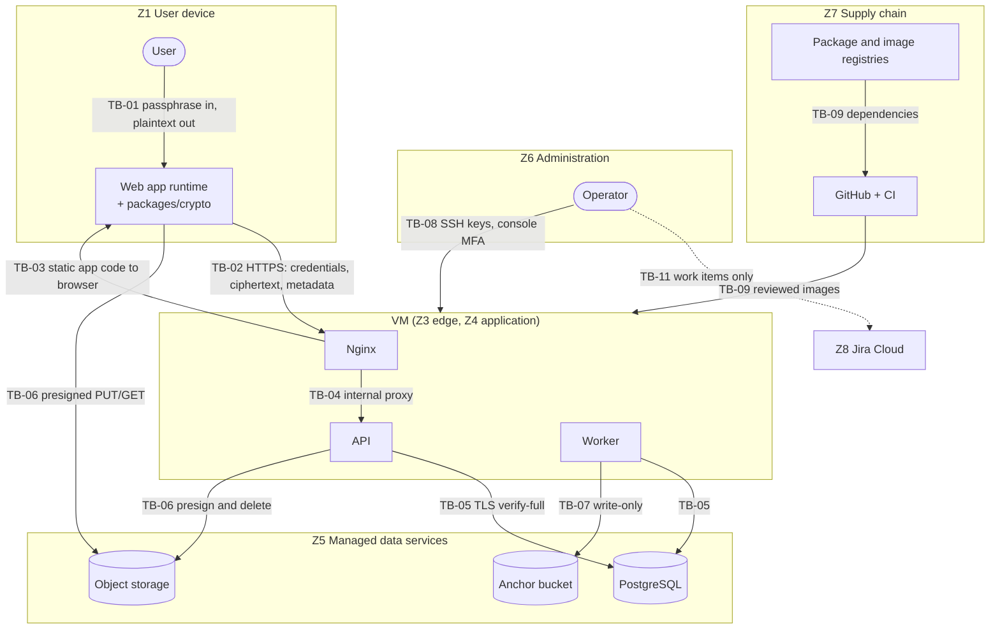

# Trust Boundaries

Status: Phase 0.5 baseline; TB-01 and TB-03 updated in Phase 4 (the Argon2id Web Worker and the vault). Related: [system-overview.md](system-overview.md), [data-flow.md](data-flow.md), [../threat-model/threat-model.md](../threat-model/threat-model.md).

A trust boundary is any point where data or control passes between parties that trust each other differently. Every boundary below has explicit validation and a list of what may cross it. Threat IDs (T-xx) refer to the threat model.

## 1. Trust zones

| Zone | Contents | Trusted for | Not trusted for |
|---|---|---|---|
| Z1 User device | Browser, web app runtime, `packages/crypto`, unlocked keys in memory | Its own user's plaintext and keys | Anything the server must enforce (roles, policy, quotas) |
| Z2 Internet | Networks between users and the VM | Nothing | Everything |
| Z3 VM edge | Nginx | TLS termination, header and rate-limit enforcement | Authorization decisions |
| Z4 VM application | API and worker containers on an internal Docker network | Authentication, authorization, policy, audit, metadata | Content confidentiality: it never holds content keys |
| Z5 Managed data services | Managed PostgreSQL (PaaS), provider-managed object storage (content and anchor buckets) | Durability and availability of stored data | Confidentiality of content (only ciphertext stored) |
| Z6 Administration | Operator workstation, SSH, cloud console | Operating the platform | Access to content keys (none exist server-side) |
| Z7 Supply chain | GitHub, CI runners, package registries, container registry | Delivering reviewed code | Unreviewed code, third-party packages without checks |
| Z8 Management SaaS | Jira Cloud | Work tracking and evidence | Secrets, credentials, production data |

## 2. Boundary diagram

TB-10 (member to member) is logical: it runs through the API and is not drawn separately. TB-12 (people comparing fingerprints and Room Safety Codes out of band) lies outside the system and is not drawn.

## 3. Boundary catalogue

### TB-01 User and browser runtime
- **Crosses:** Vault Passphrase and auth password typed by the user; decrypted content displayed to the user.
- **Risks:** compromised device, malicious extensions, shoulder surfing, clipboard leakage (T-23).
- **Controls:** keys held only in memory; non-extractable `CryptoKey` objects; vault auto-lock on inactivity; no persistence of plaintext or unlocked keys in browser storage; guidance for RESTRICTED rooms (dedicated browser profile, no extensions).
- **Inner boundary, page to Argon2id Web Worker (Phase 4):** the page transfers the passphrase bytes, the salt and the parameters to a fresh dedicated worker loaded from the same origin; the worker returns only the 32-byte result. Both sides validate every message (`packages/crypto/src/kdf/protocol.ts`): the worker accepts one request of the expected shape with parameters inside floor and ceiling, and the page accepts only a 32-byte answer. The worker wipes its copy of the passphrase and is terminated after each derivation. It is part of Z1 and runs under the same CSP, so it is a resource and isolation boundary, not a trust boundary against the page.
- **Implementation (Phase 4):** unlock in memory only, verified by Playwright inspection of cookies, localStorage, sessionStorage, IndexedDB and the Cache API in three engines; auto-lock after 15 minutes without trusted input, on sign-out, on `pagehide` and when the session ends ([../crypto/vault.md](../crypto/vault.md) section 6.3).
- **Residual:** a compromised device sees everything its user sees. Documented limitation (L-01); the auto-lock is client-side only (L-38).

### TB-02 Browser to Nginx over the internet
- **Crosses:** credentials at login and registration, session cookie, CSRF-relevant headers, ciphertext of notes and secrets, wrapped keys, metadata.
- **Never crosses:** Vault Passphrase, vault-derived keys, plaintext private keys, room key material, DEKs, plaintext content.
- **Controls:** TLS 1.2 or 1.3 only, HSTS, `__Host-` cookie with HttpOnly, Secure and SameSite=Strict, same-origin verification (`Sec-Fetch-Site` or exact `Origin`) and the `X-CipherMesh-Request` header on every state-changing request including login (INV-19), request-size limits, rate limits, schema validation in the API.

### TB-03 Code delivery from server to browser
- **Crosses:** the JavaScript, WebAssembly and HTML that perform all client-side cryptography.
- **Why it matters:** this is the weakest point of any web-based client-side encryption design. Whoever controls the served code controls the keys the moment a user unlocks the Vault (T-24).
- **Controls:** static assets built in CI from reviewed commits; content-hashed, immutable filenames; strict CSP (`script-src 'self'` plus hashes, `'wasm-unsafe-eval'` only for Argon2id, no `'unsafe-inline'` or `'unsafe-eval'`; since Phase 4 the Argon2id WebAssembly is embedded in a same-origin script bundle, so no separate WebAssembly file is fetched, and `form-action 'none'` refuses native form submissions, SF-04-01); no third-party runtime scripts; Subresource Integrity where the build supports it; published build hashes per release.
- **Residual:** no browser mechanism lets users pin application code for ordinary websites. Documented limitation L-02.

### TB-04 Nginx to API
- **Crosses:** proxied HTTP requests, client IP in `X-Forwarded-For`.
- **Controls:** API reachable only on the internal Docker network (no published host port); API trusts forwarded headers only from the Nginx hop; Nginx strips hop-by-hop and spoofable headers; request IDs assigned at the edge.
- **Implementation (Phase 3):** `TRUST_PROXY_HOPS` decides whether the API reads the client address from exactly one `X-Forwarded-For` hop (1, production behind Nginx) or ignores forwarded headers (0, the default). The address feeds rate limiting and the session list, so it must never be client-chosen.

### TB-05 Application to managed PostgreSQL
- **Crosses:** metadata, ciphertext, wrapped keys, Argon2id hashes, session digests, audit events.
- **Controls:** TLS with certificate verification (`verify-full` or the provider equivalent); access restricted to the VM by private networking or an IP allowlist; separate database roles for migrations, API and worker with least privilege; append-only grants on the audit table; provider encryption at rest as an additional layer. Migration and database-owner credentials are never stored on the VM.
- **Residual:** a database-level attacker can read metadata and tamper with records. Tampering with ciphertext is detected by AES-GCM. Tampering with the audit chain is detected up to the last anchored checkpoint.
- **Implementation (Phase 2):** roles `cm_migrator`, `cm_api`, `cm_worker`, `cm_verifier` with a tested grant matrix; append-only triggers on `audit_events`; the API accepts only `cm_api` and requires `sslmode=verify-full` in production. Details: [../security/database-security.md](../security/database-security.md).

### TB-06 Object storage (API and browser)
- **Crosses:** encrypted file blobs only.
- **Controls:** private bucket with public access blocked; objects named by random identifiers, never by filename; presigned URLs issued only after authorization, scoped to one object and one method, valid for at most 5 minutes; CORS limited to the application origin and to `PUT` and `GET`; API credential scoped to the content bucket; downloads forced to `application/octet-stream` with `Content-Disposition: attachment`.

### TB-07 Worker to anchor bucket
- **Crosses:** signed audit checkpoints (public integrity data).
- **Controls:** separate bucket with object versioning and a compliance-mode retention lock where the provider supports it; the worker credential can write but not delete or overwrite; public verification keys and revoked key IDs published in the repository; a weekly external witness copy outside the cloud account.
- **Residual:** at Level 1 the signing key lives on the VM, so a VM compromise also compromises future checkpoint signatures (L-25, ADR-009 section 8).

### TB-08 Administration
- **Crosses:** SSH sessions, deployment commands, cloud-console configuration changes.
- **Controls:** SSH key authentication only, no root login, SSH reachable only from allowlisted source addresses; MFA on cloud console, GitHub and Jira accounts; named individual accounts; changes tracked through Jira and pull requests.

### TB-09 Supply chain
- **Crosses:** third-party packages, base images, CI actions, built images.
- **Controls:** lockfile, minimal dependencies, dependency review in pull requests, automated vulnerability and secret scanning, dependency lifecycle scripts blocked unless allowlisted, CI actions pinned to commit SHAs, SBOM generation, images built from pinned base images.

### TB-10 Member to member (logical)
- **Crosses:** shared ciphertext and room key material among members of the same room.
- **Controls:** role-based permissions; per-item ownership rules; one immutable commitment per key version, which detects inconsistent envelopes while the server is honest; Room Safety Code comparison over TB-12, which detects split views; audit of membership and key changes; write lock and rekey after any member is lost (ADR-013).
- **Residual:** members can read and copy everything their role allows. A shared room key authenticates "a member of this room", not an individual author (limitation L-09). A server-side attacker can distribute a key of its own to every member, and neither the commitment nor the Safety Code reveals it (T-36, OCD-12).

### TB-11 Project team to Jira Cloud
- **Crosses:** work items, security findings, evidence screenshots.
- **Never crosses:** secrets, credentials, private keys, production data, unredacted logs.
- **Controls:** MFA, team-only project permissions, restricted visibility for open security findings, redaction rules from the evidence plan.

### TB-12 People comparing values out of band
- **Crosses:** public-key fingerprints and Room Safety Codes, compared by people in person or by voice or video.
- **Why it matters:** it is the only channel the CipherMesh server cannot influence. Fingerprint comparison detects key substitution (T-25). Safety Code comparison detects split views, where members hold different keys (T-29).
- **Controls:** UI guidance on how to compare; codes never sent through CipherMesh; RESTRICTED rooms require fingerprint confirmation and prompt Safety Code comparison ([security-ui.md](security-ui.md)).
- **Residual:** people may skip the comparison or use a channel an attacker controls (L-18, L-22).

## 4. Validation rules at boundaries

1. Every API request is validated against a schema from `packages/validation`. Unknown fields are rejected.
2. Identifiers in paths and bodies must be well-formed UUIDs. The object they reference must belong to the room in the path, and the caller must be an active member (object-level authorization).
3. Roles, ownership and policy are read from the database on every request. Nothing the client sends is trusted for authorization.
4. The client validates API responses against schemas before using them, and verifies key commitments and fingerprints before using key material. It computes the Room Safety Code only from key material it decrypted itself.
5. Ciphertext received from storage is authenticated by AES-GCM before any plaintext is shown.
6. Configuration crossing into the process (environment variables and secret files) is validated at startup. The process refuses to start on missing or malformed security settings.
