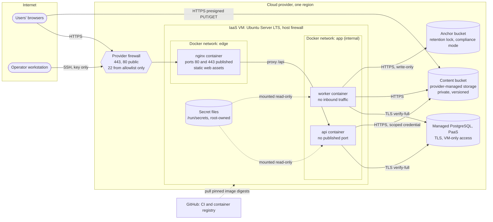

# Deployment Architecture

Status: Phase 0.5 design, provider-neutral. Nothing has been provisioned. Implementation: Phases 17 to 19. Related: [service-models.md](service-models.md), [shared-responsibility.md](shared-responsibility.md), [../architecture/trust-boundaries.md](../architecture/trust-boundaries.md).

## 1. Topology

## 2. Network exposure

| Endpoint | Exposed to | Port | Notes |
|---|---|---|---|
| Nginx HTTPS | Internet | 443 | TLS 1.2 and 1.3 only |
| Nginx HTTP | Internet | 80 | Redirect to HTTPS and ACME challenges only |
| SSH | Allowlisted operator addresses | 22 | Key authentication only |
| API | Nginx only, internal Docker network | none published | |
| Worker | No inbound | none | Outbound to database and storage only |
| PostgreSQL | The VM only | provider port | Private networking or IP allowlist |
| Object storage | Browsers through presigned URLs; API and worker with credentials | 443 | Bucket private |
| Docker socket | Nobody | not applicable | Never mounted into containers |

**Docker and the host firewall:** Docker inserts its own packet-filter rules for published ports, which can bypass host firewall tools such as UFW. Controls: the provider firewall is the primary filter; only Nginx publishes ports (80 and 443); any debugging port is bound to 127.0.0.1; if host-level filtering of container traffic is needed, rules go into the `DOCKER-USER` chain.

## 3. Containers

| Service | Image | Security settings |
|---|---|---|
| nginx | Pinned official Nginx image with the static build and configuration | Runs as non-root (unprivileged variant), read-only root filesystem with tmpfs for cache, `cap_drop: ALL` (plus the minimum needed to bind ports if not using high ports), `no-new-privileges` |
| api | CipherMesh image (Node.js LTS, production dependencies only) | Non-root user, read-only root filesystem, tmpfs for `/tmp`, `cap_drop: ALL`, `no-new-privileges`, memory and CPU limits, health check |
| worker | Same image as api, different command | Same as api, no network aliases on the edge network. The only container that mounts the audit signing key |

Rules for all containers: images pinned by digest, no `privileged`, no host network, no Docker socket, secrets mounted as files under `/run/secrets` (never as build arguments or baked into layers), log rotation configured, restart policy `unless-stopped`.

## 4. Nginx responsibilities

- TLS termination with certificates from an ACME certificate authority, automatic renewal, configuration based on the Mozilla "intermediate" profile (CP-21).
- HTTP to HTTPS redirect; HSTS after a staged rollout.
- Serve static assets with long cache lifetimes for content-hashed files and `no-cache` for HTML.
- Proxy `/api/` to the API container; strip spoofable forwarding headers and set trusted ones.
- Rate limiting zones for login, registration, MFA, user lookup and the general API; request body limits (small for the API, since files go directly to storage).
- `server_tokens off`; deny dotfiles and source maps.
- Access logs without query strings for sensitive paths and without request bodies.

Security headers set by Nginx:

| Header | Value (baseline) |
|---|---|
| Content-Security-Policy | `default-src 'none'; script-src 'self' 'wasm-unsafe-eval' <build hashes>; style-src 'self' <build hashes>; img-src 'self' blob:; connect-src 'self' https://<storage endpoint>; worker-src 'self'; font-src 'self'; manifest-src 'self'; form-action 'self'; frame-ancestors 'none'; base-uri 'none'; object-src 'none'; upgrade-insecure-requests` |
| Strict-Transport-Security | `max-age=31536000` after a staged rollout; `includeSubDomains` only if every subdomain is HTTPS |
| X-Content-Type-Options | `nosniff` |
| Referrer-Policy | `no-referrer` |
| Permissions-Policy | Deny camera, microphone, geolocation, payment, USB and similar features |
| Cross-Origin-Opener-Policy | `same-origin` |
| Cross-Origin-Resource-Policy | `same-origin` |
| X-Frame-Options | `DENY` (legacy browsers; `frame-ancestors` is authoritative) |
| Cache-Control (API responses) | `no-store` |
| Access-Control-Allow-Origin | Never sent. The API grants no CORS access ([../security/session-and-csrf.md](../security/session-and-csrf.md)) |

The exact CSP is validated in Phase 1 against the Next.js static export (ADR-011). No `'unsafe-inline'` or `'unsafe-eval'` for scripts.

## 5. Secrets and credentials

| Secret | Consumer | Storage |
|---|---|---|
| Database credentials (per role) | api, worker | Secret file, mode 0400, owned by the container user |
| Object-storage credentials (scoped) | api, worker | Secret file |
| Anchor-bucket write-only credential | worker | Secret file |
| TOTP_ENCRYPTION_KEY, IDENTIFIER_HMAC_KEY | api | Secret file |
| Audit signing key, Level 1 (Ed25519 private key) | worker only | Secret file mounted only into the worker container, with an offline backup on the operator workstation. Level 2 option: provider key service with no key file on the VM (OCD-13) |
| Database migration and owner credentials | operator, during deployments | Never stored on the VM. Used from the operator workstation |
| TLS private key | nginx | File readable only by the Nginx user |

Secrets never appear in the repository, images, CI logs, Jira or evidence screenshots. The API validates configuration at startup and refuses to start if a secret is missing or malformed. A managed secret store is an optional enhancement.

## 6. Data services configuration

- **PostgreSQL:** TLS required and verified (`sslmode=verify-full` or equivalent) with the provider CA certificate; one role per component; runtime roles without DDL rights; no UPDATE or DELETE on audit tables; connection limits; backups with documented retention; point-in-time recovery enabled; restore test recorded.
- **Content bucket:** public access blocked; bucket policy denies non-HTTPS access where supported; CORS for the application origin with PUT and GET only; versioning on; lifecycle rules for old versions and abandoned uploads; objects named by random IDs.
- **Anchor bucket:** retention lock in compliance mode where supported, with a retention period of at least one year. The worker credential can write only. Public verification keys and revoked key IDs are published in the repository.

## 7. Operations

- **Patching:** unattended security upgrades for the OS; monthly rebuild of images with updated base images; documented reboot procedure.
- **Time:** NTP synchronization, needed for TOTP and audit timestamps.
- **Logging:** Nginx and application logs in JSON with rotation; redaction enforced in the application; logs kept on the VM for a limited period; optional export to a log service is out of scope.
- **Monitoring:** container health checks, disk usage alerts, certificate-expiry check, daily audit verification result on the Security Dashboard.
- **Audit witness:** at least weekly, and at every release, the operator copies the latest signed checkpoint to the repository or release notes and to an offline store ([ADR-009](../architecture/adr/ADR-009-tamper-evident-audit-ledger.md)).
- **Backups:** the VM holds almost no state (configuration is in Git, secrets are re-creatable). Database and storage backups are provider-managed with team-configured retention and tested restores.

## 8. Build and deployment

1. A merged pull request triggers CI: lint, typecheck, all tests, scans and SBOM generation.
2. CI builds the web static export and the API image, records artifact hashes and pushes the image to the GitHub container registry.
3. The operator deploys over SSH by pulling the image by digest and restarting the Compose stack. Database migrations run as a separate step with the migration role, from the operator workstation. The migration credential is never stored on the VM.
4. After deployment, a smoke test and a comparison of served asset hashes with the release hashes run (T-24).
5. The deployment is recorded in Jira with the release version.

## 9. Environments

| Environment | Purpose | Data |
|---|---|---|
| Local development | `infrastructure/docker/compose.dev.yml`: PostgreSQL 17.11 and the SeaweedFS S3 emulator (OD-03, chosen in Phase 1), both digest-pinned and bound to 127.0.0.1 (docs/architecture/engineering-baseline.md section 5) | Synthetic only |
| Production (demonstration) | The cloud deployment | Synthetic demonstration data only; no real personal data |

Production credentials are never used in development. Test and demonstration data are synthetic (ISO/IEC 27001:2022 controls 8.31 and 8.33).

## 10. VM hardening baseline (checklist for Phase 19)

- [ ] Latest Ubuntu LTS image, all updates applied, unattended security upgrades enabled
- [ ] Non-root operator account with sudo; root login disabled
- [ ] SSH: `PasswordAuthentication no`, `KbdInteractiveAuthentication no`, `PermitRootLogin no`, `AllowUsers` set, `MaxAuthTries 3`, forwarding disabled unless needed
- [ ] Provider firewall: inbound 443 and 80 from anywhere, 22 from allowlisted addresses only, everything else denied
- [ ] Host firewall enabled with the same policy; Docker port-publishing caveat handled
- [ ] Unused services removed; listening ports reviewed with `ss -tulpn`
- [ ] Docker installed from the official repository; daemon configured with log rotation and `no-new-privileges` default
- [ ] Brute-force protection for SSH considered (rate limiting at the provider firewall or a tool such as fail2ban)
- [ ] Time synchronization active
- [ ] Lynis audit run and report stored as evidence; findings triaged in Jira
- [ ] Docker Bench for Security run and report stored as evidence
- [ ] External scan (nmap) shows only 22 (from the allowlist), 80 and 443
- [ ] TLS scan grade recorded
- [ ] Audit signing key file present only in the worker container (mode 0400); no migration or database-owner credentials anywhere on the VM
