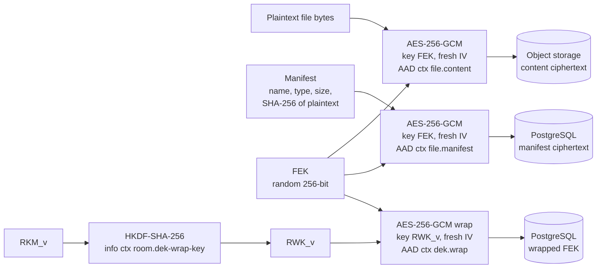
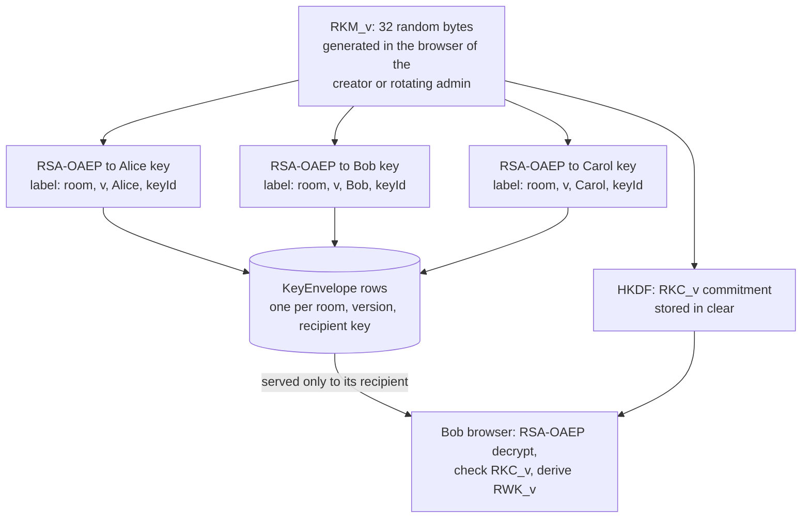

# Cryptographic Architecture

Status: Phase 0.5 baseline. Normative. Algorithms and parameters are defined only in [crypto-decisions.md](crypto-decisions.md) (CP-xx). Related: [key-hierarchy.md](key-hierarchy.md), [key-lifecycle.md](key-lifecycle.md), [../architecture/data-flow.md](../architecture/data-flow.md).

## 1. Goals

1. Room content (files, notes, secrets) is encrypted in the browser with authenticated encryption before it leaves the device.
2. The server stores only ciphertext and wrapped keys for room content, so theft of the database, object storage or backups does not reveal content.
3. Only members who hold a key envelope for a room key version can decrypt content protected by that version.
4. Tampering with stored ciphertext, wrapped keys or their context is detected before any plaintext is shown.
5. Membership changes produce new key versions for future content.
6. Every construction uses established primitives through WebCrypto or vetted libraries. Nothing is invented.

## 2. Adversaries the cryptography addresses

| Adversary | Protected by cryptography? | Notes |
|---|---|---|
| Thief of database, object storage or backups | Yes, for content | Metadata remains visible. Weak Vault Passphrases can be guessed offline (T-22) |
| Cloud provider or operator reading stored data | Yes, for content | Provider encryption at rest is an extra layer, not the main control |
| Attacker who modifies stored ciphertext or envelopes | Detected | AES-GCM tags plus context binding; availability can still be harmed |
| Removed member, for future content | Yes, once the rekey completes | The room is write-locked until a new key version exists (ADR-013) |
| Removed member, for content already obtained | No | Nothing can revoke knowledge (L-04) |
| Malicious member | Partly | Can read what their role allows; cannot make members hold different room keys while the server is honest (commitment) |
| Server-side attacker distributing a room key of its own | Not in the baseline | Detectable only after OCD-12 (section 7.6, T-36) |
| Server-side attacker showing different keys to different members | Only if members compare Room Safety Codes | Section 7.4 |
| Attacker controlling the server and the served JavaScript | No | Can capture passphrases and plaintext (L-02) |
| Compromised user device | No | L-01 |

## 3. Primitives

| Purpose | Primitive | Register |
|---|---|---|
| Content encryption and all symmetric key wrapping | AES-256-GCM with AAD | CP-01 |
| Wrapping 32-byte key material to users: room key material and SEKs (never content) | RSA-OAEP-3072, SHA-256, with OAEP label | CP-02 (proposed), INV-17 |
| Key separation, key commitments and the Room Safety Code | HKDF-SHA-256 | CP-03, CP-24 |
| Vault Passphrase to key | Argon2id (browser, WASM) | CP-04 |
| Account password storage | Argon2id (server) | CP-05 |
| Fingerprints, ciphertext hashes, audit chain, token digests | SHA-256 | CP-07 |
| Audit checkpoints | Ed25519 | CP-14 |
| Canonical encoding of contexts and audit records | RFC 8785 JCS | CP-15 |

## 4. Two separate secrets

| | Authentication password | Vault Passphrase |
|---|---|---|
| Purpose | Proves account identity to the server | Protects the private key of the cryptographic identity |
| Sent to the server | Yes, over TLS, at login and registration | **Never** |
| Stored by the server | Argon2id hash (CP-05) | Nothing: no hash, no verifier |
| Consequence of loss | Administrator-assisted reset (audited); no content is lost | Personal key is lost; room access is restored when admins re-share room keys to a new key pair |
| Consequence of theft | Attacker can log in (unless MFA) and see metadata and ciphertext, but cannot decrypt | Combined with the encrypted private key, attacker can decrypt everything the user could |

Alternatives considered: deriving both from one password on the client (the approach of some password managers, which send a derived authentication hash) and OPAQUE (an asymmetric password-authenticated key exchange). Both would allow a single secret, but add protocol complexity and make the separation harder to demonstrate. The two-secret design is simpler, explainable and matches the project requirement. The UX cost (two secrets) is accepted and documented.

## 5. The Vault (cryptographic identity)

### 5.1 Creation
1. The browser generates an RSA-OAEP-3072 key pair (CP-02) and a key ID.
2. It generates a 128-bit random salt and derives the Vault Root Key: `VRK = Argon2id(NFKC(passphrase), salt, params)` inside a Web Worker (CP-04).
3. It derives the Private-Key Wrapping Key: `PKWK = HKDF-SHA-256(VRK, info = ctx vault.pk-wrap)`, imported as a non-extractable AES-GCM key with usages `wrapKey` and `unwrapKey` only.
4. It wraps the private key: `encryptedPrivateKey = AES-256-GCM-wrap(PKCS#8, PKWK, fresh IV, AAD = ctx vault.private-key)`.
5. It uploads the SPKI public key, its SHA-256 fingerprint (CP-17), the encrypted private key, IV, salt and Argon2id parameters.
6. The server validates key type and size, fingerprint, and that parameters meet the floor, then stores the record. It never receives the passphrase, VRK, PKWK or private key.

### 5.2 Unlock and lock
- The browser fetches its own vault record, refuses parameters below the floor, derives VRK and PKWK, and unwraps the private key as **non-extractable** with usages `decrypt` and `unwrapKey`.
- It then runs a pair check: encrypt a random 32-byte value to the SPKI returned by the server and decrypt them with the unwrapped private key. This detects a server that returns a public key that does not match the private key.
- Unlocked keys live only in memory. Nothing unlocked is written to localStorage, sessionStorage, IndexedDB or cookies.
- The vault locks after 15 minutes of inactivity (CP-22), on logout, on tab close, and when the API reports the session as invalid or revoked. Locking drops all references to keys and decrypted content. JavaScript cannot guarantee memory wiping (L-15), so this is best effort.

### 5.3 Passphrase change
The browser unlocks with the old passphrase, derives a new VRK from a **new salt**, re-wraps the same private key and replaces the stored record. This does not help against an attacker who already has the old encrypted blob and knows the old passphrase. That case requires an identity-key reset (see [key-lifecycle.md](key-lifecycle.md)).

### 5.4 Lost passphrase
There is no server-side recovery by design. The user resets the vault, which generates a new key pair. Room OWNERs and ADMINs then re-share current room keys to the new public key. Content under earlier key versions is only recoverable if the history policy of the room lets the admin re-share those versions. An optional printable recovery key is tracked as OCD-10.

### 5.5 Browser-side Argon2id considerations
- WebCrypto does not provide Argon2. A WASM implementation is required (LIB-03), selected in Phase 4 against RFC 9106 test vectors.
- Derivation runs in a Web Worker so the UI stays responsive.
- Memory is the main constraint. Browsers limit WebAssembly memory and mobile devices have less of it. Parameters are chosen by benchmark with the floor as a hard minimum. They are stored per vault, so they can be raised later by re-wrapping.
- Browser WASM is usually single-threaded, so the parallelism parameter stays at 1.
- The Content Security Policy must allow `'wasm-unsafe-eval'` to compile WebAssembly. Nothing else about script restrictions is relaxed.
- There is **no fallback** to PBKDF2 or any weaker KDF (CD-14, INV-15).
- The Argon2id output and the passphrase string are overwritten where the language allows (typed arrays) and dropped immediately. Strings are immutable in JavaScript, so this is best effort.
- Because an attacker who steals the database can guess passphrases offline at the Argon2id cost, passphrase length (CP-06) and strength feedback matter more than any server-side control.

## 6. Envelope encryption of content

Every content item gets its own random 256-bit Data Encryption Key (DEK). The DEK encrypts the item with AES-256-GCM and is then wrapped. The item is never encrypted directly with an asymmetric key.

| Item | DEK name | DEK is wrapped by | Ciphertext stored in |
|---|---|---|---|
| File (content and manifest) | FEK | RWK_v (room wrapping key) with AES-256-GCM | Object storage (content), PostgreSQL (manifest, wrapped FEK) |
| Note revision (title and body) | NEK | RWK_v with AES-256-GCM | PostgreSQL |
| Secret | SEK | Recipient public key with RSA-OAEP (the 32-byte SEK only) | PostgreSQL |

### 6.1 File encryption flow



Rules:
- Files up to the single-shot limit (CP-19) are encrypted in one AES-GCM operation. WebCrypto has no streaming AES-GCM, and a chunked design would need its own ADR (OCD-09).
- The server stores the SHA-256 of the **ciphertext** as a storage-integrity reference. The SHA-256 of the **plaintext** exists only inside the encrypted manifest (CD-09).
- On download, the browser authenticates the manifest and the content before showing or saving anything. A failed tag produces an integrity error and no plaintext.

### 6.2 Notes
Each save creates a fresh NEK for the new revision. The AAD contains the revision number, so ciphertext from another note or another revision fails authentication. Only the current revision is stored.

### 6.3 Secrets

Secrets use the same envelope pattern as files and notes (CD-06):

1. The sender's browser generates a fresh random 256-bit **SEK** for the secret.
2. It encrypts the plaintext with AES-256-GCM under the SEK, with a fresh 96-bit IV and AAD = ctx `secret.payload`.
3. It wraps the 32-byte SEK to the recipient's ACTIVE public key with RSA-OAEP, using the OAEP label ctx `secret.sek-wrap`. The label binds the room, secret, recipient user, recipient key and suite.
4. The API stores only the payload ciphertext (including the 128-bit tag), the IV, the wrapped SEK, the algorithm suite and the non-secret context identifiers.

Only the recipient can unwrap the SEK, so other room members cannot decrypt the secret even if they obtain the ciphertext. Burn-after-reading is described in section 11.

### 6.4 Why RSA-OAEP never encrypts content

RSA-OAEP is used only on 32-byte random values: room key material, SEKs and the vault's pair-check value (INV-17, CD-17).

- **Size:** RSA-OAEP-3072 with SHA-256 accepts at most 318 bytes per operation. Content would need chunking or a hybrid scheme built by hand.
- **Right tool:** authenticated symmetric encryption is fast, handles any length and binds context through the AAD. RSA-OAEP is slow and exists to transport small keys.
- **One pattern:** every content type follows the same path of data key, AES-256-GCM, then key wrap. Only the wrapping step changes with the audience: the room wrapping key for room items, the recipient's public key for secrets.
- **Testability:** one content-encryption code path means one set of known-answer and tamper tests covers files, notes and secrets. The RSA wrapper rejects any input that is not 32 bytes, and a test checks this.
- **Agility:** replacing RSA-OAEP later, for example with a post-quantum KEM, changes only the key-wrapping step.

## 7. Room keys and cryptographic membership

### 7.1 Room key material and derived keys
- For each room key version `v`, the creating browser generates **RKM_v**: 32 random bytes (CP-23). It exists in plaintext only inside browsers of members.
- Every member derives three values with HKDF-SHA-256 (CP-03):
  - `RWK_v = HKDF(RKM_v, info = ctx room.dek-wrap-key)`: a non-extractable AES-256-GCM key with usages `wrapKey` and `unwrapKey`. It wraps and unwraps DEKs.
  - `RKC_v = HKDF(RKM_v, info = ctx room.commitment)`: 32 bytes stored in the clear on the RoomKeyVersion record. It is a **key commitment**, not a key.
  - `RSC_v = HKDF(RKM_v, info = ctx room.safety-code)`: the Room Safety Code. It is computed only in the browser and shown to the member (section 7.4). It is never sent or stored.
- RKM_v is never used directly for encryption. That keeps the wrapping key, the commitment and the Safety Code cryptographically separated (principle 6, key separation).

### 7.2 Envelopes
For each recipient key, the sharer computes `envelope = RSA-OAEP-Encrypt(recipientPublicKey, RKM_v, label = ctx room.envelope)`. The label binds the envelope to the room, version, recipient user and recipient key. Moving an envelope to another context makes decryption fail.



### 7.3 Commitment check and its limits

After decrypting an envelope, the browser recomputes RKC_v and compares it with the commitment the API returned for that version. The server stores exactly one commitment per room and version when the version is activated, and never changes it. On mismatch the browser refuses to use the key, shows a security alert and reports `KEY_COMMITMENT_MISMATCH`.

What the commitment detects:
- a malicious member or ADMIN who wraps different key material for different members while the server behaves honestly. AES-GCM is not key-committing (CD-13), so without this check such keys could make one ciphertext decrypt differently for different members;
- envelopes altered in the database without also changing the commitment;
- implementation bugs that produce inconsistent envelopes.

What it does **not** detect:
- a server, or an attacker controlling API responses, that shows different commitments and matching envelopes to different members (a split view). The commitment comes from the same server, and the server can create envelopes itself because RSA-OAEP needs only public keys;
- a key version that every member receives consistently from an attacker (section 7.6);
- a server that withholds newer versions from some members (rollback).

Split views are detected only when members compare their Room Safety Codes (section 7.4).

### 7.4 Room Safety Code

The Room Safety Code lets members check by hand that they hold the same room key ([ADR-012](../architecture/adr/ADR-012-room-safety-code.md), CP-24).

```
RSC_v = HKDF-SHA-256(IKM = RKM_v, salt = 32 zero bytes,
                     info = ctx room.safety-code {roomId, keyVersion}, L = 32 bytes)
code  = first 66 bits of RSC_v as six 11-bit indices into a fixed 2048-word list (LIB-08)
```

- It is computed only in the browser, after the envelope is decrypted and the commitment check has passed. It is never sent to the server, stored or logged (INV-18).
- It changes whenever the key material, the key version or the room changes. It reveals nothing useful about RKM_v, because HKDF is one-way, only 66 of 256 bits are shown and the context differs from every other derived key.
- Members compare the six words and the key version over an independent channel: in person, or by voice or video with someone they recognise. Matching codes mean they hold the same key material. A mismatch means a split view or a rollback, and the UI tells them to stop adding content and alert the OWNER out of band.
- 66 bits make a brute-force search for a colliding key impractical even for an attacker who learns one member's code early. A 20 to 30 bit code would not be safe.
- **Limits (L-22):** it detects inconsistency only when members actually compare. It says nothing about who else holds the key. It does not detect a key that all members received from an attacker (section 7.6), or key substitution where the attacker re-wraps the real key. Malicious JavaScript can display a fake code (L-02). It is an optional manual check, never automatic protection.

### 7.5 The public-key directory problem

The server distributes public keys. An attacker who controls the server or can write to the database could therefore substitute an invitee's public key and receive the room key (T-25). Controls:
- Every public key has a SHA-256 fingerprint (CP-17), shown in the UI to its owner and to inviters.
- In RESTRICTED rooms the inviter must confirm the fingerprint, compared out of band. The API checks that the confirmed value equals the invitee's current key. The API cannot prove that the human comparison happened (L-18).
- A user's public key is immutable per key ID. A new key is a new key ID. That invalidates pending invitations, and the change is recorded in the audit log and shown to room administrators.
- The OAEP label contains the recipient key ID, so an envelope is bound to one specific key.
- The rekeying client shows the recipient list with fingerprints before wrapping (ADR-013).

The Room Safety Code does not detect substitution when the attacker unwraps the room key and re-wraps it to the victim's real key: everyone then holds the same key. Fingerprint comparison is the control. Residual risk: users who skip out-of-band verification can be attacked by an active server-side adversary. Fingerprint pinning is tracked as OCD-06.

### 7.6 Unauthenticated key distribution (open decision OCD-12)

RSA-OAEP provides no sender authentication, and anyone can encrypt to a public key. A server-side attacker with database write access or control of API responses can therefore create a key version of its own and wrap it to every member. It can then store a matching commitment and make that version current. Every member accepts it, and every Safety Code matches, because all members hold the same attacker-known key. New content would then be readable by the attacker (T-36, L-23).

The baseline has no cryptographic defence against this. Only server-side controls apply: authorization of rekey operations, least-privilege database roles and audit. OCD-12 decides the fix before Phase 4 (CM-T086). The recommended option is per-user ECDSA P-256 signing keys that sign key-version packages and envelopes, with the fingerprint covering both of a user's public keys.

### 7.7 History access
The security profile decides which versions a new member receives:
- STANDARD and CONFIDENTIAL: all retained versions (full history).
- RESTRICTED: the current version only. Content encrypted under the current version before joining stays readable. For strict isolation, an admin runs a manual rekey before inviting.

## 8. Canonical contexts

Every AAD, OAEP label and HKDF info value is `JCS({ctx, v, ...fields})` (CP-15). Field sets are fixed; missing optional values are serialized as `null`, never omitted.

| `ctx` value | Used as | Additional fields |
|---|---|---|
| `cm.vault.pk-wrap` | HKDF info for PKWK | userId, keyId |
| `cm.vault.private-key` | AES-GCM AAD for the private-key wrap | userId, keyId, suite |
| `cm.room.envelope` | RSA-OAEP label for RKM_v | roomId, keyVersion, recipientUserId, recipientKeyId, suite |
| `cm.room.dek-wrap-key` | HKDF info for RWK_v | roomId, keyVersion |
| `cm.room.commitment` | HKDF info for RKC_v | roomId, keyVersion |
| `cm.room.safety-code` | HKDF info for the Room Safety Code RSC_v | roomId, keyVersion |
| `cm.dek.wrap` | AES-GCM AAD for a DEK wrapped under RWK_v | roomId, keyVersion, itemType, itemId, revision (0 for files) |
| `cm.file.content` | AES-GCM AAD for file content | roomId, fileId |
| `cm.file.manifest` | AES-GCM AAD for the file manifest | roomId, fileId |
| `cm.note.content` | AES-GCM AAD for a note revision | roomId, noteId, revision |
| `cm.secret.sek-wrap` | RSA-OAEP label for the 32-byte SEK | roomId, secretId, recipientUserId, recipientKeyId, suite |
| `cm.secret.payload` | AES-GCM AAD for the secret payload | roomId, secretId |
| `cm.srv.totp` | AES-GCM AAD for server-side TOTP secret encryption | userId, keyId |

Example: the AAD for file content is the UTF-8 bytes of
`{"ctx":"cm.file.content","fileId":"<uuid>","roomId":"<uuid>","v":1}` (keys sorted as RFC 8785 requires).

## 9. Nonce (IV) management

- Every AES-GCM encryption uses a fresh 96-bit IV from the CSPRNG. The IV is generated **inside** `packages/crypto`. Encryption functions do not accept an IV argument, so callers cannot reuse one by mistake.
- IVs are stored next to their ciphertext. They are not secret.
- Random IVs are used instead of counters because clients are stateless, users have several devices, and there is no reliable shared counter.
- Invocation bounds per key (CP-16): each DEK is used for one or two encryptions; RWK_v wraps at most 2^20 DEKs before the server forces rotation; PKWK is used once per vault write, and a passphrase change derives a new PKWK from a new salt. All are far below the 2^32 limit that NIST SP 800-38D sets for random 96-bit IVs.
- Tests: known-answer tests with fixed IVs through a test-only seam that is not exported in production builds; a property test that many encryptions produce distinct IVs; a review rule that no production code constructs an IV.

## 10. Integrity, fingerprints and the role of SHA-256

AES-GCM authentication (with AAD) is the integrity mechanism for all content and wrapped keys. SHA-256 is used where an explicit, keyless fingerprint is useful:

| What is hashed | Why | Stored where | Visible to |
|---|---|---|---|
| SPKI public key | Key fingerprint for verification | UserKeyPair | Owner and room members |
| File ciphertext | Storage integrity reference and Crypto Inspector | EncryptedFile | Room members |
| File plaintext | Confirms a correct end-to-end round trip | Only inside the encrypted manifest | Room members after decryption |
| Audit records | Hash chain | AuditEvent | OWNER, ADMIN (room events), PLATFORM_ADMIN |
| Session tokens and recovery codes | Storage without the raw secret | Session, RecoveryCode | Nobody |

SHA-256 is **not** encryption, **not** a MAC (it has no key) and **not** a password hash. Where keyed integrity is needed, CipherMesh uses AES-GCM tags or HMAC.

## 11. Expiring content and burn-after-reading

- **Expiry** is enforced by the API at read time (INV-14). The worker deletes objects, ciphertext and wrapped DEKs afterwards. Removing the wrapped DEK makes the item unrecoverable from the live system (crypto-shredding), but not from backups or from members who already downloaded it.
- **Burn-after-reading** is an atomic server transaction triggered by POST: the row is locked, checked (recipient, status, expiry), and the payload ciphertext and wrapped SEK are set to NULL in the same transaction that returns them (INV-13). Delivery is at most once.
- **What burn-after-reading cannot do:** stop the recipient from copying the plaintext, or remove ciphertext already captured in database backups. These are stated in the UI and in [../security/limitations.md](../security/limitations.md).
- **External one-time links (stretch, STANDARD rooms only):** the browser encrypts the secret under a fresh key and puts the key in the URL fragment (`#...`), which browsers never send to the server. Reveal is a POST. Pages set `Referrer-Policy: no-referrer`. Anyone who obtains the link before first use can read the secret.

## 12. Key rotation (summary)
Losing a member (removal, leaving, suspension or deletion), a reported identity-key compromise, cryptoperiod expiry or the wrap bound puts the room in REKEY_REQUIRED at once. The departed member's envelopes are deleted, and the room is write-locked. An OWNER or ADMIN browser then starts a rekey operation, generates RKM_(v+1) and wraps it for exactly the recipients the server snapshotted. The server validates the package and activates it atomically. Writes that use an old version are rejected. Interrupted operations expire after a lease and can be restarted, and repeated finalize requests are idempotent. Rotation protects **future** content only. Details: [key-lifecycle.md](key-lifecycle.md) and [ADR-013](../architecture/adr/ADR-013-rekey-state-machine.md).

## 13. Audit ledger (summary)
Audit records are hashed with SHA-256 over RFC 8785 canonical JSON, and each record includes the previous hash. The chain is tamper-evident, not tamper-proof. Signed checkpoints are exported to a retention-locked bucket and copied to an external witness, so a database-level attacker cannot silently regenerate anchored history. The signatures prove nothing once the signing key is compromised, which at Level 1 includes a VM compromise. The trust model per compromise scenario is in ADR-009 section 8. Details: [ADR-009](../architecture/adr/ADR-009-tamper-evident-audit-ledger.md).

## 14. Server-side cryptography (separate domain)
Server keys never protect client content and client keys never protect server secrets.

| Key | Purpose | Storage |
|---|---|---|
| `TOTP_ENCRYPTION_KEY` | Encrypts TOTP secrets (CP-11) | Secret file on the VM |
| `IDENTIFIER_HMAC_KEY` | HMAC of unknown login identifiers (CP-12) | Secret file on the VM |
| Audit signing key (Ed25519) | Signs audit checkpoints (CP-14) | Level 1: secret file mounted only into the worker container; public key in the repository. Level 2 (optional): provider-managed, non-exportable key (OCD-13) |
| TLS private key | HTTPS termination in Nginx | VM file system, readable only by Nginx |

## 15. Crypto agility
Every encrypted record stores its algorithm suite (`CM1`, CP-18) and every context carries a version field `v`. A future suite would be introduced for new data, with old data re-wrapped or re-encrypted when accessed. Suites are never mixed within one record, and a downgrade to an older suite is never accepted for new data.

## 16. WebCrypto implementation notes

| Key | Algorithm | Extractable | Usages |
|---|---|---|---|
| User private key (after unlock) | RSA-OAEP, SHA-256 | No | `decrypt`, `unwrapKey` |
| User public key | RSA-OAEP, SHA-256 | Yes (public) | `encrypt`, `wrapKey`, only through the 32-byte key wrapper (INV-17) |
| VRK import | HKDF | No | `deriveKey` |
| PKWK | AES-GCM 256 | No | `wrapKey`, `unwrapKey` |
| RKM_v import | HKDF | No | `deriveKey` (RWK_v), `deriveBits` (RKC_v and RSC_v) |
| RWK_v | AES-GCM 256 | No | `wrapKey`, `unwrapKey` |
| New DEK before wrapping | AES-GCM 256 | Yes, only until wrapped | `encrypt`, `decrypt` |
| Unwrapped DEK | AES-GCM 256 | No | `decrypt` |

Notes to verify during implementation:
- Sharing RKM_v with another member requires its raw bytes, so envelopes are opened with `decrypt` and the bytes are imported and dropped as soon as possible (CD-16).
- OAEP label support and RSA-OAEP decryption into an HKDF key must be tested in Chromium, Firefox and WebKit in Phase 6 (OCD-01). If label support differs, the fallback is recorded in an ADR update, not improvised.
- RSA-3072 key generation takes noticeable time on slow devices. It happens once per vault and shows a progress state.

## 17. Limitations
Cryptography does not protect against a compromised device, malicious code delivered by a compromised server, copying by authorized users, metadata analysis, or future quantum attacks on RSA. In the baseline it also does not authenticate who created a room-key version (section 7.6). The Room Safety Code helps only when members compare it. The complete list is in [../security/limitations.md](../security/limitations.md).
