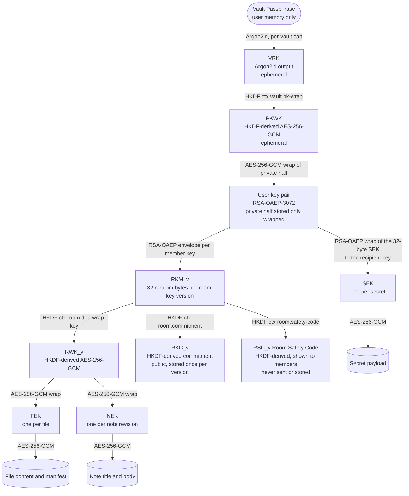
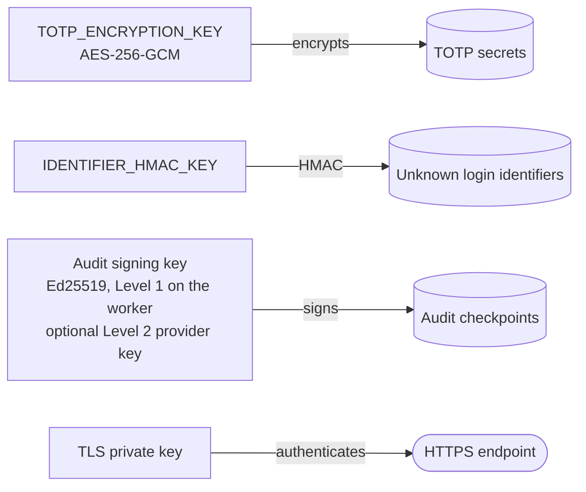

# Key Hierarchy

Status: Phase 0.5 baseline. Normative. Parameters: [crypto-decisions.md](crypto-decisions.md). Mechanisms: [cryptographic-architecture.md](cryptographic-architecture.md). Lifecycle: [key-lifecycle.md](key-lifecycle.md).

In the diagrams, an arrow from A to B means "A protects or derives B".

## 1. Client-side hierarchy (room content)

Every content item follows the same envelope pattern: its own data key, AES-256-GCM, and then a key wrap chosen by the audience. RSA-OAEP only ever wraps 32-byte keys: room key material and SEKs (INV-17).

## 2. Server-side keys (separate domain)

These keys never protect room content, and client keys never protect them.

## 3. Key inventory

| Key or value | Type | Created by | Protected by | Stored | Lifetime | Destroyed |
|---|---|---|---|---|---|---|
| Vault Passphrase | Secret string | User | User memory | Never | Until changed | Not applicable |
| VRK | 256-bit Argon2id output | Browser Web Worker | Derived | Never | Seconds | Immediately after deriving PKWK |
| PKWK | AES-256-GCM, non-extractable | Browser (HKDF) | Derived | Never | Duration of unlock or wrap | After use |
| User private key | RSA-OAEP-3072 | Browser at vault setup | PKWK (AES-256-GCM) | PostgreSQL as ciphertext; memory while unlocked | Until identity reset | Ciphertext set to NULL on reset or account deletion |
| User public key | RSA-OAEP-3072 SPKI | Browser | Public | PostgreSQL | Same as private key | Kept for audit |
| RKM_v | 256 random bits | Browser of the room creator or the rekeying OWNER or ADMIN | Member key pairs (RSA-OAEP envelopes) | PostgreSQL as envelopes only | While version v is ACTIVE or RETIRED | Envelopes deleted when the version is destroyed, or per member when that member leaves the room |
| RWK_v | AES-256-GCM, non-extractable | Each member's browser (HKDF) | Derived | Never | In memory while the vault is unlocked | On vault lock |
| RKC_v | 256-bit commitment | Browser (HKDF) | Public value | PostgreSQL in clear, immutable | With version v | Kept |
| RSC_v (Room Safety Code) | 256-bit HKDF output, 66 bits displayed | Each member's browser (HKDF) | Derived; displaying it reveals nothing useful about RKM_v | Never; displayed only | While the room view is open | On vault lock or navigation |
| FEK | AES-256 | Uploader's browser | RWK_v | PostgreSQL, wrapped | Lifetime of the file | Wrapped FEK set to NULL on delete or expiry |
| NEK | AES-256 | Author's browser, per revision | RWK_v | PostgreSQL, wrapped | Until the next revision | Replaced on save; NULL on delete |
| SEK | AES-256 | Sender's browser | Recipient key pair (RSA-OAEP wrap of the 32-byte key) | PostgreSQL, wrapped | Until reveal or expiry | Wrapped SEK set to NULL on burn, expiry or revoke |
| Session token | 256 random bits | Server | Bearer secret in cookie | Cookie; PostgreSQL stores SHA-256 digest | At most 12 hours | Revocation or expiry |
| TOTP secret | 160 random bits | Server | TOTP_ENCRYPTION_KEY | PostgreSQL, server-encrypted | Until MFA is disabled | Set to NULL |
| TOTP_ENCRYPTION_KEY | AES-256 | Operator | File permissions, VM hardening | Secret file on the VM | Rotated yearly or on suspicion | Old key kept only until re-encryption completes |
| IDENTIFIER_HMAC_KEY | 256 random bits | Operator | File permissions | Secret file on the VM | Rotated yearly | Old HMACs age out with the 90-day retention |
| Audit signing key | Ed25519 | Operator workstation (Level 1) or provider key service (Level 2) | Level 1: file permissions, worker-only mount. Level 2: non-exportable provider key | Level 1: secret file on the VM plus offline backup; public key in the repository | Until compromise or planned rotation | Revoked key IDs listed in the repository with revocation time |
| TLS private key | Certificate key | Certificate automation | File permissions | VM | Short-lived, renewed automatically | On renewal |

## 4. No circular dependencies

The protection relation forms a directed acyclic graph:

1. Vault Passphrase -> VRK -> PKWK -> user private key.
2. User key pair -> RKM_v (envelopes) and user key pair -> SEK (wrapped SEKs).
3. RKM_v -> RWK_v, RKM_v -> RKC_v and RKM_v -> RSC_v. RKC_v and RSC_v are leaves: they protect nothing.
4. RWK_v -> FEK and NEK.
5. FEK, NEK and SEK -> content.
6. Server keys protect only server-side secrets and have no edges into or out of the client hierarchy.

No key protects one of its ancestors. Room keys never protect user keys, content keys never protect other keys, and no stored secret is needed to recover the key that protects it. Two practical consequences:

- **Losing a Vault Passphrase does not destroy rooms.** Other members still hold RKM_v and can re-share it to the user's new key pair. A rekey also wraps the new version to the new key automatically.
- **Losing a room does not affect identities.** Deleting a room removes only its envelopes and content keys.

## 5. Compromise impact

| If an attacker obtains | They can | They cannot | Response |
|---|---|---|---|
| One DEK | Read that one item version, given its ciphertext | Read any other item | Delete the item |
| RKM_v or RWK_v | Read every item wrapped under version v, given ciphertext access | Read other versions or other rooms | Rekey; consider re-encryption (OCD-07) |
| A user private key | Unwrap every RKM version wrapped to that key and every SEK sent to it, given envelope access | Read rooms the user never joined | Identity reset, then a rekey of every room of the user |
| The Vault Passphrase only | Nothing without the encrypted private key | | Change the passphrase |
| The Vault Passphrase and the database | Everything a private-key compromise gives | | As for a private key |
| A displayed Room Safety Code | Nothing: it is derived one-way and is designed to be read aloud | Recover or narrow down RKM_v | None needed |
| The auth password | Log in unless MFA is enabled; see metadata and ciphertext; perform non-cryptographic actions | Decrypt anything, because the vault stays locked | Reset the password, revoke sessions |
| A session token | Act as the user within that session for non-cryptographic actions | Decrypt, because unlocking needs the Vault Passphrase | Revoke the session |
| TOTP_ENCRYPTION_KEY and the database | Recover TOTP secrets and bypass MFA where the password is also known | Decrypt content | Rotate the key, force MFA re-enrollment |
| Audit signing key | Sign forged checkpoints | Change checkpoints already in the retention-locked bucket or the external witness copies | Revoke and rotate the key, publish the new public key, investigate (ADR-009 section 8) |
| TLS private key plus a network position | Impersonate the server and deliver malicious JavaScript (L-02) | Decrypt stored content directly | Revoke and reissue the certificate |
| Write access to the database or control of API responses | Distribute a room-key version it knows to every member (T-36) | Read content encrypted before that version | Open decision OCD-12; treat as a server compromise |
