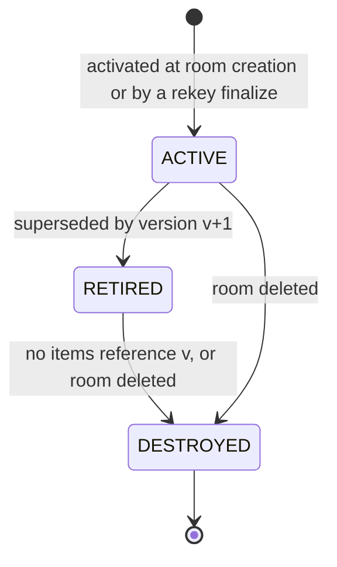
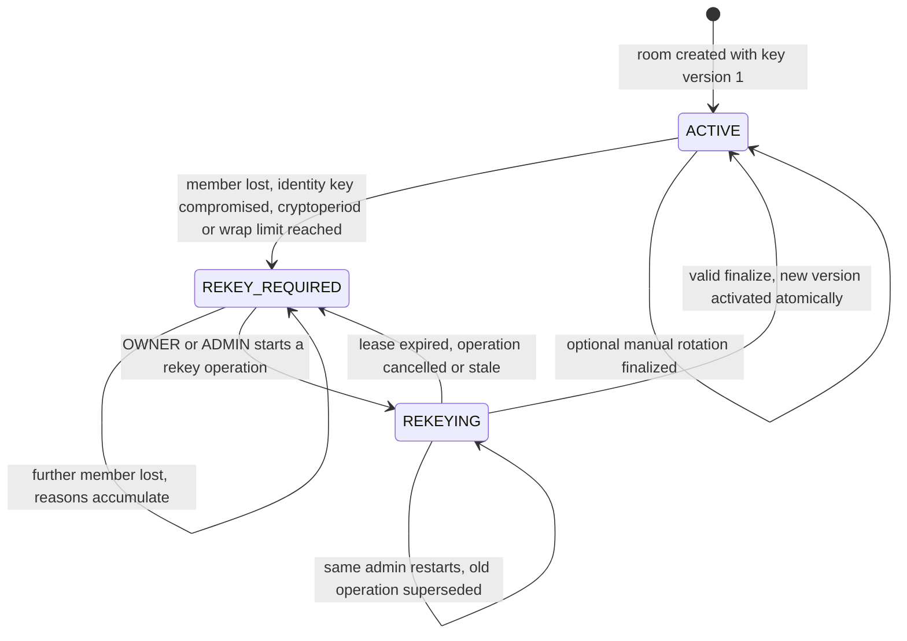
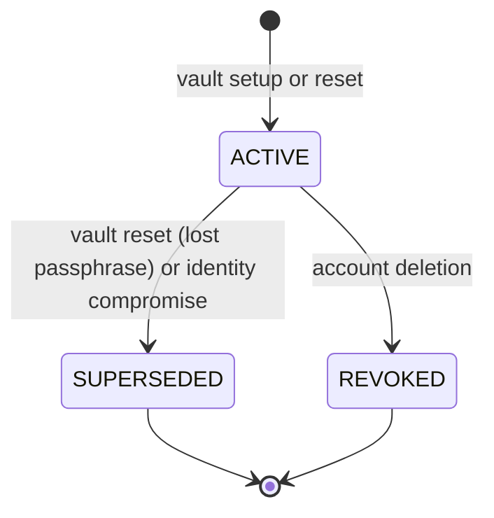

# Key Lifecycle

Status: Phase 0.5 baseline, updated in Phase 4 (section 3: identities with signing keys, implemented vault events). Normative. Related: [key-hierarchy.md](key-hierarchy.md), [crypto-decisions.md](crypto-decisions.md), [ADR-013](../architecture/adr/ADR-013-rekey-state-machine.md), [../security/security-policy-profiles.md](../security/security-policy-profiles.md).

The lifecycle stages follow the model of NIST SP 800-57 Part 1: generation, distribution, active use, retirement (decrypt-only), destruction and compromise handling.

## 1. Room keys

### 1.1 Key version states

| State | Encrypt new DEKs | Unwrap existing DEKs | Envelopes exist |
|---|---|---|---|
| ACTIVE (exactly one per room) | Yes, while the room key state is ACTIVE | Yes | Yes, for every recipient in the version's snapshot |
| RETIRED | No. Writes naming it fail with `KEY_VERSION_STALE` | Yes | Yes, for current members who hold it |
| DESTROYED | No | No | No. Only the commitment and metadata remain |

### 1.2 Room key state (rekey state machine)

| State | Content writes and invitations | Reads | Who can move it on |
|---|---|---|---|
| ACTIVE | Allowed with the current key version only | Allowed | Any trigger moves it to REKEY_REQUIRED |
| REKEY_REQUIRED | Rejected with 409 `REKEY_REQUIRED` | Allowed | An OWNER or ADMIN starting a rekey operation |
| REKEYING | Rejected with 409 `REKEY_REQUIRED` | Allowed | The starter's finalize, lease expiry, cancellation or a membership change |

"Member lost" covers removal, leaving, suspension (the member's account was disabled) and account deletion. The transaction that records the loss also:
- deletes all of that member's envelopes;
- increments the room's membership epoch;
- cancels pending uploads;
- appends `REKEY_REQUIRED`.

The departed member's API access ends in that same transaction.

### 1.3 Triggers

| ID | Trigger | Effect | Reason code |
|---|---|---|---|
| R1 | OWNER or ADMIN removes a member | REKEY_REQUIRED; the UI immediately offers the admin to rekey | MEMBER_REMOVED |
| R2 | Member leaves | REKEY_REQUIRED | MEMBER_LEFT |
| R3 | Account disabled by a PLATFORM_ADMIN (memberships become SUSPENDED) | REKEY_REQUIRED in every room of the user | MEMBER_SUSPENDED |
| R4 | Account deleted | REKEY_REQUIRED in every room of the user | MEMBER_DELETED |
| R5 | Member reports a compromised identity key or device | REKEY_REQUIRED in every room of the user | IDENTITY_KEY_COMPROMISED |
| R6 | Cryptoperiod exceeded (CONFIDENTIAL 180 days, RESTRICTED 90 days, PC-14) | Worker sets REKEY_REQUIRED; a reminder appears 14 days before | CRYPTOPERIOD_EXPIRED |
| R7 | Wrap-count bound reached (2^20 DEKs, CP-16) | API sets REKEY_REQUIRED | WRAP_LIMIT_REACHED |
| R8 | OWNER or ADMIN chooses to rotate | Manual rekey operation, no write lock | MANUAL |
| R9 | Security profile changed | Optional manual rekey | POLICY_CHANGE |

### 1.4 Rekey procedure

1. **Start.** An OWNER or ADMIN (AZ-13) calls `POST /api/rooms/{roomId}/rekey-operations`.
   - The server allows one live operation per room: expired operations become ABANDONED, and the caller's own earlier operation becomes SUPERSEDED.
   - It snapshots the membership epoch and the recipient set. The set holds the ACTIVE identity key of every ACTIVE member plus the confirmed key of every pending invitee.
   - It returns the operation ID, base version v, the recipients with fingerprints, and a lease that expires after 10 minutes (CP-25).
2. **Generate.** The admin's browser, with the vault unlocked:
   1. shows the recipients with fingerprints for review;
   2. generates fresh RKM_(v+1) and checks that its commitment under version v's context differs from RKC_v, which would reveal reused key material;
   3. computes RKC_(v+1);
   4. creates one RSA-OAEP envelope per recipient key.
3. **Finalize.** The browser sends the target version, commitment and envelopes. In one transaction, with the room row locked, the server checks:
   - the operation belongs to the room and the caller started it;
   - it is PENDING and the lease is valid;
   - the base version is still current and the membership epoch is unchanged;
   - the envelope set equals the recipient snapshot exactly, with no missing and no extra recipient;
   - envelope and commitment sizes are valid.

   It then:
   - activates v+1 and retires v;
   - stores the envelopes, those for pending invitees as PENDING;
   - returns the room to ACTIVE;
   - completes the operation with the digest of its payload and appends `REKEY_COMPLETED`.
4. **Receive.** Each member fetches its new envelope and verifies the commitment. It repeats the reuse check against the previous version, derives RWK_(v+1), and can display the new Room Safety Code.

### 1.5 Failure, replay and recovery

| Situation | Behaviour |
|---|---|
| Browser crashes or closes during a rekey | Nothing was stored. The lease expires and the operation becomes ABANDONED. The room returns to REKEY_REQUIRED and any OWNER or ADMIN starts again |
| Network timeout after finalize | The client repeats the same finalize. The server finds the COMPLETED operation with the same payload digest and returns the original result |
| Finalize repeated with a different payload | 409 `REKEY_PAYLOAD_MISMATCH` |
| Finalize for an ABANDONED, SUPERSEDED, CANCELLED or STALE operation | 409 `REKEY_OPERATION_CLOSED` |
| A member is removed, leaves or changes identity key while an operation is pending | The epoch changes, the operation becomes STALE and the room stays or becomes REKEY_REQUIRED. The admin restarts, and the new snapshot excludes the departed member |
| Two admins start at the same time | The second receives 409 `REKEY_IN_PROGRESS` with the lease expiry. The OWNER can cancel a stuck operation |
| Envelope set missing a member or including a removed one | 422 `REKEY_RECIPIENTS_MISMATCH`, operation stays PENDING until its lease ends |
| Client writes with the old version after activation | 409 `KEY_VERSION_STALE`. The client refreshes its key state and re-encrypts |
| No OWNER or ADMIN available | The room stays read-only until one is available (L-24). The Security Dashboard counts locked rooms (SD-08) |

### 1.6 What a rekey achieves and what it cannot achieve

- **Achieves:** content created after activation is protected by a key that departed members never received. Departed members lose API access to all ciphertext and envelopes as soon as the loss is recorded, and no new content is created while the room is locked.
- **Cannot achieve:** a departed member keeps any plaintext they saw and any key material they received. If they later obtain old ciphertext, for example through a database leak, they can decrypt content from versions they held. **A rekey never makes anyone forget.** Re-encrypting historical content is a deferred option (OCD-07) and would still not undo earlier access.
- **Authenticated from Phase 6:** without signatures a server-side attacker could activate a key version of its own (T-36). ADR-015 (accepted) makes the creator sign every key version, and clients refuse unsigned or unauthorized versions; the verification is implemented in Phase 6 and applied to rekeys in Phase 11.

### 1.7 Destruction

When no file or note references a RETIRED version, the worker deletes its envelopes and marks it DESTROYED. The commitment and metadata stay for audit and for the Crypto Inspector. Backups may still contain envelopes until their retention expires (L-12).

## 2. Content keys (FEK, NEK, SEK)

| Stage | FEK (file) | NEK (note revision) | SEK (secret) |
|---|---|---|---|
| Generation | Uploader's browser, per file | Author's browser, per revision | Sender's browser, per secret |
| Distribution | Wrapped under RWK_v with AES-256-GCM | Wrapped under RWK_v with AES-256-GCM | The 32-byte key wrapped to the recipient's key with RSA-OAEP |
| Use | Content and manifest (2 encryptions) | One revision | One payload |
| Retirement | Not applicable (files are immutable) | Replaced by the next revision | Not applicable |
| Destruction | Wrapped FEK set to NULL on delete or expiry | Replaced, or set to NULL on delete | Wrapped SEK and payload set to NULL on burn, expiry or revoke |

## 3. User identity keys

An identity is the encryption key pair and the signing key pair under one key ID (ADR-015). Both pairs always share one status and change together; there is no separate rotation of the signing key.

A retired identity never becomes ACTIVE again, its public keys never change, and at most one identity per user is ACTIVE (database trigger and partial unique index, Phase 4).

| Event | Effect | Phase |
|---|---|---|
| Vault creation | New ACTIVE identity generated in the browser; the server verifies and stores public keys and ciphertext (DF-03). Needs a recent step-up | 4, implemented |
| Unlock and lock | Private keys in memory only while unlocked (CP-22) | 4, implemented |
| Passphrase change | Same identity (key ID and fingerprint), both private keys re-wrapped under a new salt and new wrapping keys; signed by the identity and applied by compare-and-swap (CD-26). Does not help if an old copy of the record and the old passphrase are both known (L-40): reset instead | 4, implemented |
| Parameter upgrade | As a passphrase change, with the same passphrase, for vaults below the target parameters (ADR-010) | 4, implemented |
| Vault reset (lost passphrase) | Needs a strict step-up. Old identity SUPERSEDED with both encrypted private keys set to NULL (public keys kept). A new ACTIVE identity is created, other sessions are revoked and the current one is rotated, in one transaction. **When rooms exist (from Phase 6; the complete procedure is CM-T053 in Phase 11):** the same transaction deletes the old identity's envelopes, invalidates pending invitations for it, destroys unrevealed secrets addressed to it (they can no longer be decrypted) and increments the membership epoch of each room of the user; room admins re-share keys, and the next rekey includes the new identity automatically | Session and identity parts in 4; room parts from 6, completed in 11 |
| Suspected identity compromise | As for a reset, plus REKEY_REQUIRED in every room of the user (R5), because the attacker may hold every RKM wrapped to the old key and can sign as the old identity | 11 (CM-T053) |
| Account disabled | Sessions end (Phase 3). Memberships become SUSPENDED and envelopes are deleted (R3). After re-enabling, an OWNER or ADMIN reinstates each membership by re-sharing keys | Sessions in 3; rooms in 6 |
| Account deletion | Identity REVOKED, encrypted private keys set to NULL, memberships removed, REKEY_REQUIRED in each room (R4) | 11 (CM-T051) |

**Re-sharing after a reset (AZ-14):** an OWNER or ADMIN browser fetches the new public key, wraps the versions allowed by the history policy and posts the envelopes. The API applies the same checks as for invitations, including fingerprint confirmation in RESTRICTED rooms. Key changes are audited and shown to room administrators, because an unexpected key change can indicate key substitution (T-25).

## 4. Server-side keys and credentials

| Item | Rotation interval | Procedure |
|---|---|---|
| TOTP_ENCRYPTION_KEY | Yearly or on suspicion | Add a new key with a new key ID. New encryptions use it, a worker job re-encrypts stored secrets, and the old key is removed afterwards |
| IDENTIFIER_HMAC_KEY | Yearly | Replace. Old values age out with the 90-day retention |
| Audit signing key, Level 1 (Ed25519) | Yearly or on suspicion | Generate on the operator workstation, back up offline, deploy to the worker only, commit the new public key with its key ID. On suspicion, add the old key ID to the revocation list with the revocation time, then run the offline verifier against the anchors |
| Audit signing key, Level 2 (optional) | Per provider policy | Create a new provider key version and record the key ID. Disabling the old key revokes it centrally (OCD-13) |
| TLS certificate and key | Automatic renewal | Certificate automation on the VM; expiry monitored |
| Database and object-storage credentials | Every 90 days, on team changes and on suspicion | Create the new credential, deploy, verify, revoke the old one; record in Jira. Migration and owner credentials never live on the VM |
| SSH keys | On team changes and on suspicion | Replace authorized keys; remove departed users |

## 5. Cryptoperiod summary

| Key | Cryptoperiod |
|---|---|
| Room key version | STANDARD: event-driven only. CONFIDENTIAL: 180 days. RESTRICTED: 90 days |
| DEKs | Lifetime of one item version |
| User identity (encryption and signing key pairs) | No fixed expiry in the baseline; replaced on reset or compromise |
| Session token | At most 12 hours (CP-08) |
| Server keys | As in section 4 |

## 6. Compromise response summary

| Suspected compromise | Immediate actions |
|---|---|
| A member's device | Remove or suspend the member (R1, R3), which revokes access and write-locks the rooms. Revoke their sessions, then rekey the rooms involved |
| A user's private key or Vault Passphrase | Identity reset with the compromise flag (R5), rekey of all the user's rooms, review of audit events |
| The database | Rotate database credentials. Treat encrypted private keys as exposed to offline guessing and prompt users with weak passphrases to reset. Verify the audit chain against anchors and witness copies. Check for unexpected key versions (T-36) |
| The VM | Rebuild from a clean image and rotate every server key and credential, including the Level 1 audit signing key. Warn users that JavaScript served during the compromise window may have captured passphrases, then run identity resets and rekeys for affected users |
| The audit signing key | Revoke and rotate, publish the new public key, verify existing checkpoints against the retention-locked copies and external witnesses |
| A Room Safety Code mismatch | Stop adding content, alert the OWNER out of band, treat the server as potentially compromised. A rekey through the same server does not repair a server-made split view |
