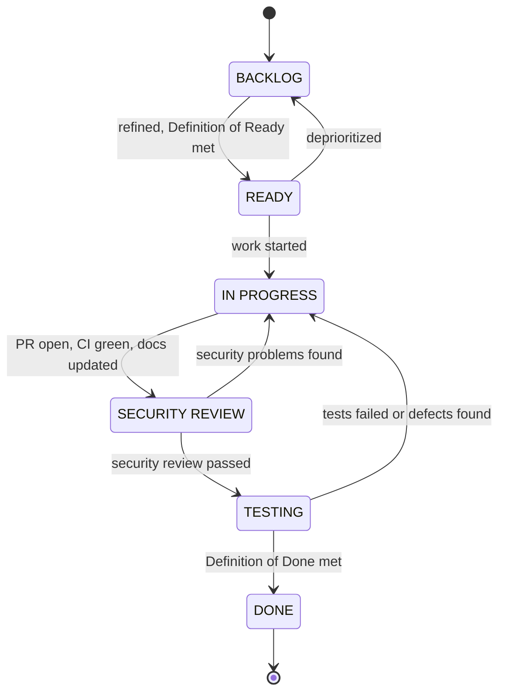

# Jira Workflow

Status: Phase 0.5 specification. These documents create nothing in Jira; setup is manual (CM-T083). Related: [jira-backlog.md](jira-backlog.md), [project-roadmap.md](project-roadmap.md), [ADR-005](../architecture/adr/ADR-005-jira-cloud-management-saas.md).

The workflow is the project's change-management process (ISO/IEC 27001:2022 control 8.32) and brings security into project management (control 5.8). The SECURITY REVIEW status is a mandatory gate before testing and release.

## 1. Workflow



| Status | Entry criteria | Exit criteria |
|---|---|---|
| BACKLOG | Any idea, requirement, bug or finding | Definition of Ready met |
| READY | Description, acceptance criteria, security considerations, priority, labels, epic and dependencies filled in; relevant documents or ADRs linked | Assignee starts work and creates a branch named with the key |
| IN PROGRESS | Branch exists | Pull request open, CI green, documentation updated, self-review done |
| SECURITY REVIEW | Pull request ready for review | Reviewer completes the security review checklist (section 5); pass moves to TESTING, fail returns to IN PROGRESS with comments |
| TESTING | Security review passed | Acceptance criteria verified, automated tests present and passing, regression test present for any security fix, evidence captured; pass moves to DONE, fail returns to IN PROGRESS |
| DONE | Definition of Done in CLAUDE.md met, pull request merged and linked | Not applicable |

Rules:
- Every item passes SECURITY REVIEW, including documentation items (the review then checks for misleading security claims and exposed secrets).
- The reviewer should not be the author. Where the team is one person, the author completes the checklist separately after a break and records the limitation; a Claude Code review session may assist but does not replace accountability.
- Returning from SECURITY REVIEW or TESTING to IN PROGRESS requires a comment explaining why. These transitions are valuable evidence.

## 2. Issue types

| Type | Use |
|---|---|
| Epic | The 16 epics CM-EPIC-01 to CM-EPIC-16 |
| Story | User-visible capability |
| Task | Technical or documentation work. The imported backlog uses Task for every work item; change it to Story where a capability is user-visible |
| Bug | Functional defect |
| Security Finding | Vulnerability or control failure found by testing, review or assessment (label `security-finding`) |
| Sub-task | Optional breakdown of a story or task |

If a custom issue type is not available, Security Findings are Bugs with the `security-finding` label and the template in section 7.

## 3. Priorities

| Priority | Meaning | Security finding target |
|---|---|---|
| P0 Blocker / Critical | **Rare.** Only for work whose absence blocks the project entirely, breaks a fundamental security invariant that later work relies on, or prevents safe continuation into a dependent phase. In this backlog: phase gates and foundation controls | Critical findings: fix immediately; feature work stops |
| P1 High | Core product or security functionality required for the final project | High findings: fix within the current phase |
| P2 Medium | Important functionality that does not block other work | Medium findings: fix before Phase 22 |
| P3 Low | Enhancements, polish and genuinely optional work | Low findings: fix or accept with documented rationale |

Priority expresses impact, not order. Order comes from phases and dependency links, so a P0 item may depend on P1 items scheduled before it.

Jira's default priorities map as Highest = P0, High = P1, Medium = P2 and Low = P3; Lowest is unused. Renaming them is optional and described in [jira-import-guide.md](jira-import-guide.md). The current counts are in [jira-backlog.md](jira-backlog.md).

## 4. Labels, components and releases

- **Labels:** `architecture`, `cloud`, `crypto`, `security`, `frontend`, `backend`, `database`, `testing`, `documentation`, `infrastructure`, `risk`, `security-finding`.
- **Components (optional):** web, api, crypto, database, infrastructure, docs.
- **Releases (fix versions):**

| Release | Phases | Content |
|---|---|---|
| M0 Architecture Baseline | 0, 0.5 | Architecture, threat model, crypto design, hardening, backlog and import package, baseline commit |
| M1 Foundation | 1, 2 | Monorepo, CI, API and web scaffolds, database schema |
| M2 Identity and Access | 3, 4, 5 | Authentication, MFA, vault, rooms and RBAC |
| M3 Encrypted Collaboration | 6, 7, 8, 9 | Cryptographic membership, files, notes, secrets |
| M4 Governance and Key Lifecycle | 10, 11, 12 | Policy engine, rotation, audit ledger |
| M5 Visibility | 13, 14 | Crypto Inspector, Security Dashboard |
| M6 Hardening and Test Automation | 15, 16 | API hardening, full automated test suites |
| M7 Cloud Deployment | 17, 18, 19 | IaaS, managed PostgreSQL (PaaS) and object storage integration, cloud hardening |
| M8 Assessment and Report | 20, 21, 22 | Security assessment, remediation, final report |

## 5. Security review checklist (SECURITY REVIEW status)

Copy into the Jira comment or the pull-request template and tick each line, or mark it "not applicable" with a reason.

- [ ] Every new or changed endpoint declares its action and is authorized server-side; object-level rules OL-01 to OL-12 hold.
- [ ] All inputs are validated with shared schemas; unknown fields rejected.
- [ ] Responses use explicit projections; no sensitive fields returned.
- [ ] Nothing sensitive is logged; the redaction list is updated if new sensitive fields exist.
- [ ] Cryptography uses only registered algorithms and parameters, canonical contexts and internally generated IVs; tamper tests exist.
- [ ] Profile controls affected by the change are enforced in the API and covered by the policy matrix.
- [ ] Security-relevant actions emit audit events at the right audit level.
- [ ] Errors fail closed and reveal nothing internal.
- [ ] New dependencies are justified, scanned and recorded where required.
- [ ] No secrets in code, configuration, tests, screenshots or the issue itself.
- [ ] Threat model, ADRs and limitations updated if the change affects them.
- [ ] RSA-OAEP is used only through the 32-byte key wrapper; no content is RSA-encrypted (INV-17).
- [ ] Content writes and invitations respect the room key state and the current key version (INV-07). Rekey endpoints validate the operation, lease, membership epoch and recipient set.
- [ ] Every state-changing route passes the same-origin and request-header checks (INV-19).
- [ ] The Room Safety Code is never sent or stored, and neither it nor the commitment is presented as protection against a malicious server (INV-18).
- [ ] UI text and documentation make no claim stronger than the implementation provides.

## 6. Testing checklist (TESTING status)

- [ ] Each acceptance criterion verified and noted.
- [ ] Unit, integration and security regression suites pass in CI.
- [ ] Negative tests exist (denied roles, other rooms, tampered data, expired items).
- [ ] For a security fix: a regression test that fails without the fix is linked.
- [ ] Evidence listed in the evidence plan captured and redacted.

## 7. Security Finding template

```
Summary:            [SF] <short title>
Severity:           Critical | High | Medium | Low   (optional CVSS v4.0 vector)
Priority:           P0 to P3 according to severity
Component:          web | api | crypto | database | infrastructure
Found in:           commit or release
Related threat:     T-xx      Related control: PC-xx / AZ-xx / OL-xx / INV-xx
Discovery method:   automated test | DAST | manual test | code review | external report
CWE / OWASP:        CWE-xxx / OWASP category
Description:        (restricted detail until fixed)
Reproduction steps: (restricted detail until fixed)
Impact:
Recommended fix:
Fix PR:
Regression test:
Retest result/date:
Risk acceptance:    (only if not fixed) approver, rationale, review date
```

## 8. GitHub conventions

| Item | Convention | Example |
|---|---|---|
| Branch | `<type>/CM-<n>-<short-description>` | `feature/CM-17-session-revocation` |
| Commit | Conventional Commits with the key | `feat(api): add session revocation endpoint (CM-17)` |
| Pull request title | Key and summary | `CM-17: Session revocation` |
| Pull request body | Link to Jira, security impact, tests, completed checklist | |

Branch types: `feature`, `fix`, `security`, `docs`, `infra`, `test`, `chore`.

## 9. Board

Kanban board with the columns Backlog, Ready, In Progress, Security Review, Testing, Done. Work-in-progress limits: In Progress at most 3 per person, Security Review at most 5. Quick filters for `security-finding`, each epic and each priority.

## 10. Evidence to capture from Jira

- Board screenshots at the end of each milestone.
- Issue history of one feature and of one security finding, showing the SECURITY REVIEW gate and at least one return to IN PROGRESS.
- Release reports for M0 to M8.
- The CSV import result and the board right after import (EV-00-10).
- A filter listing all security findings with status and severity.
- Development panel showing linked branches, commits and pull requests (if the GitHub integration is enabled).

## 11. Jira project setup and import

The exact project to create (a team-managed Kanban software project named CipherMesh with key CM), the workflow configuration, the custom fields, labels, releases and the CSV import steps are in [jira-import-guide.md](jira-import-guide.md). The importable backlog is [jira-backlog.csv](jira-backlog.csv), generated from [jira-backlog.md](jira-backlog.md). Setting up Jira is tracked as CM-T083.
