# Project Roadmap

Status: Phase 0.5 baseline. Progress: Phase 1 implemented (2026-10-02, [phase-01-traceability.md](phase-01-traceability.md)); Phase 2 implemented (2026-10-04, [phase-02-traceability.md](phase-02-traceability.md)); Phase 3 implemented (2026-10-04, [phase-03-traceability.md](phase-03-traceability.md)); Phase 4 implemented (2026-10-05, [phase-04-traceability.md](phase-04-traceability.md)), approved and merged into `main` through pull request #10. Related: [jira-backlog.md](jira-backlog.md), [jira-workflow.md](jira-workflow.md), [../report/evidence-plan.md](../report/evidence-plan.md).

## 1. Principles

1. **Phase gating.** A phase starts only after the project owner approves the previous one. Claude Code sessions stop at the end of each phase and report.
2. **Security checkpoint per phase.** Every phase ends with a checkpoint: all phase items DONE through SECURITY REVIEW and TESTING, security suites green, threat model and limitations updated, evidence captured.
3. **Tests are written with the code.** Phase 16 consolidates and extends automation; it does not start it. The Definition of Done in CLAUDE.md applies from Phase 1.
4. **Documentation moves with the code.** Deviations from the Phase 0 design require an ADR or an explicit documented change, never a silent change.
5. **Evidence is captured when it happens**, following the evidence plan, not reconstructed at the end.

## 2. Milestones

| Release | Phases | Outcome |
|---|---|---|
| M0 Architecture Baseline | 0, 0.5 | Approved and hardened architecture, security model and crypto design; backlog and Jira import package; baseline commit |
| M1 Foundation | 1, 2 | Secure scaffolds, CI, local environment, database schema |
| M2 Identity and Access | 3, 4, 5 | Authentication and MFA, cryptographic identity, rooms and RBAC |
| M3 Encrypted Collaboration | 6, 7, 8, 9 | Cryptographic membership, encrypted files, notes and secrets |
| M4 Governance and Key Lifecycle | 10, 11, 12 | Policy engine, key rotation, tamper-evident audit |
| M5 Visibility | 13, 14 | Crypto Inspector, Security Dashboard |
| M6 Hardening and Test Automation | 15, 16 | API hardening, complete automated suites |
| M7 Cloud Deployment | 17, 18, 19 | IaaS deployment, managed PostgreSQL (PaaS) and object storage integration, cloud hardening |
| M8 Assessment and Report | 20, 21, 22 | Security assessment, remediation, final report |

## 3. Phase dependencies

```mermaid
flowchart LR
  P0["P0 Architecture"] --> P05["P0.5 Hardening"] --> P1["P1 Foundation"] --> P2["P2 Database"] --> P3["P3 Authentication"]
  P3 --> P4["P4 Vault"]
  P3 --> P5["P5 Rooms and RBAC"]
  P4 --> P6["P6 Crypto membership"]
  P5 --> P6
  P6 --> P7["P7 Files"]
  P6 --> P8["P8 Notes"]
  P6 --> P9["P9 Secrets"]
  P7 --> P10["P10 Policies"]
  P8 --> P10
  P9 --> P10
  P10 --> P11["P11 Rotation"] --> P12["P12 Audit"]
  P12 --> P13["P13 Inspector"] --> P14["P14 Dashboard"]
  P14 --> P15["P15 API hardening"] --> P16["P16 Test automation"]
  P16 --> P17["P17 IaaS"] --> P18["P18 PaaS and storage"] --> P19["P19 Cloud hardening"]
  P19 --> P20["P20 Assessment"] --> P21["P21 Remediation"] --> P22["P22 Final docs"]
```

Phases 17 and 18 are separate for evidence purposes and can run back to back: the API needs the managed database and storage to serve real traffic, and no database container is ever deployed on the VM.

## 4. Phases

### Phase 0: Architecture (M0, CM-T001 to CM-T005)
| Aspect | Details |
|---|---|
| Goal | Establish the architecture, security model, cryptographic design, cloud design, rules, backlog, roadmap and evidence plan |
| Dependencies | None |
| Deliverables | CLAUDE.md, README, all documents under `docs/`, ADR-001 to ADR-011, repository skeleton |
| Security checkpoint | Security architecture review completed and fixes applied; project owner acknowledges accepted risks (register section 5) and the proposed ADRs |
| Tests | No code. Consistency checks: backlog dependencies resolve without cycles; identifiers and parameters consistent across documents |
| Documentation updates | All created in this phase |
| Jira evidence | Epics and Phase 0 items created and moved through the workflow to DONE; M0 board screenshot |

### Phase 0.5: Architecture Hardening and Project-Management Bootstrap (M0, CM-T082 to CM-T084)
| Aspect | Details |
|---|---|
| Goal | Correct the architecture issues found by the external review, prepare Jira, and start the project history |
| Dependencies | Phase 0 |
| Deliverables | The corrections applied consistently across all documents: envelope encryption for secrets, the corrected commitment claims and the new Room Safety Code (ADR-012), the rekey state machine (ADR-013), the audit trust model with Level 1 and Level 2 key custody (ADR-009), and the object-storage classification (ADR-006). Also the session and CSRF design, the normalized priorities, the Jira import guide and CSV, the local git repository with the baseline commit, and the Phase 0.5 architecture gate record |
| Security checkpoint | An attack-focused architecture review covering 14 areas. Unresolved risks recorded (T-36, L-23) and open decisions gated to their phases (OCD-12 before Phase 4) |
| Tests | No code. Consistency checks: links resolve, identifiers exist, Mermaid structure valid, backlog dependencies acyclic, CSV matches the markdown backlog |
| Documentation updates | All documents listed in the Phase 0.5 gate record |
| Jira evidence | CM-T082 moved to DONE after approval; import result and board (EV-00-10); baseline commit hash (EV-00-09) |

### Phase 1: Repository and Application Foundation (M1, CM-T006 to CM-T012)
| Aspect | Details |
|---|---|
| Goal | A working monorepo with secure API and web scaffolds, logging, CI and a local environment |
| Dependencies | Phase 0 approval |
| Deliverables | pnpm workspaces; strict TypeScript; ESLint security and forbidden-API rules; Express scaffold with deny-by-default route registry and central error handler; redacting logger; Next.js static export with strict CSP; validation and shared packages; Docker Compose with PostgreSQL and an S3 emulator; CI with tests and scans; branch protection |
| Security checkpoint | CSP without `'unsafe-inline'` or `'unsafe-eval'` for scripts works (ADR-011 decided); secret scanning and dependency audit green; dependency lifecycle scripts blocked; development ports bound to localhost |
| Tests | Middleware tests (404, 413, 415, error format); redaction tests and log canary; lint-rule tests; CI proves a failing check blocks merging |
| Documentation updates | README setup section; ADR-011 status; CLAUDE.md phase status |
| Jira evidence | Pull requests linked to each item; screenshots of branch protection and of a blocked merge |

### Phase 2: Database (M1, CM-T013 to CM-T014)
| Aspect | Details |
|---|---|
| Goal | Schema v1 and least-privilege database access |
| Dependencies | Phase 1 |
| Deliverables | Prisma schema and migrations; database roles; append-only audit trigger; script that checks for forbidden fields; synthetic seed data |
| Security checkpoint | Schema reviewed against field classifications and the "must never exist" list; grants reviewed per role |
| Tests | Migrations from an empty database; constraint tests (one ACTIVE key pair per user, one OWNER per room); role permission tests; trigger test |
| Documentation updates | `data-model.md` records any justified deviation |
| Jira evidence | Schema pull request through SECURITY REVIEW; test output showing a rejected UPDATE on the audit table |

### Phase 3: Authentication (M2, CM-T015 to CM-T022)
| Aspect | Details |
|---|---|
| Goal | Secure registration, login, sessions, MFA, CSRF protection and step-up |
| Dependencies | Phase 2 |
| Deliverables | Argon2id registration; login with opaque sessions; rotation, invalidation, logout, idle and absolute expiry and the 10-session limit ([../security/session-and-csrf.md](../security/session-and-csrf.md)); rate limiting and backoff; TOTP MFA with recovery codes; CSRF defences (same-origin verification, custom header, login CSRF); step-up; PLATFORM_ADMIN bootstrap and account disabling |
| Security checkpoint | Argon2id library and parameters benchmarked and recorded (CP-05, OCD-03); TOTP library chosen (LIB-06); pepper decision taken (OCD-05); cookie attributes verified; no raw identifiers or passwords stored for failed logins |
| Tests | `session`, `csrf` and `auth-abuse` suites; RFC 6238 vectors; parameter tests; credential redaction tests |
| Documentation updates | Parameter and library registers; threat model check of T-03, T-08, T-09, T-10, T-13, T-30 |
| Jira evidence | Issue history of the MFA item including SECURITY REVIEW; rate-limit test output; database row showing a PHC-format hash |

### Phase 4: Cryptographic Identity and Vault (M2, CM-T023 to CM-T028)
| Aspect | Details |
|---|---|
| Goal | The crypto package and the user Vault |
| Dependencies | Phases 1 and 3; OCD-12 decided (CM-T086), because it may add a signing key to the identity format. **Phase 4 outcome:** ADR-015 accepted before implementation; the identity has a signing key |
| Deliverables | WebCrypto wrappers and canonical contexts; RFC 8785 implementation; Argon2id WASM in a Web Worker; vault setup, unlock, auto-lock and passphrase change; public-key directory and fingerprints |
| Security checkpoint | Known-answer tests pass; no public function accepts an IV; final CP-04 parameters recorded and ADR-010 accepted; network inspection shows no passphrase or private key leaving the browser; no keys in browser storage |
| Tests | `crypto-invariants` and `browser-storage` suites; Playwright vault tests in three engines |
| Documentation updates | CP-04, LIB-03, LIB-05 final; OCD-02 and OCD-04 closed; ADR-010 status. **Done in Phase 4**, plus ADR-015, CP-26, CP-27 and [../crypto/vault.md](../crypto/vault.md) |
| Jira evidence | Benchmark table; database row with the encrypted private key; network capture showing only public data and ciphertext |

### Phase 5: Secure Rooms and RBAC (M2, CM-T029 to CM-T032)
| Aspect | Details |
|---|---|
| Goal | Rooms and server-side authorization |
| Dependencies | Phase 3 |
| Deliverables | Authorization module and shared matrix; route registry enforcement; room creation, listing, renaming and deletion; membership administration; BOLA suite |
| Security checkpoint | Every route declared and tested; PLATFORM_ADMIN has no room access; non-members receive 404 |
| Tests | `authz-matrix`, `bola` and `route-inventory` suites |
| Documentation updates | Authorization model if the matrix changes |
| Jira evidence | BOLA report; optional demonstration branch where removing a room check makes the suite fail (never merged) |

### Phase 6: Cryptographic Membership (M3, CM-T033 to CM-T036, CM-T085)
| Aspect | Details |
|---|---|
| Goal | Room keys delivered cryptographically to exactly the authorized members |
| Dependencies | Phases 4 and 5 |
| Deliverables | Key version 1 at room creation; invitations with envelopes; OWNER approval; acceptance; client unwrap and commitment check; Room Safety Code panel and word list (LIB-08); cross-browser tests |
| Security checkpoint | OCD-01 resolved and ADR-007 accepted or revised; request schemas cannot carry raw keys; RESTRICTED fingerprint confirmation enforced; PENDING envelopes never served; the Safety Code never leaves the browser; UI wording states the limits of the commitment and the Safety Code |
| Tests | Commitment mismatch tests; `safety-code` suite including the two-browser split-view harness; invitation policy tests; cross-browser crypto tests |
| Documentation updates | ADR-007 status; data flows DF-05 and DF-06 if changed |
| Jira evidence | Database view of KeyEnvelope rows (ciphertext only); Safety Code screenshots (EV-06-05, EV-06-06); issue histories |

### Phase 7: Encrypted Files (M3, CM-T037 to CM-T041)
| Aspect | Details |
|---|---|
| Goal | Client-side encrypted upload and download through object storage |
| Dependencies | Phase 6 |
| Deliverables | Storage adapter and presigned URLs; upload and download flows; deletion, expiry and cleanup worker; quotas and safe downloads |
| Security checkpoint | Canary scan passes; presigned lifetimes enforced; URLs never logged; HTML and SVG never rendered inline; size limit confirmed by a browser memory benchmark (CP-19) |
| Tests | `canary-scan` and `upload` suites; file tamper tests; expiry tests |
| Documentation updates | CP-19 confirmation; L-11 demonstration notes |
| Jira evidence | Bucket object (ciphertext) next to the original file; tamper demonstration |

### Phase 8: Secure Notes (M3, CM-T042)
| Aspect | Details |
|---|---|
| Goal | Encrypted notes with per-revision keys |
| Dependencies | Phase 6 |
| Deliverables | Note creation, reading, editing and deletion with optimistic concurrency |
| Security checkpoint | Text-only rendering; revision bound in AAD; edit rights per the matrix |
| Tests | XSS corpus in notes; revision tamper tests; note canary scan |
| Documentation updates | DF-12 confirmed or updated |
| Jira evidence | Note ciphertext in the database next to the rendered note |

### Phase 9: Burn Secrets (M3, CM-T043 to CM-T045)
| Aspect | Details |
|---|---|
| Goal | Recipient-bound secrets with burn-after-reading |
| Dependencies | Phase 6 (the stretch item CM-T045 also needs Phase 10) |
| Deliverables | Secret creation with the envelope pattern (AES-256-GCM payload, RSA-wrapped 32-byte SEK) and listing; atomic reveal; revocation and expiry; optional external one-time links |
| Security checkpoint | At-most-once delivery; POST-only reveal; only the recipient can decrypt; the UI states that copying cannot be prevented |
| Tests | `burn` and `secret-envelope` suites; concurrent reveals; recipient isolation test |
| Documentation updates | L-03 and L-12 demonstration notes |
| Jira evidence | Database row before and after reveal; concurrency test output |

### Phase 10: Security Policies (M4, CM-T046 to CM-T049)
| Aspect | Details |
|---|---|
| Goal | STANDARD, CONFIDENTIAL and RESTRICTED as real, backend-enforced controls |
| Dependencies | Phase 3 (step-up) and Phases 5 to 9 (features being governed) |
| Deliverables | Versioned policy catalogue; enforcement gates; profile-change rules; policy test matrix |
| Security checkpoint | Every control PC-01 to PC-16 enforced by the API; no control enforced only in the UI; downgrades audited and highlighted |
| Tests | `policy-matrix` suite |
| Documentation updates | Policy profiles document if values change (weakening needs an ADR) |
| Jira evidence | Matrix test report; API response showing a denied action in a RESTRICTED room |

### Phase 11: Key Rotation and Rekey State Machine (M4, CM-T050 to CM-T053)
| Aspect | Details |
|---|---|
| Goal | Complete room-key lifecycle and identity-key recovery |
| Dependencies | Phases 6 and 10 |
| Deliverables | Rekey state machine and operation API (start, finalize, cancel, lease, idempotency, staleness); member removal, leaving, suspension and deletion trigger REKEY_REQUIRED and the write lock; retirement and destruction; cryptoperiods and the wrap bound; compromised-identity procedure and runbook |
| Security checkpoint | Departed members lose access immediately; writes and invitations blocked while REKEY_REQUIRED or REKEYING; the recipient snapshot excludes departed members; stale and replayed finalize requests rejected; interrupted rekeys recoverable; old key material cannot unwrap new DEKs |
| Tests | `rekey` suite |
| Documentation updates | Key lifecycle; incident runbook |
| Jira evidence | Key-version history after a removal; write lock, recovery and replay evidence (EV-11-04 to EV-11-07); demonstration of L-04 |

### Phase 12: Tamper-Evident Audit (M4, CM-T054 to CM-T058)
| Aspect | Details |
|---|---|
| Goal | Hash-chained audit ledger with signed, anchored checkpoints and an offline verifier |
| Dependencies | Phase 2 (roles, trigger) and Phase 10 (audit levels) |
| Deliverables | Chain implementation; event catalogue and emission; verification service; checkpoints and anchor bucket (emulator in development); offline verifier; Level 1 key custody and the weekly witness procedure; tampering and trust-model scenario demonstration |
| Security checkpoint | Append-only enforced at database level; canonicalization round-trip property tests pass; verifier works without API access; the worker refuses to sign a diverged chain; OCD-08 decided; trust model (ADR-009 section 8) demonstrated for scenarios A to D |
| Tests | `audit-tamper` suite |
| Documentation updates | ADR-009; threat model re-rated now that all application controls exist |
| Jira evidence | Verifier output pinpointing a tampered event; checkpoint object in the anchor bucket |

### Phase 13: Crypto Inspector (M5, CM-T059 to CM-T060)
| Aspect | Details |
|---|---|
| Goal | Explain the protection of each item without exposing keys |
| Dependencies | Phases 7 and 9 |
| Deliverables | Inspection API with allowlisted projection; Inspector panel with client-side verification results, key state, the Room Safety Code and limitations |
| Security checkpoint | No key material in responses or DOM; locally computed plaintext hash never leaves the browser; wording checked against the honest-claims rule |
| Tests | Projection schema tests; DOM scan; network test |
| Documentation updates | `crypto-inspector.md` if fields change |
| Jira evidence | Inspector screenshot for a file in a RESTRICTED room |

### Phase 14: Security Dashboard (M5, CM-T061 to CM-T062)
| Aspect | Details |
|---|---|
| Goal | Monitoring view based only on real data |
| Dependencies | Phases 3, 11 and 12 |
| Deliverables | Metrics API with documented queries; dashboard UI |
| Security checkpoint | PLATFORM_ADMIN only; aggregates only; no invented scores; every metric shows its definition and timestamp |
| Tests | Seeded-data tests with exact expected values; empty-state tests; authorization tests |
| Documentation updates | `security-dashboard.md` if metrics change |
| Jira evidence | Dashboard screenshot after a scripted scenario (failed logins, a rekey, a downgrade, a Safety Code mismatch report) |

### Phase 15: API Hardening (M6, CM-T073)
| Aspect | Details |
|---|---|
| Goal | Systematic hardening pass over the whole API |
| Dependencies | Phase 10 onwards (all endpoints exist) |
| Deliverables | Endpoint review against OWASP ASVS sections; Trusted Types evaluation; ZAP baseline scan; fixes |
| Security checkpoint | No unresolved High findings from the baseline scan; headers, errors and rate limits consistent |
| Tests | New regression tests for every fix |
| Documentation updates | Threat model and limitations where findings reveal new risks |
| Jira evidence | ZAP report summary; findings tracked as Security Findings |

### Phase 16: Automated Testing (M6, CM-T074 to CM-T076)
| Aspect | Details |
|---|---|
| Goal | Complete, traceable automation of all security tests |
| Dependencies | Phase 15 |
| Deliverables | Consolidated security regression suite with threat and control tags; traceability table; full Playwright suite on three engines; scheduled dependency, container and secret scans; SBOM per release |
| Security checkpoint | Every threat and control has a test or documented verification; coverage thresholds enforced |
| Tests | All suites in `docs/security/security-testing-plan.md` |
| Documentation updates | Testing plan; traceability table |
| Jira evidence | CI run summary; traceability table; scheduled scan results |

### Phase 17: IaaS Deployment (M7, CM-T063 to CM-T066)
| Aspect | Details |
|---|---|
| Goal | The VM stack running securely in the chosen cloud |
| Dependencies | Phase 16; project owner approval to create cloud resources |
| Deliverables | Provider selection ADR (ADR-014); VM with baseline configuration; production images and Compose stack; Nginx with TLS and headers |
| Security checkpoint | Only 80 and 443 public, SSH restricted; containers non-root without published API port; TLS configuration verified; deployed asset hashes match the release |
| Tests | External port scan; TLS scan; header checks; smoke tests |
| Documentation updates | Deployment architecture with provider specifics; shared-responsibility matrix |
| Jira evidence | Cloud console configuration, firewall rules, `docker ps` and `docker inspect` excerpts, TLS scan result |

### Phase 18: PaaS and Managed Storage Integration (M7, CM-T067 to CM-T068)
| Aspect | Details |
|---|---|
| Goal | Managed PostgreSQL (the PaaS demonstration) and provider-managed object storage connected securely |
| Dependencies | Phase 17 (can run back to back) |
| Deliverables | Managed database with VM-only access, verified TLS and role separation; content and anchor buckets with correct policies; backups and point-in-time recovery |
| Security checkpoint | Connections from other addresses, without TLS or with a wrong CA fail; anonymous bucket access denied; anchor deletion denied; canary scan against deployed services passes |
| Tests | Connectivity-negative tests; storage configuration tests; canary scan |
| Documentation updates | Service models and shared responsibility with provider specifics |
| Jira evidence | Database network settings, bucket policy and CORS configuration, canary scan output |

### Phase 19: Cloud Hardening (M7, CM-T069 to CM-T072)
| Aspect | Details |
|---|---|
| Goal | Hardened VM, runtime and operations |
| Dependencies | Phases 17 and 18 |
| Deliverables | Completed hardening checklist; Lynis before and after; Docker Bench; credential inventory and one executed rotation; backup restore test; monitoring; optional Level 2 audit signing with a provider key (CM-T087, OCD-13) |
| Security checkpoint | Hardening findings triaged; MFA verified on every management account; restore proven |
| Tests | SSH configuration audit; port scan; restore test |
| Documentation updates | Deployment architecture checklist results; threat model re-rating of T-17, T-19 and T-31 |
| Jira evidence | Lynis and Docker Bench summaries; SSH configuration excerpt; restore report |

### Phase 20: Security Assessment (M8, CM-T077)
| Aspect | Details |
|---|---|
| Goal | Structured assessment of the deployed system |
| Dependencies | Phase 19 |
| Deliverables | ASVS 5.0 Level 2 checklist, WSTG tests, authenticated ZAP scan, infrastructure scans, crypto implementation review, assessment report |
| Security checkpoint | Every finding recorded with the Security Finding template; residual risks updated |
| Tests | Manual and automated assessment tests |
| Documentation updates | Threat model and limitations |
| Jira evidence | Security Finding issues with severity; assessment summary |

### Phase 21: Remediation (M8, CM-T078)
| Aspect | Details |
|---|---|
| Goal | Close findings with proof |
| Dependencies | Phase 20 |
| Deliverables | Fixes, regression tests, retests, formal acceptance of any remaining risk |
| Security checkpoint | All Critical and High findings fixed; Medium fixed or accepted by the project owner |
| Tests | Regression test per finding that fails before the fix |
| Documentation updates | Risk register residual ratings; limitations |
| Jira evidence | Full lifecycle of at least one finding: discovery, SECURITY REVIEW, return to IN PROGRESS where applicable, fix, regression test, DONE |

### Phase 22: Final Documentation (M8, CM-T079 to CM-T081)
| Aspect | Details |
|---|---|
| Goal | Final report, ISMS documentation and demonstration |
| Dependencies | Phase 21 |
| Deliverables | Final report by subject; ISMS documentation set (risk register, control mapping, incident response procedure, access review, supplier assessment); evidence index; demonstration script |
| Security checkpoint | Every claim checked against the limitations; no secrets in evidence; risk acceptances signed off |
| Tests | Demonstration rehearsal on the deployed system |
| Documentation updates | All documents final |
| Jira evidence | M8 release report; final board screenshot |

## 5. Recommendations

- **Decide OCD-12 before Phase 4.** It decides whether identities carry a signing key, which changes the vault format.

- **Early deployment rehearsal (optional, needs approval).** A short throwaway rehearsal of the Phase 1 scaffold on a small VM after Phase 2 would surface cloud issues early. It would be torn down afterwards and does not replace Phases 17 to 19.
- **Keep scope honest.** CM-T045 (external links) and the open crypto decisions marked as stretch goals are the first candidates to drop if time is short. Dropping anything is a project-owner decision recorded in Jira.
- **Re-rate risks at three points:** after Phase 12, after Phase 19 and after Phase 21.
