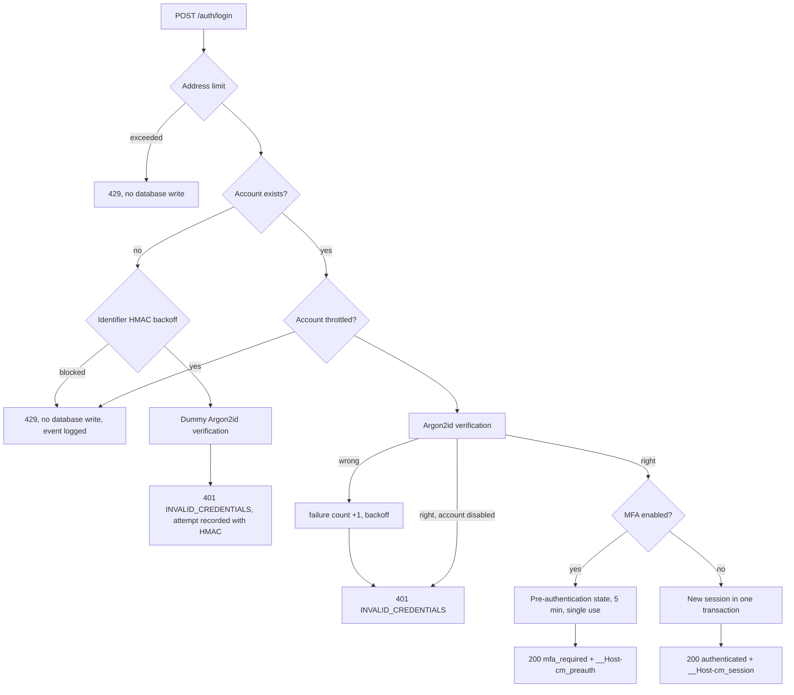

# Authentication Security (Phase 3)

Status: implemented in Phase 3 (CM-T015 to CM-T022), awaiting project owner approval. This document describes what was built and how it is tested. The normative designs are [session-and-csrf.md](session-and-csrf.md), [ADR-008](../architecture/adr/ADR-008-server-side-sessions.md), [../architecture/data-flow.md](../architecture/data-flow.md) DF-01 and DF-02, and the parameter register CP-05 to CP-12 in [../crypto/crypto-decisions.md](../crypto/crypto-decisions.md).

**Scope boundary.** This is account authentication: the account password proves identity to the server. The Vault Passphrase, which protects the user's private key in the browser, is a different secret in a different trust domain (CD-01). Nothing in this phase derives keys from the account password, generates key pairs or touches the vault (Phase 4).

## 1. Components

| Concern | Module |
|---|---|
| Password policy and Argon2id (CP-05, CP-06) | `apps/api/src/auth/password.ts`, blocklist `apps/api/src/auth/data/common-passwords.ts` (generated) |
| Session and pre-authentication tokens | `apps/api/src/auth/tokens.ts`, `apps/api/src/auth/cookies.ts` |
| Session lifecycle and gates | `apps/api/src/auth/sessions.ts` |
| Workflows (register, login, MFA, step-up, password change, sessions) | `apps/api/src/auth/service.ts` |
| Platform administration | `apps/api/src/auth/admin.ts`, CLI `apps/api/src/cli/platform-admin.ts` |
| TOTP (LIB-06) and secret encryption at rest (CP-11) | `apps/api/src/auth/totp.ts`, `apps/api/src/auth/totp-secret-box.ts` |
| Recovery codes (CP-10), identifier HMAC (CP-12) | `apps/api/src/auth/recovery-codes.ts`, `apps/api/src/auth/identifier.ts` |
| Abuse limits | `apps/api/src/auth/limits.ts` |
| Security events | `apps/api/src/auth/security-events.ts` |
| Data access (the only code touching auth tables) | `apps/api/src/db/auth-store.ts`, retention `apps/api/src/db/retention.ts` |
| Routes | `apps/api/src/routes/auth.ts`, central authentication in `apps/api/src/routes/registry.ts` |
| Web client | `apps/web/src/app/{register,login,account}`, `apps/web/src/lib/api.ts` |

## 2. Endpoints

All paths are under `/api`. Every POST passes the same-origin gate, the JSON content-type gate and the `X-CipherMesh-Request` header check before routing (INV-19), including the unauthenticated ones.

| Method and path | Access | Gate | Rate limit | Purpose |
|---|---|---|---|---|
| POST `/auth/register` | Public | | 10 per hour per address | CM-T015 |
| POST `/auth/login` | Public | | 20 per 10 min per address, plus per-account backoff | CM-T016 |
| POST `/auth/mfa/verify` | Public, needs `__Host-cm_preauth` | | 20 per 10 min per address, 5 per pre-auth state, account backoff | CM-T019 |
| POST `/auth/mfa/recovery` | Public, needs `__Host-cm_preauth` | | Same | CM-T019 |
| GET `/auth/session` | Session | | | Current user and session times |
| POST `/auth/logout` | Session | | | CM-T017 |
| GET `/auth/sessions` | Session | | | Own sessions |
| POST `/auth/sessions/revoke`, `/auth/sessions/revoke-others` | Session | | | CM-T017 |
| POST `/auth/step-up` | Session | | 10 per 15 min per user | CM-T021 |
| POST `/auth/password` | Session | Current password (+ TOTP) in the request | 10 per 15 min per user | Section 7 of the session design |
| POST `/mfa/totp/enroll`, `/mfa/totp/confirm` | Session | Step-up within 15 min | Confirm: 10 per 15 min per user | CM-T019 |
| POST `/mfa/totp/disable`, `/mfa/recovery-codes/regenerate` | Session | Step-up within 15 min (password and TOTP) | | CM-T019 |
| POST `/admin/users/disable`, `/admin/users/enable` | Session | PLATFORM_ADMIN, MFA-verified session, step-up | | CM-T022, PA-03 |

The route inventory test fixes the public surface to six routes (health, readiness and the four above). Every request object is strict, so unknown fields such as `platformRole`, `status`, `mfaEnabled`, `passwordHash` or `stepUpAt` are rejected (mass assignment). Responses are explicit projections; no hash, digest, token or internal counter is ever returned.

## 3. Registration

1. The address limiter runs first, before any hashing.
2. Email: NFKC, trimmed, lower-cased once in the request schema, at most 254 characters, stored as `citext` with a unique index. Display name: NFKC, trimmed, 1 to 80 characters, no control characters.
3. Password policy (CP-06): 12 to 128 Unicode code points after NFKC normalization, never truncated; lone surrogates refused; a local blocklist of 30,402 breached passwords; no password containing the email local part, the display name or the product name. No composition rules. Refusals return `PASSWORD_REJECTED` with issue codes only, never the value.
4. Argon2id (CP-05: m = 65536 KiB, t = 3, p = 4, 16-byte random salt, 32-byte output) through Node.js `crypto.argon2` (LIB-04). The database stores the PHC string; a CHECK constraint refuses anything else (INV-11).
5. The account is inserted; a concurrent duplicate loses on the unique index (tested with five parallel requests). No session, no keys. Response: `201 {"status":"registered"}`.

## 4. Login (DF-01)

- **One answer for every failure:** wrong password, unknown account, malformed identifier and disabled account all return `401 INVALID_CREDENTIALS` with the same message.
- **No timing shortcut:** unknown accounts run a full Argon2id verification against a per-process dummy hash with the current parameters; a malformed stored hash does the same and fails closed. A test compares median timings; a negative control removing the dummy verification is caught.
- **Rehash:** a correct password stored with older parameters is rehashed with the current ones.
- **No session before all factors:** an MFA account gets only the pre-authentication cookie.
- Any cookie sent with the login request is ignored: login always creates new state (fixation, T-08).

## 5. Sessions

| Property | Implementation |
|---|---|
| Token | 32 bytes from `crypto.randomBytes`, base64url (43 characters); carries no data |
| Storage | SHA-256 digest only (`sessions.token_digest`, 32-byte CHECK); the raw token exists only in the cookie |
| Cookie | `__Host-cm_session=…; Max-Age=<remaining absolute lifetime>; Path=/; Secure; HttpOnly; SameSite=Strict`, no Domain. Identical in every environment; there is no configuration that weakens it |
| Idle timeout | 30 minutes; activity extends it at most once a minute, never beyond the absolute lifetime |
| Absolute lifetime | 12 hours from the password authentication; MFA and activity do not extend it |
| Validation | On every authenticated request: digest lookup, not revoked, idle and absolute expiry, account ACTIVE. A dead cookie is answered with 401 and a cookie deletion. An expired session stays expired because expiry is checked from timestamps; it is not additionally marked revoked |
| Rotation | New token after MFA completion, step-up, password change and MFA enable or disable; the old token stops working immediately |
| Invalidation | Logout (current), "sign out other sessions", password change and MFA change (others), recovery-code login (others), account disable and platform role change (all) |
| Limit | 10 active sessions; the 11th login revokes the least recently used one under a row lock (`SESSION_EVICTED`) |
| Identity | The actor comes only from the session row. Headers such as `X-User-Id`, body or query fields are never identity (tested) |
| Retention | `pnpm worker:retention` (as `cm_worker`) deletes sessions 30 days after they ended; scheduling arrives with the worker (Phase 12) |

## 6. MFA (DF-02, CM-T019)

**Enrollment.** Requires a step-up within 15 minutes, so a stolen but stale session cannot attach the attacker's authenticator.
1. `POST /mfa/totp/enroll`: the server generates a 160-bit secret with the CSPRNG, encrypts it (CP-11) and stores it as pending (`mfa_enabled = false`). The response carries the otpauth URI and the base32 secret, shown once (QR code rendered as SVG elements, no image request, nothing stored by the client). Refused with 409 if MFA is already on.
2. `POST /mfa/totp/confirm`: a valid code proves the authenticator holds the secret. Only then is MFA enabled; ten recovery codes are issued and returned once; the session rotates and records `mfaVerifiedAt`; other sessions are revoked.

**Secret at rest (CP-11).** AES-256-GCM under `TOTP_ENCRYPTION_KEY` (32 bytes, outside the database), fresh 96-bit IV, AAD = canonical context `{"ctx":"cm.srv.totp","keyId":…,"userId":…,"v":1}`. Stored as IV, ciphertext and tag (48 bytes). A ciphertext moved to another user, a wrong key ID or any flipped bit fails closed (tested). This is a server-readable secret by design: the server must verify codes. It has nothing to do with the user's vault.

**Verification (CP-09, LIB-06).** RFC 6238 with HMAC-SHA-1, 6 digits, 30-second steps, and a window of one step either way (about 90 seconds). The library compares codes in constant time. Each accepted time step is stored per account (`mfa_last_used_step`) with a conditional update, so a code is never accepted twice, even concurrently. The server clock must be NTP-synchronized.

**Login step.** The pre-authentication state is a separate row (`auth_challenges`, see data-model 4.3.1) with its own random token in `__Host-cm_preauth` (same attributes, 5 minutes). It opens no authenticated endpoint, allows at most five code attempts (atomic counter), is consumed by success (single use, atomic), and expires after five minutes. Failed codes also count toward the account backoff, so new pre-authentication states do not give unlimited guesses. Success creates a fresh session with `authenticatedAt` = time of the password check and `mfaVerifiedAt` = now.

**Disabling** requires a step-up that included a current TOTP code, rotates the session, revokes the others, and deletes the secret and recovery codes. Platform administrators cannot disable MFA.

## 7. Recovery codes (CP-10)

Ten codes of 20 characters from the Crockford base32 alphabet chosen with `crypto.randomInt` (100 bits each), shown as `XXXXX-XXXXX-XXXXX-XXXXX`. Input is accepted in any case, with or without separators, with Crockford look-alikes mapped. Only the SHA-256 digest of the canonical form is stored. Use at the MFA step consumes one code atomically (exactly one of two concurrent uses succeeds), creates a new session, revokes all other sessions and records `RECOVERY_CODE_USED` with the remaining count. Regeneration requires a step-up and replaces every previous code. Codes appear in the browser only while displayed and are never written to browser storage.

## 8. Step-up and freshness gates (CM-T021)

- `POST /auth/step-up` verifies the password, plus a current TOTP code when MFA is enabled, sets `stepUpAt` and rotates the token.
- Route gates are declared in the route registry (`requires: { stepUp: 'standard' | 'strict' }`) and enforced on the server from the session row: 15 minutes, or 5 minutes for the strict variant (profile downgrades, Phase 10). A step-up time in the future is refused. Failure: `401 STEP_UP_REQUIRED`.
- `requireRecentAuthentication(actor, maxAge)` returns `REAUTH_REQUIRED`; it is the building block for the per-profile freshness gate PC-02 (Phase 10).
- The client cannot claim a step-up: request fields that look like one are rejected, headers are ignored (tested).

## 9. CSRF (CM-T020)

Implemented exactly as [session-and-csrf.md](session-and-csrf.md) section 8: SameSite=Strict as one layer; `Sec-Fetch-Site: same-origin`, otherwise an exact `Origin` match, on every state-changing request; JSON only; the custom header; no CORS headers at all; no state change on GET. The suite runs nine attack shapes (cross-site forms in three encodings, foreign-origin fetch, same-site sibling, `Origin: null`, no origin information, missing header, wrong content type) against eleven state-changing routes (104 tests), plus login CSRF, side-effect and preflight checks. Playwright confirms in Chromium, Firefox and WebKit that `fetch()` sends the real `Origin` while the page uses `Referrer-Policy: no-referrer`. The client never submits HTML forms. No synchronizer token is needed while the client and API share one origin.

## 10. Abuse controls (CM-T018)

| Layer | Rule | Why |
|---|---|---|
| Per client address (in memory) | Login 20 / 10 min, MFA step 20 / 10 min, registration 10 / hour | Credential stuffing and spraying from one source. Checked before any database write or hash, so a flood cannot grow `login_attempts` |
| Bounded writes | Requests refused by any limit or backoff write no `login_attempts` row (the security event is logged instead); rows are written only after an Argon2id verification | A distributed flood against a throttled account cannot grow the table faster than Argon2id throughput (found in the Phase 3 self-review) |
| Per account (database) | After 5 consecutive failures (password or MFA code), blocked for 30 s, doubling per further failure up to 15 min; a success resets | Targeted guessing without permanent lockout. Correct passwords are refused while blocked (`429` with `Retry-After`) |
| Per unknown identifier (database, keyed HMAC) | The same schedule from `login_attempts` within 24 hours | Throttling behaves identically for unknown accounts, so it reveals nothing |
| Per authenticated user (in memory) | Password or code re-verification 10 / 15 min | Guessing through step-up or password change with a stolen session |
| Argon2id concurrency | min(4, CPUs) at once, 32 queued, then `503` with `Retry-After: 1` | Memory-hard hashing cannot be turned into memory exhaustion (T-26) |
| Nginx (Phase 17) | Rate-limit zones in front of the API | Defence in depth; the API does not rely on it |

Client addresses come from the socket, or from exactly one `X-Forwarded-For` hop when `TRUST_PROXY_HOPS=1` (production behind Nginx). Without it, forwarded headers are ignored, so clients cannot choose their own address.

**Resource review.** One Argon2id computation uses 64 MiB. With the limiter, the API holds at most 4 × 64 MiB = 256 MiB of Argon2 memory (128 MiB on a 2-vCPU VM). A burst of 60 concurrent unauthenticated logins in the test suite receives only 401, 429 or 503 answers, and the API stays healthy. Tests use the production parameters; nothing is weakened for speed.

## 11. Enumeration

| Protected | How |
|---|---|
| Login: whether an account exists, is disabled, has MFA, or is an administrator | One error for every failure; MFA status is revealed only after the correct password; equal Argon2id work for unknown accounts; identical throttling for unknown identifiers |
| Platform endpoints | Non-administrators get 404 |
| Other users' sessions | Revoking an unknown or foreign session ID gives the same 404 |

**Not protected (accepted, T-15):** registration answers `409 EMAIL_UNAVAILABLE` for a taken address, because the alternative (silently accepting) needs an email service the baseline does not have (DF-01). It is rate-limited per address. Recorded as L-35.

## 12. Security telemetry and retention

| Data | Where | Content | Retention |
|---|---|---|---|
| Login attempts | `login_attempts` | Outcome, time, IP address, user agent, and either the account ID or HMAC-SHA-256 of an unknown identifier. Never the password, never a raw unknown identifier | 90 days (`pnpm worker:retention`) |
| Security events | Structured application log (redacted) | Catalogued event name, outcome, actor and target user IDs, request ID, allowlisted counts and reason codes | Log retention of the deployment (Phase 17) |
| Sessions | `sessions` | Digest, timestamps, IP address, user agent, revocation reason | 30 days after ending |
| Pre-authentication states | `auth_challenges` | Digest, user, timestamps, attempt count | 1 day after expiry |

**Why the log and not the audit table:** INV-09 requires audit rows to be hash-chained, and the chain arrives in Phase 12 (ADR-009). Rows inserted now could never be chained later, because `audit_events` is append-only. All events go through one catalogue module (`SECURITY_EVENTS`), so Phase 12 replaces the sink without touching call sites (L-33).

The logger redacts passwords (any key ending in `password`), `otp`, `totp`, `otpauth` URIs, recovery codes, tokens, cookies, `challenge` and authentication cookie values in strings. A test runs every flow and then searches the whole log and all events for every password, secret, code and token used.

## 13. Platform administrators (CM-T022)

- Granted or removed only by the server-side CLI `pnpm admin:platform-role grant|revoke <email>`; there is no API. Granting requires MFA on the account; removing the last active administrator is refused; every change revokes all sessions of that account.
- Administrator routes require the role, an MFA-verified session and a step-up. Others receive 404.
- Disabling: not oneself, not the last active administrator; status and the revocation of all sessions in one transaction; the session check refuses disabled accounts on the next request regardless. Enabling restores login. Room memberships become SUSPENDED once rooms exist (Phase 5; integration test in Phase 11).
- PLATFORM_ADMIN grants no room access and no key material (PA-05). There is no administrator bypass in the authentication code.
- **Administrator-assisted password or MFA reset (PA-04)** is a documented procedure in this phase, not tooling: (1) the operator verifies the person's identity out of band (in a university project: in person, with a second team member as witness); (2) records the request, the check and the decision in Jira; (3) performs the reset with a reviewed one-off change (clearing the MFA fields and recovery codes, or setting a temporary password hash produced by the API's own hasher), revoking all sessions of the account; (4) the user changes the temporary password at the next login. The user's vault is never touched. A CLI command like the role CLI is the planned tooling (tracked in the Phase 3 traceability record); no API endpoint exists for it.

## 14. Browser

The session and pre-authentication cookies are HttpOnly, so page scripts never see them. The client stores nothing in `localStorage`, `sessionStorage` or IndexedDB. The TOTP secret and recovery codes exist only in component state while displayed. Playwright checks all of this in three engines after login and after MFA enrollment; a negative control shows the storage check detects a script-readable cookie.

## 15. Tests

| Suite | Content |
|---|---|
| `apps/api/src/auth/*.test.ts` | RFC 6238 vectors and window; password policy, PHC format, rehash flag, malformed hashes, concurrency limiter; tokens, cookies, recovery codes, backoff, HMAC, TOTP secret encryption and AAD, gates |
| `tests/auth/registration` | Hash format, mass assignment, normalization, concurrent duplicates, policy, 128-character and Unicode passwords, rate limit |
| `tests/auth/login` | Cookie attributes, digest-only storage, identical failures, timing, fixation, disabled accounts, malformed hash, rehash, login-attempt privacy, no password in logs |
| `tests/auth/session` | Identity only from the session, dead cookies, idle and absolute expiry, logout, session list and revocation, eviction, password change, disabled accounts |
| `tests/auth/abuse` | Backoff and recovery, doubling, unknown identifiers, per-address limit, no writes when limited, Argon2id burst |
| `tests/auth/csrf` | 104 attack cases plus side effects, login CSRF, preflight |
| `tests/auth/mfa` | Enrollment gate and confirmation, encrypted secret, MFA bypass attempts, single use, five attempts, expiry, drift window and replay, concurrency, disabling |
| `tests/auth/recovery` | Single use, normalization, digests only, concurrency, regeneration |
| `tests/auth/step-up`, `tests/auth/admin`, `tests/auth/logging` | Gates and rotation, forged claims, limits; administrator bootstrap and disabling; log and event secrecy |
| `tests/e2e/auth.spec.ts` | Cookies, browser storage, real Origin, MFA enrollment and recovery login in three engines |
| `pnpm security:negative-controls` | Ten deliberate defects, each caught by the suites above |
