# Authorization Model

Status: Phase 0.5 baseline. Normative. The central module and the shared matrix are implemented since Phase 5 (CM-T029); section 9 records how. Related: [security-policy-profiles.md](security-policy-profiles.md), [../architecture/data-model.md](../architecture/data-model.md), [../threat-model/threat-model.md](../threat-model/threat-model.md) (T-05, T-06).

## 1. Principles

1. **Deny by default.** Every route requires an authenticated session unless it is on the explicit public allowlist (registration, login, MFA verification during login, health and readiness checks). In code this is `PUBLIC_ROUTE_ALLOWLIST` in `apps/api/src/routes/system.ts`, enforced by the route registry.
2. **Server-side only.** Hiding a button is not authorization. The API decides every privileged action.
3. **Database-loaded state.** Roles, membership, ownership and profile are read from the database on every request. Nothing in the request body or cookie grants privileges.
4. **Object-level checks.** Every object is loaded through its room and checked against the caller's membership, which is the main defence against BOLA/IDOR.
5. **Least privilege.** Roles get only the actions they need. The platform administrator has no implicit access to rooms.
6. **Two layers.** Even if an authorization check fails open, room content stays encrypted and envelopes are useful only to their recipient. Cryptography is the second layer, never the only one.

## 2. Roles

### 2.1 Room roles

| Role | Purpose | Constraints |
|---|---|---|
| OWNER | Accountable for the room: profile, deletion, ownership, approvals | Exactly one ACTIVE OWNER per room. Cannot leave before transferring ownership |
| ADMIN | Day-to-day administration: invitations, member management, key rotation | Cannot create ADMINs, cannot remove or demote the OWNER or other ADMINs |
| MEMBER | Contributes content | Can modify and delete only their own content |
| VIEWER | Reads content | Cannot create content. In RESTRICTED rooms cannot obtain file ciphertext (PC-12) |

**Room without an active OWNER.** Ownership changes only through AZ-05, and a PLATFORM_ADMIN cannot reassign it (PA-05). If the OWNER's account is suspended, the OWNER membership becomes SUSPENDED. ADMINs keep operating the room, including rekeys. OWNER-only actions (profile changes, deletion, approval of ADMIN invitations, cancelling another admin's rekey) wait until the account is re-enabled and an ADMIN reinstates the OWNER by re-sharing keys (AZ-14). This fails secure and is accepted as a governance limitation. An audited ownership-recovery procedure is a possible future extension. An OWNER account cannot be deleted while it owns rooms.

### 2.2 Platform roles

| Role | Purpose | Explicitly not allowed |
|---|---|---|
| USER | Normal account | Anything outside own account and own rooms |
| PLATFORM_ADMIN | Account administration, Security Dashboard, audit verification | Reading room names, content, membership or envelopes; joining or adding people to rooms; changing room profiles. Can only be granted through a server-side CLI, never through the API |

PLATFORM_ADMIN accounts must have MFA enabled, and every PA action requires an MFA-verified session.

## 3. Room authorization matrix

Legend: **Y** allowed, **N** denied, **own** only on items the caller created. Profile conditions (PC-xx) apply on top of this matrix.

| ID | Action | OWNER | ADMIN | MEMBER | VIEWER | Notes |
|---|---|---|---|---|---|---|
| AZ-01 | View room metadata, member list, profile | Y | Y | Y | Y | |
| AZ-02 | Rename room | Y | Y | N | N | |
| AZ-03 | Change security profile | Y | N | N | N | Downgrade needs step-up |
| AZ-04 | Delete room | Y | N | N | N | Step-up in every profile |
| AZ-05 | Transfer ownership to an ADMIN | Y | N | N | N | Step-up in every profile |
| AZ-06 | Create invitation | Y (ADMIN, MEMBER, VIEWER) | Y (MEMBER, VIEWER) | N | N | PC-04 to PC-07; blocked while REKEY_REQUIRED or REKEYING |
| AZ-07 | Approve an ADMIN-created invitation | Y | N | N | N | PC-04; approver differs from inviter |
| AZ-08 | Revoke a pending invitation | Y (any) | own | N | N | |
| AZ-09 | Remove a member | Y (ADMIN, MEMBER, VIEWER) | Y (MEMBER, VIEWER) | N | N | Envelopes deleted and room set to REKEY_REQUIRED in the same transaction (PC-15, ADR-013) |
| AZ-10 | Change a member role | Y (among ADMIN, MEMBER, VIEWER) | Y (between MEMBER and VIEWER) | N | N | |
| AZ-11 | Leave room | N (transfer first) | Y | Y | Y | Room becomes REKEY_REQUIRED |
| AZ-12 | Fetch own key envelopes | Y | Y | Y | Y | Own envelopes only |
| AZ-13 | Start, finalize or cancel a rekey operation | Y | Y | N | N | Only the starter can finalize. The starter or the OWNER can cancel. Step-up in RESTRICTED rooms (PC-03) |
| AZ-14 | Re-share keys to a new identity key of a member | Y | Y | N | N | Same checks as invitations |
| AZ-15 | View key state, rekey status, key-version metadata and commitments | Y | Y | Y | Y | |
| AZ-16 | Upload file | Y | Y | Y | N | Blocked while REKEY_REQUIRED or REKEYING |
| AZ-17 | Get file key material (wrapped FEK, encrypted manifest) and ciphertext | Y | Y | Y | Y | VIEWER denied in RESTRICTED (PC-12); the file list with server-side metadata stays visible |
| AZ-18 | Delete file | Y | Y | own | N | |
| AZ-19 | Create note | Y | Y | Y | N | Blocked while REKEY_REQUIRED or REKEYING |
| AZ-20 | Read note | Y | Y | Y | Y | |
| AZ-21 | Update note | Y | Y | own | N | Blocked while REKEY_REQUIRED or REKEYING |
| AZ-22 | Delete note | Y | Y | own | N | |
| AZ-23 | Create secret for an ACTIVE room member | Y | Y | Y | N | Blocked while REKEY_REQUIRED or REKEYING |
| AZ-24 | Reveal a secret | Recipient | Recipient | Recipient | Recipient | Only the recipient, any role |
| AZ-25 | Revoke an unrevealed secret | Y | Y | own (sender) | N | |
| AZ-26 | Create external one-time link (stretch) | Y | Y | Y | N | STANDARD only (PC-11) |
| AZ-27 | Open Crypto Inspector for an item | Same as read access to the item | | | | Projection of safe metadata only |
| AZ-28 | View room audit log | Y | Y | N | N | |
| AZ-29 | Report a key-commitment mismatch | Y | Y | Y | Y | Creates a security event |
| AZ-30 | Record a Room Safety Code comparison or report a mismatch | Y | Y | Y | Y | Stores the key version only, never the code (INV-18) |

## 4. Platform and self-service actions

| ID | Action | Who | Notes |
|---|---|---|---|
| PA-01 | View Security Dashboard (aggregates) | PLATFORM_ADMIN | No room names or content |
| PA-02 | Run and view audit-chain verification | PLATFORM_ADMIN | Global chain |
| PA-03 | Disable or enable a user account | PLATFORM_ADMIN | Step-up required; not self; not the last PLATFORM_ADMIN. Disabling revokes all sessions, sets the user's memberships to SUSPENDED and sets each of those rooms to REKEY_REQUIRED |
| PA-04 | Administrator-assisted password or MFA reset | PLATFORM_ADMIN | Documented identity check, step-up, audit. Does not touch the vault |
| PA-05 | Room content, membership, envelopes | Nobody outside the room | Explicit deny, tested |
| SS-01 | Manage own profile, sessions, MFA | The user | Enabling MFA needs recent authentication; disabling MFA needs step-up |
| SS-02 | Create, unlock, re-wrap or reset own vault | The user | Server sees only public data and ciphertext |
| SS-03 | View, accept or decline own invitations | The invitee | |
| SS-04 | Create a room | Any user with an ACTIVE vault | Must meet the chosen profile's access requirements |
| SS-05 | Look up a user by exact email to invite | Any user with an ACTIVE vault | Rate-limited, returns only ID, display name, account creation date, key ID, public key and fingerprint; the email is shown as unverified (T-35) |
| SS-06 | List own rooms | The user | Only ACTIVE rooms in which the caller has an ACTIVE membership, filtered by membership in the query and paginated (OL-08); each entry carries the caller's own role. Added in Phase 5 (CM-T030): the list is a query over the caller's own memberships, so no action inside one room (AZ-01) covers it |

## 5. Object-level authorization rules

| ID | Rule |
|---|---|
| OL-01 | Every room-scoped route carries the room ID in the path. The first step loads the caller's ACTIVE membership. No membership: 404. |
| OL-02 | Every object is loaded with both its ID and the room ID (`WHERE id = ? AND room_id = ?`). An ID from another room behaves as not found. |
| OL-03 | Identifiers in request bodies that point to other objects (recipient, invitee, key version) are validated against the room: recipients must be ACTIVE members, key versions must belong to the room. |
| OL-04 | Ownership checks compare stored author, uploader or sender IDs with the session user ID. Client-supplied owner fields are rejected by schema validation. |
| OL-05 | Envelopes are selected by room and `recipientUserId = caller`. No endpoint fetches an envelope by its own ID. |
| OL-06 | Secret reveal selects by secret ID, room ID and `recipientUserId = caller` inside the locking transaction. |
| OL-07 | Presigned URLs are issued only after OL-01, OL-02 and action authorization, for one object key and one method, with the lifetimes in CP-20. |
| OL-08 | List endpoints filter by membership inside the query and are paginated with a maximum page size. Results are never filtered after loading. |
| OL-09 | UUIDv4 identifiers make enumeration harder, but no rule relies on identifiers being secret. |
| OL-10 | Only the owner of a vault can fetch its encrypted private key. Others see only public key data. |
| OL-11 | Invitees see only their own invitations; room OWNER and ADMIN see the invitations of their room. |
| OL-12 | Removing, suspending or losing a member deletes that member's envelopes in the same transaction, so every later request fails at OL-01. |
| OL-13 | Rekey operations are loaded by operation ID and room ID. Only the starter can finalize. The recipient set is computed by the server from the database and never taken from the client. |

## 6. Enforcement architecture

```mermaid
flowchart LR
  R["Request"] --> RL["Rate limit"] --> CS["Same-origin and header check<br/>(state-changing requests, including login)"]
  CS --> AU["Authenticate session<br/>(except public routes)"]
  AU --> VA["Schema validation"] --> AC["Load actor context"]
  AC --> RM["Room scope: load room,<br/>membership, profile (OL-01)"]
  RM --> PG["Profile access gates<br/>PC-01, PC-02"]
  PG --> AZ["authorize(actor, action, resource)<br/>matrix + action gates"]
  AZ --> H["Handler: repositories take<br/>actor context and room ID"]
  H --> PR["Response projection<br/>(allowlisted fields)"] --> AUD["Audit"]
```

- **Route registry.** Every route declares its action ID (AZ-xx, PA-xx, SS-xx), scope (room, platform, self) and whether it is public. The application refuses to start if a route has no declaration, and a test checks that every declared action has matrix tests.
- **Central decision function.** `authorize()` is a pure function over database-loaded state and the shared matrix. It returns allow or deny with a reason code and is unit-tested exhaustively.
- **Shared matrix.** The matrix lives in `packages/shared` as data. The UI uses it to hide controls (UX only); the API uses it to enforce; tests compare both.
- **Scoped repositories.** Data-access functions for room objects require the room ID and actor context as parameters, so a query without room scoping is hard to write by accident.

## 7. Error semantics

| Status | Code | When |
|---|---|---|
| 401 | `UNAUTHENTICATED` | No valid session |
| 401 | `REAUTH_REQUIRED` | Session older than the profile allows (PC-02) |
| 401 | `STEP_UP_REQUIRED` | Step-up needed (PC-03, or AZ-03, AZ-04 and AZ-05) |
| 403 | `FORBIDDEN` | Active member without permission for the action |
| 403 | `ORIGIN_REJECTED` | Same-origin verification failed on a state-changing request (INV-19) |
| 403 | `MFA_REQUIRED` | Profile requires MFA (PC-01) |
| 404 | `NOT_FOUND` | Not a member, object outside the room, or a platform endpoint called by a non-admin |
| 409 | `REKEY_REQUIRED` | Content write or invitation while the room is REKEY_REQUIRED or REKEYING (PC-16) |
| 409 | `KEY_VERSION_STALE` | Write names a key version other than the current one |
| 409 | `REVISION_CONFLICT` | Stale note revision |
| 409 | `REKEY_IN_PROGRESS` | Another member's rekey operation holds a valid lease |
| 409 | `REKEY_OPERATION_CLOSED` | Finalize for an expired, cancelled, superseded or stale operation |
| 409 | `REKEY_PAYLOAD_MISMATCH` | Repeated finalize with a different payload |
| 422 | `REKEY_RECIPIENTS_MISMATCH` | Envelope set differs from the server's recipient snapshot |
| 429 | `RATE_LIMITED` | Rate limit exceeded |

Denials are logged with the request ID and reason code, and recorded as audit events according to the audit level (PC-13).

## 8. Testing

- **Matrix tests:** generated from the shared matrix for every action, role and profile, run against a real database with real memberships. No mocked authorization.
- **BOLA/IDOR suite:** two rooms with separate members; every endpoint is called with identifiers from the other room and must return 404 without side effects.
- **Route inventory test:** every route has a declaration and a test.
- **Tampering tests:** requests that include role, owner, sender or room fields in the body are rejected.
- **Platform admin tests:** PLATFORM_ADMIN receives 404 for every room-scoped endpoint of rooms they are not a member of.
- **Rekey authorization tests:** MEMBERs and VIEWERs cannot start rekeys; only the starter can finalize; a removed member's requests fail at OL-01; client-supplied recipient lists are ignored.

## 9. Implementation (Phase 5, CM-T029 to CM-T031)

Status: the central authorization module, the shared matrix and the route-registry enforcement (CM-T029), and the room lifecycle and membership administration routes (CM-T030, CM-T031, section 9.6) are implemented. The BOLA suite over every room route (CM-T032) is still to come. Sections 1 to 8 stay normative; this section records how the code realizes them.

### 9.1 Where the rules live

| Part | Location | Role |
|---|---|---|
| Matrix as data | `packages/shared/src/authorization.ts` (`ROOM_ACTIONS`, `ACCOUNT_ACTIONS`) | Every AZ cell of section 3 and every PA and SS action of section 4, deeply frozen at load. The web client may read it to hide controls (UX only) |
| Decision function | `decideRoomAction` in the same file | Pure and fail-closed: membership, room state and target facts in; allow or a reason code out. The platform role is not an input (PA-05) |
| Membership lookup | `apps/api/src/db/room-access-store.ts` | One query per request, filtered by room ID, session user, ACTIVE membership and ACTIVE room (OL-01). Projection without room name or key material |
| Central authorizer | `apps/api/src/authorization/rooms.ts` | Loads the membership, decides, loads the target object only when the membership and role allow a first step, maps reasons to the responses of section 7 and records `ROOM_ACCESS_DENIED` |
| Declarations | `apps/api/src/routes/registry.ts` | Refuses to start when a route's declaration is missing, unknown or inconsistent (section 9.3). Runs the authorizer for every room route before the handler |

`tests/security/authz-matrix.test.ts` parses sections 3 and 4 of this document and compares every cell with the catalogue, so the table and the code cannot drift apart.

### 9.2 Cell notation

| Cell in section 3 | Catalogue rule | Meaning in the decision |
|---|---|---|
| Y, Y (any) | `allow` | Allowed for the role |
| N, N (transfer first) | `deny` | Denied for the role (403) |
| own, own (sender) | `own` | Allowed only when the stored author, uploader, sender or inviter is the caller (OL-04) |
| Recipient | `recipient` | Allowed only for the stored recipient (OL-06); others get 404 |
| Y (ADMIN, MEMBER, VIEWER) and similar | `targetRoles` | Every role the action touches must be in the list: the target member's stored role and, for role changes and invitations, the requested role. This is how an ADMIN never creates, removes or demotes an ADMIN and nobody grants OWNER outside AZ-05 |
| Same as read access to the item | `inherited` | No permission of its own: the decision denies AZ-27, and the registry refuses a route that declares it. The Crypto Inspector (Phase 13) authorizes through the read action of the inspected item |

Reviewed readings:
- **AZ-05:** the cell says Y, and the action is "Transfer ownership to an ADMIN", so the OWNER's rule is `targetRoles` with ADMIN only.
- **AZ-12:** Y for every role; "own envelopes only" is enforced by selecting envelopes by recipient in the query (OL-05), not by an object rule.
- **AZ-13:** Y for OWNER and ADMIN; the operation rules of OL-13 (only the starter finalizes, the starter or the OWNER cancels) need the operation row and belong to the rekey state machine (CM-T050).
- **Notes that are profile conditions** (PC-03 to PC-16, including "blocked while REKEY_REQUIRED or REKEYING", PC-16) are not cells. They arrive with the policy gates (CM-T046, CM-T047). INV-07 still applies from the first invitation or content-write route on (Phase 6). Whether AZ-07, AZ-14 ("same checks as invitations") and AZ-26 count as invitations or content writes for PC-16 is decided when they are implemented.
- **Step-up in every profile** (AZ-04, AZ-05) and the step-up of PA-03 and PA-04 are part of the catalogue, so a route that forgets them is refused at startup. Profile-dependent step-ups (PC-03, the AZ-03 downgrade) are not.

### 9.3 Route declarations

- Public routes declare no matrix action. Routes behind authentication declare a self-service (SS-xx) or platform (PA-xx) action; PA actions require the platform administrator gate, and only they may use it. PA-05 is an explicit deny and cannot be declared.
- Room routes declare `access: { kind: 'room' }` and a room action (AZ-xx, for example `AZ-02-ROOM-RENAME`); their path starts with `/rooms/:roomId` (OL-01). Conversely, any path below `/rooms/:param` or with a `:roomId` parameter must be a room route, so no route can carry a room ID without the membership check.
- A room route declares a resource loader exactly when some cell of its action depends on the target object. The loader loads the object by its identifier and the room ID (OL-02); null is 404. The decision checks again that the object belongs to the addressed room.
- Paths use lowercase static segments and `:named` parameters only. A route with path parameters declares an object schema with exactly those keys. A malformed or undecodable parameter is the generic 404, never a validation error (review finding R-05-01: undecodable percent-encoding used to reach the error handler as an unhandled 500).

### 9.4 Evaluation order and responses

For a room route: authenticate the session (401) → path parameters (404) → query and body schemas (400) → central room authorization (404 or 403) → step-up gate (401) → handler → response projection. The matrix is checked before the step-up prompt, so a non-member learns nothing and a member without the permission gets 403 without being asked to step up.

| Reason codes | Response |
|---|---|
| `NOT_A_MEMBER`, `MEMBERSHIP_MISMATCH`, `MEMBERSHIP_NOT_ACTIVE`, `ROOM_NOT_ACTIVE`, `UNKNOWN_ROLE`, `RESOURCE_OUTSIDE_ROOM`, `RESOURCE_NOT_FOUND`, `NOT_RECIPIENT` | 404 `NOT_FOUND`, the same body as an unknown room or path |
| `ROLE_NOT_PERMITTED`, `NOT_OWN_ITEM`, `TARGET_ROLE_NOT_PERMITTED`, `INHERITED_ACTION`, `UNKNOWN_ACTION`, `RESOURCE_REQUIRED` | 403 `FORBIDDEN` |

SUSPENDED, REMOVED and LEFT memberships and DELETING or DELETED rooms behave as no membership. The reason code goes only into the `ROOM_ACCESS_DENIED` security event (action and reason, plus the actor and request ID), which is written to the application log until the Phase 12 ledger (L-33).

The decision describes the database state at the start of the request; nothing is cached between requests. A handler that changes membership, roles or ownership must re-check the stored state inside its own transaction (a conditional update or a row lock), so a concurrent change cannot slip between the check and the write.

### 9.5 Decisions recorded with CM-T030 and CM-T031

- **SS-06, listing one's own rooms**, was added to section 4. The list is a query over the caller's own memberships, not an action inside one room, so AZ-01 cannot authorize it, and an unscoped collection must not borrow a room action.
- **PA-03's room consequence** is implemented: disabling an account suspends its memberships and locks their rooms in the same transaction (section 9.6).
- **The former OWNER becomes an ADMIN** after a transfer (AZ-05). Section 2.1 says only that ownership moves to an ADMIN; ADMIN keeps the former owner in the room with the next lower role, and lets them leave later (AZ-11), which an OWNER cannot.
- **A PLATFORM_ADMIN account may create a room** like any user with an ACTIVE vault (SS-04). Section 2.2 forbids using the platform role to reach other people's rooms; creating one's own room grants nothing in anyone else's.
- **Removing a SUSPENDED member** is allowed with the same role ceilings, and it runs the full member-loss transaction like any removal.

### 9.6 Room lifecycle and membership administration (CM-T030, CM-T031)

| Route | Action | Notes |
|---|---|---|
| `POST /rooms` | SS-04 | Body: client-chosen room ID (UUIDv4, DF-05), name, profile. Needs an ACTIVE account (checked under a lock on the user row), an ACTIVE vault (`403 VAULT_SETUP_REQUIRED`), and the profile's access requirements: an MFA-verified session for CONFIDENTIAL and RESTRICTED (PC-01, `403 MFA_REQUIRED`) and a password sign-in within 12, 4 or 1 hours (PC-02, `401 REAUTH_REQUIRED`). Writes the room (policy version 1) and the OWNER membership in one transaction; no key version, envelope or commitment (CM-T033). An ID that was ever used gives `409 ROOM_ID_UNAVAILABLE` (L-45) |
| `GET /rooms` | SS-06 | ACTIVE memberships in ACTIVE rooms, filtered in the query, newest first, pages of at most 50 with a keyset cursor (OL-08) |
| `GET /rooms/{roomId}`, `GET /rooms/{roomId}/members` | AZ-01 | Room metadata and the caller's role; ACTIVE and SUSPENDED members with display name, role, status and join time (pages of at most 100). Both queries are constrained by the caller's ACTIVE membership again |
| `POST /rooms/{roomId}/rename` | AZ-02 | Name: NFKC, trimmed, 1 to 100 characters, no control or bidirectional-override characters. The UI warns that names are not encrypted (T-28) |
| `POST /rooms/{roomId}/delete` | AZ-04, step-up | The room becomes DELETING and refuses every request at once. The worker job (`pnpm worker:retention`, as `cm_worker`) makes it DELETED only when no envelope, file, note or secret row is left, so a later phase that adds content cannot end with a DELETED room still holding ciphertext |
| `POST /rooms/{roomId}/members/{userId}/role` | AZ-10 | Body: ADMIN, MEMBER or VIEWER; OWNER is not representable. Target: ACTIVE member of this room. Increments the membership epoch; an unchanged role is a no-op |
| `POST /rooms/{roomId}/members/{userId}/remove` | AZ-09 | Target: ACTIVE or SUSPENDED member of this room. One transaction: status REMOVED, the target's envelopes deleted, epoch incremented, room REKEY_REQUIRED with MEMBER_REMOVED (INV-07, DF-10). Answers `rekeyRequired: true` |
| `POST /rooms/{roomId}/members/{userId}/transfer-ownership` | AZ-05, step-up | Target: ACTIVE ADMIN of this room. The OWNER becomes ADMIN first, then the target becomes OWNER, so the partial unique index (one ACTIVE OWNER per room) holds at every statement. Increments the epoch |

**Account disabling (PA-03, key-lifecycle R3).** The disable transaction sets the account DISABLED and revokes its sessions, then suspends every ACTIVE membership (`removal_reason` ACCOUNT_DISABLED, role kept for reinstatement), deletes the user's envelopes in those rooms and sets each affected ACTIVE room to REKEY_REQUIRED with MEMBER_SUSPENDED. Repeating it suspends whatever is still ACTIVE. Re-enabling restores the login only: memberships stay SUSPENDED until an OWNER or ADMIN re-shares keys (AZ-14, Phase 6), as section 2.1 and data-model 4.7 specify (L-44).

**REKEY_REQUIRED.** Removal and suspension only record the state, reasons and epoch the rekey state machine needs (ADR-013); nothing creates a key version or claims a rekey. REKEY_REQUIRED blocks content writes and invitations (PC-16, enforced from the first such route); membership administration and reads continue.

**Concurrency.** Every room change locks the room row first, then the memberships it reads, and runs the decision again on that locked state (`reauthorizeRoomAction`), so the gate's decision never outlives a concurrent change; writes are conditional on the checked role and status. Account suspension locks the affected rooms in ID order before their memberships, the same order, so the two kinds of transaction cannot deadlock; it also updates the user row before reading memberships, so a concurrent room creation by that user either finishes first and is suspended, or sees the disabled account. An interactive transaction that runs longer than five seconds, for example while waiting for a lock, is rolled back and the request fails closed (500). `tests/authz/membership-concurrency.test.ts` forces each race by holding the room lock until both requests wait.

**Events.** `ROOM_CREATED`, `ROOM_RENAMED`, `ROOM_DELETED`, `MEMBER_ROLE_CHANGED`, `MEMBER_REMOVED`, `MEMBER_SUSPENDED`, `OWNERSHIP_TRANSFERRED` and `REKEY_REQUIRED` (only when a room leaves ACTIVE), after the transaction commits. Details carry the room ID, roles, reason codes and counts, never the room name (T-28); they go to the application log until the Phase 12 ledger (L-33).
