# Authorization Model

Status: Phase 0.5 baseline. Normative. Related: [security-policy-profiles.md](security-policy-profiles.md), [../architecture/data-model.md](../architecture/data-model.md), [../threat-model/threat-model.md](../threat-model/threat-model.md) (T-05, T-06).

## 1. Principles

1. **Deny by default.** Every route requires an authenticated session unless it is on the explicit public allowlist (registration, login, MFA verification during login, health and readiness checks). In code this is `PUBLIC_ROUTE_ALLOWLIST` in `apps/api/src/routes/system.ts`, enforced by the route registry.
2. **Server-side only.** Hiding a button is not authorization. The API decides every privileged action.
3. **Database-loaded state.** Roles, membership, ownership and profile are read from the database on every request. Nothing in the request body or cookie grants privileges.
4. **Object-level checks.** Every object is loaded through its room and checked against the caller's membership, which is the main defence against BOLA/IDOR.
5. **Least privilege.** Roles get only the actions they need. The platform administrator has no implicit access to rooms.
6. **Two layers.** Even if an authorization check fails open, room content stays encrypted and envelopes are useful only to their recipient. Cryptography is the second layer, never the only one.

## 2. Roles

### 2.1 Room roles

| Role | Purpose | Constraints |
|---|---|---|
| OWNER | Accountable for the room: profile, deletion, ownership, approvals | Exactly one ACTIVE OWNER per room. Cannot leave before transferring ownership |
| ADMIN | Day-to-day administration: invitations, member management, key rotation | Cannot create ADMINs, cannot remove or demote the OWNER or other ADMINs |
| MEMBER | Contributes content | Can modify and delete only their own content |
| VIEWER | Reads content | Cannot create content. In RESTRICTED rooms cannot obtain file ciphertext (PC-12) |

**Room without an active OWNER.** Ownership changes only through AZ-05, and a PLATFORM_ADMIN cannot reassign it (PA-05). If the OWNER's account is suspended, the OWNER membership becomes SUSPENDED. ADMINs keep operating the room, including rekeys. OWNER-only actions (profile changes, deletion, approval of ADMIN invitations, cancelling another admin's rekey) wait until the account is re-enabled and an ADMIN reinstates the OWNER by re-sharing keys (AZ-14). This fails secure and is accepted as a governance limitation. An audited ownership-recovery procedure is a possible future extension. An OWNER account cannot be deleted while it owns rooms.

### 2.2 Platform roles

| Role | Purpose | Explicitly not allowed |
|---|---|---|
| USER | Normal account | Anything outside own account and own rooms |
| PLATFORM_ADMIN | Account administration, Security Dashboard, audit verification | Reading room names, content, membership or envelopes; joining or adding people to rooms; changing room profiles. Can only be granted through a server-side CLI, never through the API |

PLATFORM_ADMIN accounts must have MFA enabled, and every PA action requires an MFA-verified session.

## 3. Room authorization matrix

Legend: **Y** allowed, **N** denied, **own** only on items the caller created. Profile conditions (PC-xx) apply on top of this matrix.

| ID | Action | OWNER | ADMIN | MEMBER | VIEWER | Notes |
|---|---|---|---|---|---|---|
| AZ-01 | View room metadata, member list, profile | Y | Y | Y | Y | |
| AZ-02 | Rename room | Y | Y | N | N | |
| AZ-03 | Change security profile | Y | N | N | N | Downgrade needs step-up |
| AZ-04 | Delete room | Y | N | N | N | Step-up in every profile |
| AZ-05 | Transfer ownership to an ADMIN | Y | N | N | N | Step-up in every profile |
| AZ-06 | Create invitation | Y (ADMIN, MEMBER, VIEWER) | Y (MEMBER, VIEWER) | N | N | PC-04 to PC-07; blocked while REKEY_REQUIRED or REKEYING |
| AZ-07 | Approve an ADMIN-created invitation | Y | N | N | N | PC-04; approver differs from inviter |
| AZ-08 | Revoke a pending invitation | Y (any) | own | N | N | |
| AZ-09 | Remove a member | Y (ADMIN, MEMBER, VIEWER) | Y (MEMBER, VIEWER) | N | N | Envelopes deleted and room set to REKEY_REQUIRED in the same transaction (PC-15, ADR-013) |
| AZ-10 | Change a member role | Y (among ADMIN, MEMBER, VIEWER) | Y (between MEMBER and VIEWER) | N | N | |
| AZ-11 | Leave room | N (transfer first) | Y | Y | Y | Room becomes REKEY_REQUIRED |
| AZ-12 | Fetch own key envelopes | Y | Y | Y | Y | Own envelopes only |
| AZ-13 | Start, finalize or cancel a rekey operation | Y | Y | N | N | Only the starter can finalize. The starter or the OWNER can cancel. Step-up in RESTRICTED rooms (PC-03) |
| AZ-14 | Re-share keys to a new identity key of a member | Y | Y | N | N | Same checks as invitations |
| AZ-15 | View key state, rekey status, key-version metadata and commitments | Y | Y | Y | Y | |
| AZ-16 | Upload file | Y | Y | Y | N | Blocked while REKEY_REQUIRED or REKEYING |
| AZ-17 | Get file key material (wrapped FEK, encrypted manifest) and ciphertext | Y | Y | Y | Y | VIEWER denied in RESTRICTED (PC-12); the file list with server-side metadata stays visible |
| AZ-18 | Delete file | Y | Y | own | N | |
| AZ-19 | Create note | Y | Y | Y | N | Blocked while REKEY_REQUIRED or REKEYING |
| AZ-20 | Read note | Y | Y | Y | Y | |
| AZ-21 | Update note | Y | Y | own | N | Blocked while REKEY_REQUIRED or REKEYING |
| AZ-22 | Delete note | Y | Y | own | N | |
| AZ-23 | Create secret for an ACTIVE room member | Y | Y | Y | N | Blocked while REKEY_REQUIRED or REKEYING |
| AZ-24 | Reveal a secret | Recipient | Recipient | Recipient | Recipient | Only the recipient, any role |
| AZ-25 | Revoke an unrevealed secret | Y | Y | own (sender) | N | |
| AZ-26 | Create external one-time link (stretch) | Y | Y | Y | N | STANDARD only (PC-11) |
| AZ-27 | Open Crypto Inspector for an item | Same as read access to the item | | | | Projection of safe metadata only |
| AZ-28 | View room audit log | Y | Y | N | N | |
| AZ-29 | Report a key-commitment mismatch | Y | Y | Y | Y | Creates a security event |
| AZ-30 | Record a Room Safety Code comparison or report a mismatch | Y | Y | Y | Y | Stores the key version only, never the code (INV-18) |

## 4. Platform and self-service actions

| ID | Action | Who | Notes |
|---|---|---|---|
| PA-01 | View Security Dashboard (aggregates) | PLATFORM_ADMIN | No room names or content |
| PA-02 | Run and view audit-chain verification | PLATFORM_ADMIN | Global chain |
| PA-03 | Disable or enable a user account | PLATFORM_ADMIN | Step-up required; not self; not the last PLATFORM_ADMIN. Disabling revokes all sessions, sets the user's memberships to SUSPENDED and sets each of those rooms to REKEY_REQUIRED |
| PA-04 | Administrator-assisted password or MFA reset | PLATFORM_ADMIN | Documented identity check, step-up, audit. Does not touch the vault |
| PA-05 | Room content, membership, envelopes | Nobody outside the room | Explicit deny, tested |
| SS-01 | Manage own profile, sessions, MFA | The user | Enabling MFA needs recent authentication; disabling MFA needs step-up |
| SS-02 | Create, unlock, re-wrap or reset own vault | The user | Server sees only public data and ciphertext |
| SS-03 | View, accept or decline own invitations | The invitee | |
| SS-04 | Create a room | Any user with an ACTIVE vault | Must meet the chosen profile's access requirements |
| SS-05 | Look up a user by exact email to invite | Any user with an ACTIVE vault | Rate-limited, returns only ID, display name, account creation date, key ID, public key and fingerprint; the email is shown as unverified (T-35) |

## 5. Object-level authorization rules

| ID | Rule |
|---|---|
| OL-01 | Every room-scoped route carries the room ID in the path. The first step loads the caller's ACTIVE membership. No membership: 404. |
| OL-02 | Every object is loaded with both its ID and the room ID (`WHERE id = ? AND room_id = ?`). An ID from another room behaves as not found. |
| OL-03 | Identifiers in request bodies that point to other objects (recipient, invitee, key version) are validated against the room: recipients must be ACTIVE members, key versions must belong to the room. |
| OL-04 | Ownership checks compare stored author, uploader or sender IDs with the session user ID. Client-supplied owner fields are rejected by schema validation. |
| OL-05 | Envelopes are selected by room and `recipientUserId = caller`. No endpoint fetches an envelope by its own ID. |
| OL-06 | Secret reveal selects by secret ID, room ID and `recipientUserId = caller` inside the locking transaction. |
| OL-07 | Presigned URLs are issued only after OL-01, OL-02 and action authorization, for one object key and one method, with the lifetimes in CP-20. |
| OL-08 | List endpoints filter by membership inside the query and are paginated with a maximum page size. Results are never filtered after loading. |
| OL-09 | UUIDv4 identifiers make enumeration harder, but no rule relies on identifiers being secret. |
| OL-10 | Only the owner of a vault can fetch its encrypted private key. Others see only public key data. |
| OL-11 | Invitees see only their own invitations; room OWNER and ADMIN see the invitations of their room. |
| OL-12 | Removing, suspending or losing a member deletes that member's envelopes in the same transaction, so every later request fails at OL-01. |
| OL-13 | Rekey operations are loaded by operation ID and room ID. Only the starter can finalize. The recipient set is computed by the server from the database and never taken from the client. |

## 6. Enforcement architecture

```mermaid
flowchart LR
  R["Request"] --> RL["Rate limit"] --> CS["Same-origin and header check<br/>(state-changing requests, including login)"]
  CS --> AU["Authenticate session<br/>(except public routes)"]
  AU --> VA["Schema validation"] --> AC["Load actor context"]
  AC --> RM["Room scope: load room,<br/>membership, profile (OL-01)"]
  RM --> PG["Profile access gates<br/>PC-01, PC-02"]
  PG --> AZ["authorize(actor, action, resource)<br/>matrix + action gates"]
  AZ --> H["Handler: repositories take<br/>actor context and room ID"]
  H --> PR["Response projection<br/>(allowlisted fields)"] --> AUD["Audit"]
```

- **Route registry.** Every route declares its action ID (AZ-xx, PA-xx, SS-xx), scope (room, platform, self) and whether it is public. The application refuses to start if a route has no declaration, and a test checks that every declared action has matrix tests.
- **Central decision function.** `authorize()` is a pure function over database-loaded state and the shared matrix. It returns allow or deny with a reason code and is unit-tested exhaustively.
- **Shared matrix.** The matrix lives in `packages/shared` as data. The UI uses it to hide controls (UX only); the API uses it to enforce; tests compare both.
- **Scoped repositories.** Data-access functions for room objects require the room ID and actor context as parameters, so a query without room scoping is hard to write by accident.

## 7. Error semantics

| Status | Code | When |
|---|---|---|
| 401 | `UNAUTHENTICATED` | No valid session |
| 401 | `REAUTH_REQUIRED` | Session older than the profile allows (PC-02) |
| 401 | `STEP_UP_REQUIRED` | Step-up needed (PC-03, or AZ-03, AZ-04 and AZ-05) |
| 403 | `FORBIDDEN` | Active member without permission for the action |
| 403 | `ORIGIN_REJECTED` | Same-origin verification failed on a state-changing request (INV-19) |
| 403 | `MFA_REQUIRED` | Profile requires MFA (PC-01) |
| 404 | `NOT_FOUND` | Not a member, object outside the room, or a platform endpoint called by a non-admin |
| 409 | `REKEY_REQUIRED` | Content write or invitation while the room is REKEY_REQUIRED or REKEYING (PC-16) |
| 409 | `KEY_VERSION_STALE` | Write names a key version other than the current one |
| 409 | `REVISION_CONFLICT` | Stale note revision |
| 409 | `REKEY_IN_PROGRESS` | Another member's rekey operation holds a valid lease |
| 409 | `REKEY_OPERATION_CLOSED` | Finalize for an expired, cancelled, superseded or stale operation |
| 409 | `REKEY_PAYLOAD_MISMATCH` | Repeated finalize with a different payload |
| 422 | `REKEY_RECIPIENTS_MISMATCH` | Envelope set differs from the server's recipient snapshot |
| 429 | `RATE_LIMITED` | Rate limit exceeded |

Denials are logged with the request ID and reason code, and recorded as audit events according to the audit level (PC-13).

## 8. Testing

- **Matrix tests:** generated from the shared matrix for every action, role and profile, run against a real database with real memberships. No mocked authorization.
- **BOLA/IDOR suite:** two rooms with separate members; every endpoint is called with identifiers from the other room and must return 404 without side effects.
- **Route inventory test:** every route has a declaration and a test.
- **Tampering tests:** requests that include role, owner, sender or room fields in the body are rejected.
- **Platform admin tests:** PLATFORM_ADMIN receives 404 for every room-scoped endpoint of rooms they are not a member of.
- **Rekey authorization tests:** MEMBERs and VIEWERs cannot start rekeys; only the starter can finalize; a removed member's requests fail at OL-01; client-supplied recipient lists are ignored.
